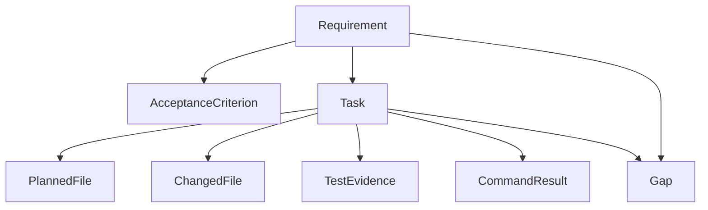
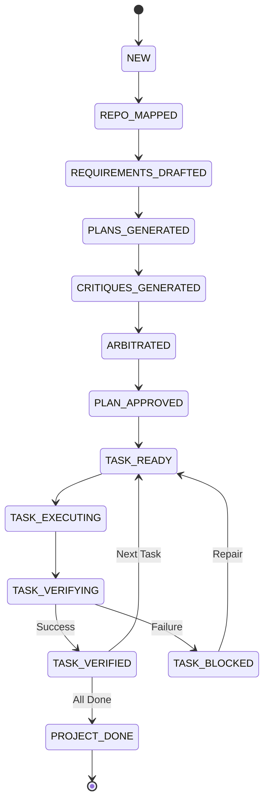

# DevCouncil

**AI coding with staff-engineer-style execution gates.**

DevCouncil is a gated orchestrator for AI-assisted software development. It ensures that AI-generated work proves it satisfied the original intent by enforcing strict software-engineering gates. It maps requirements to deterministic tasks, patches, and evidence via a persistent **Artifact Graph**.

---

## 🚀 Core Thesis

**DevCouncil should not merely generate code. It should make AI-generated work prove that it satisfied the original intent.**

AI coding agents often fail in subtle ways:
- They build the happy path and skip edge cases.
- They implement one requirement while forgetting another.
- They say tests passed but do not prove the important behavior.
- They modify unrelated files or change architecture without justification.
- They hide critical assumptions inside transient chat history.

DevCouncil attacks this by treating the implementation process like a high-performing software team, where **evidence**, not LLM "vibes," is the final authority.

---

## 🔄 The Gated Orchestration Flow

DevCouncil follows a rigorous, multi-agent implementation lifecycle:

1. **Goal Analysis**: Deep indexing and repository mapping.
2. **Requirements Drafting**: Extracting explicit functional requirements and assumptions.
3. **The Council Debate**:
   - **Planner A**: Pragmatic tech lead (simplest maintainable implementation).
   - **Planner B**: Production architect (security, edge cases, failure modes).
   - **Cross-Critique**: Agents attack each other's plans for flaws or omissions.
   - **Arbitration**: A final "graph compilation" into a single coherent task graph.
4. **Gated Execution**:
   - Tasks are scoped with allowed files and authorized commands.
   - Execution via **Native Agent**, **OpenHands**, **mini-SWE-agent**, or **Manual** mode.
5. **Deterministic Verification**:
   - Scans for **Orphan Diffs** (unauthorized file changes).
   - Runs automated **Secret Scanning** and test coverage.
   - **LLM Implementation Review** against the approved artifact graph.
6. **Repair Loop**: Blocking gaps are automatically converted into focused repair tasks.
7. **Evidence Reporting**: Generates a final implementation matrix proving requirement coverage.

---

## ✨ Features

- **Artifact Graph**: A persistent data structure connecting Requirements -> Tasks -> Evidence -> Gaps.
- **Multi-Agent Council**: Leverage diverse models (Claude, GPT, Gemini) for independent planning and critique.
- **Execution Guardrails**: Strict permission system blocking unauthorized file writes or shell commands.
- **Security Scanning**: Automated detection of API keys, tokens, and secrets in generated code.
- **Self-Healing LLM Router**: Automatic recovery from malformed JSON or schema validation errors.
- **MCP Server**: Expose DevCouncil status and tasks to tools like Claude Code and Cursor.
- **Intelligent Repair**: LLM-driven inference to close verification gaps.

---

## 📐 Visual Architecture

### Artifact Graph
The core data structure that ensures every line of code traces back to a requirement.



### Gating State Machine
The deterministic workflow that manages the implementation lifecycle.



---

## 🛠 Installation

Recommended global CLI install:

```bash
uv tool install --force .
devcouncil --help
```

From a local checkout:
```bash
# Windows
.\scripts\install.ps1

# macOS/Linux
./scripts/install.sh
```

---

## 📖 Usage

### 1. Initialize
```bash
devcouncil init
```

### 2. Plan
```bash
devcouncil plan "Add password reset with single-use expiring tokens"
```

### 3. Status & Tasks
```bash
devcouncil status
devcouncil tasks
devcouncil show TASK-001
```

### 4. Run & Verify
```bash
devcouncil run TASK-001 --executor native
devcouncil verify TASK-001
devcouncil repair
```

### 5. Report
```bash
devcouncil report
```

---

## 🔌 MCP Server
Expose tasks and project status to your IDE (Cursor) or Agent (Claude Code):
```bash
uv run python -m devcouncil.integrations.mcp.server
```

---

## 📚 Documentation
- [Architecture & Orchestration](docs/architecture.md)
- [Artifact Graph](docs/artifact-graph.md)
- [Gating Policy](docs/gating-policy.md)
- [Executor Adapters](docs/executor-adapters.md)

---

## 📜 License
Licensed under the [Apache-2.0 License](LICENSE).
