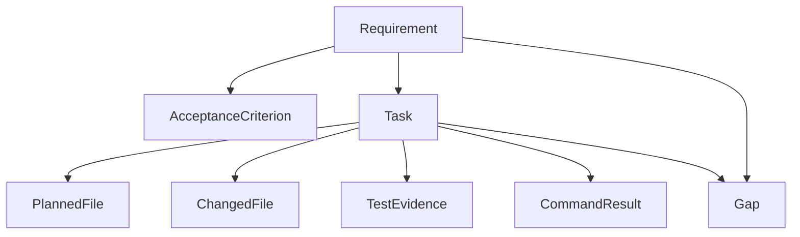
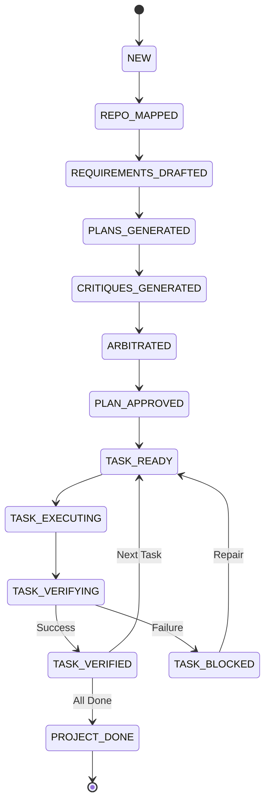

# DevCouncil: The Gated AI Orchestrator

[](LICENSE)
[](https://www.python.org/downloads/)
[](https://github.com/astral-sh/uv)

**"DevCouncil should not merely generate code. It should make AI-generated work prove that it satisfied the original intent."**

DevCouncil is a high-integrity command-line orchestration platform for AI-assisted software development. It turns AI implementation from a black-box generation task into a gated engineering workflow where every change is authorized, verified, and traceable back to a requirement.

DevCouncil is not trying to replace coding agents. It sits beside tools like Codex CLI, Gemini CLI, Claude Code, Cursor, and Aider, then owns the plan, task scope, verification loop, repair prompts, and evidence trail.

---

## Table Of Contents

- [Why DevCouncil Exists](#why-devcouncil-exists)
- [Quickstart](#quickstart)
- [Daily Workflow](#daily-workflow)
- [Coding CLI Integration](#coding-cli-integration)
- [Installation](#installation)
- [CLI Command Reference](#cli-command-reference)
- [Architecture](#architecture)
- [Project Status](#project-status)
- [Security Model](#security-model)
- [Acknowledgements](#acknowledgements)
- [License](#license)

---

## Why DevCouncil Exists

Standard AI coding agents are good at producing the happy path, but they often fail in expensive ways when complexity grows:

- **Requirement omission:** agents lose track of original product or PRD constraints across chat turns.
- **Architecture drift:** agents add dependencies or change design patterns without explicit authorization.
- **Unverified success:** agents claim tests passed without proving that the new logic was exercised.
- **Hidden assumptions:** important decisions stay buried in transient chat history instead of durable project artifacts.

**DevCouncil makes evidence, not model confidence, the final authority.**

It creates a persistent **Requirement -> Task -> Diff -> Evidence** graph, blocks completion when evidence is missing, detects unauthorized changes, and produces a final report that can be reviewed like an engineering artifact.

---

## Quickstart

Run DevCouncil commands in a normal terminal from the root of the repository you want DevCouncil to manage. Do not run these commands inside a coding CLI chat.

**Where to run what:**

- Terminal at repo root: `dev setup`, `dev plan`, `dev run`, `dev prompt`, `dev verify`.
- Coding CLI chat: paste only the generated output from `dev prompt TASK-ID`.
- Different repo path: use `dev setup --project-root path/to/project`.

If you are developing DevCouncil itself, install dependencies from this checkout:

```bash
uv sync
uv run dev setup
```

For normal use from a local checkout, install DevCouncil as a `uv` tool:

```bash
uv tool install --force .
devcouncil --help
```

If `uv` is missing, install it first:

```powershell
powershell -ExecutionPolicy ByPass -c "irm https://astral.sh/uv/install.ps1 | iex"
```

On macOS or Linux:

```bash
curl -LsSf https://astral.sh/uv/install.sh | sh
```

After installing DevCouncil globally, initialize it in a target repository:

```bash
cd path/to/your/project
dev setup
```

`dev setup` creates `.devcouncil/` if needed, runs the environment doctor, and prints the next commands for planning, prompting, and verification.

Start the first gated workflow:

```bash
dev plan "Describe the implementation goal"
dev tasks
dev run TASK-001 --executor manual
dev prompt TASK-001
dev verify TASK-001
```

Paste only the output from `dev prompt TASK-001` into Codex, Gemini, Claude Code, Cursor, Aider, or another coding tool. Keep `dev setup`, `dev plan`, `dev run`, and `dev verify` in the terminal at the repository root.

For the shortest install-to-first-task guide, see [docs/quickstart.md](docs/quickstart.md).

---

## Daily Workflow

DevCouncil's recommended default is **Manual Sidecar Mode**:

1. DevCouncil plans the work and creates a task graph.
2. You ask DevCouncil for one constrained task prompt.
3. You paste that prompt into your coding CLI or agent.
4. The agent edits the repository.
5. DevCouncil verifies the resulting diff against task constraints.
6. If verification fails, DevCouncil creates a focused repair loop.

### 1. Create The Implementation Plan

```bash
dev plan "Add password reset with expiring single-use tokens"
```

DevCouncil maps the repository, drafts requirements, runs planner and critic roles, and stores an approved task graph locally.

Inspect the plan:

```bash
dev status
dev tasks
dev show TASK-001
```

### 2. Start One Task

```bash
dev run TASK-001 --executor manual
```

This creates a checkpoint and marks the task as running. DevCouncil expects the next repository diff to match this task's allowed files, acceptance criteria, and verification commands.

### 3. Generate The Coding Prompt

```bash
dev prompt TASK-001
```

Paste the full output into your coding CLI. The generated prompt includes the task objective, allowed files, constraints, acceptance criteria, and evidence requirements.

### 4. Verify The Result

After the coding CLI modifies the repository:

```bash
dev verify TASK-001
```

Verification records evidence and marks the task as either `verified` or `blocked`.

Inspect the result:

```bash
dev status
dev report
dev report --json
```

### 5. Repair Gaps

If verification blocks the task, convert the gaps into focused repair work:

```bash
dev repair
dev tasks
dev prompt REPAIR-001
```

Paste the repair prompt into the same coding CLI, then verify again:

```bash
dev verify REPAIR-001
dev verify TASK-001
```

### 6. Continue Task By Task

```bash
dev tasks
dev show TASK-002
dev run TASK-002 --executor manual
dev prompt TASK-002
dev verify TASK-002
dev report
```

Recommended working rules:

- Run DevCouncil and the coding CLI from the same repository root.
- Give the coding CLI one DevCouncil task prompt at a time.
- Do not ask the coding CLI to broaden scope beyond the generated prompt.
- Run `dev verify TASK-ID` before committing agent-generated changes.
- Use `dev repair` for follow-up fixes instead of free-form retry prompts.
- Use `dev rollback TASK-ID` if a task needs to be reverted from its checkpoint.
- Treat `.devcouncil/` as local project state and the audit trail for the gated run.

---

## Coding CLI Integration

DevCouncil works with any tool that can accept a prompt and edit files in the same repository.

### Compatibility Matrix

| Tool | Manual sidecar prompts | Headless prompt handoff | DevCouncil MCP tools | Write-blocking hooks |
| :--- | :---: | :---: | :---: | :---: |
| **Codex CLI** | Supported | Supported via `codex exec` | Supported via `codex mcp` | Use DevCouncil verification gates |
| **Gemini CLI** | Supported | Supported via `gemini -p` or stdin | Supported via `gemini mcp` | Use DevCouncil verification gates |
| **Claude Code** | Supported | Tool-dependent | Manual MCP config only | Starter `dev hook` commands |
| **Cursor** | Supported | Tool-dependent | Manual MCP config only | Use DevCouncil verification gates |
| **Aider** | Supported | Prompt/stdin friendly | Not a primary path | Use DevCouncil verification gates |

### Fast Integration Setup

Preview coding CLI integrations:

```bash
dev setup --integrate
```

Apply supported MCP integrations for installed clients:

```bash
dev setup --integrate --apply
```

Configure every coding CLI with first-party setup support:

```bash
dev integrate all --apply
```

Preview exact setup commands without changing client config:

```bash
dev integrate all
```

Verify that DevCouncil is ready to expose MCP tools:

```bash
dev integrate check
```

Set up one first-party integration at a time:

```bash
dev integrate codex --apply
dev integrate gemini --apply
```

If a configured MCP client launches tools from a different directory, point it at the target repository:

```bash
dev integrate all --apply --project-root path/to/project
```

### Codex CLI

Manual sidecar flow:

```bash
cd path/to/project
dev run TASK-001 --executor manual
dev prompt TASK-001
```

Paste the generated prompt into Codex CLI. After Codex finishes:

```bash
dev verify TASK-001
```

Headless handoff:

```bash
dev prompt TASK-001 | codex exec -
dev verify TASK-001
```

MCP setup:

```bash
dev integrate codex --apply
```

If Codex launches MCP servers outside the target repository root, set `DEVCOUNCIL_PROJECT_ROOT` to the repository path in the MCP server environment.

### Gemini CLI

Manual sidecar flow:

```bash
cd path/to/project
dev run TASK-001 --executor manual
dev prompt TASK-001
```

Paste the prompt into Gemini CLI, then verify:

```bash
dev verify TASK-001
```

Headless handoff:

```bash
dev prompt TASK-001 | gemini
dev verify TASK-001
```

Or:

```bash
gemini -p "$(dev prompt TASK-001)"
```

MCP setup:

```bash
dev integrate gemini --apply
```

If Gemini launches MCP servers outside the target repository root, configure the server with `DEVCOUNCIL_PROJECT_ROOT` pointing at the repository that contains `.devcouncil/`.

### Claude Code

Start Claude Code in the same repository, then paste the generated task prompt:

```bash
cd path/to/project
dev run TASK-001 --executor manual
dev prompt TASK-001
```

After Claude Code finishes:

```bash
dev verify TASK-001
```

DevCouncil also includes an experimental hook command group:

```bash
dev hook --help
```

The intended hook integration is to call `dev hook pre-tool-use` before file-writing tools and block unauthorized writes with a non-zero exit. Treat this as experimental until your local Claude Code hook JSON shape matches what `dev hook pre-tool-use` expects.

### Cursor

Use DevCouncil as the planning and verification shell around Cursor:

```bash
dev run TASK-001 --executor manual
dev prompt TASK-001
```

Paste the prompt into Cursor Chat or Agent mode and instruct Cursor to stay within the prompt's allowed files. When Cursor finishes:

```bash
dev verify TASK-001
```

If Cursor changes files outside the task scope, DevCouncil verification should flag the unauthorized diff.

DevCouncil does not currently ship a dedicated `dev integrate cursor` command. Use manual sidecar prompts, or configure Cursor's MCP client manually against `devcouncil mcp-server` with `DEVCOUNCIL_PROJECT_ROOT` set to the target repository.

### Aider

Start Aider in the target repository:

```bash
cd path/to/project
aider
```

Paste the output from:

```bash
dev prompt TASK-001
```

After Aider commits or leaves a working-tree diff:

```bash
dev verify TASK-001
```

If you want DevCouncil to inspect the live working tree before committing, verify before creating the final commit.

### Automated Executors

Manual sidecar mode is the recommended default because it works with any coding CLI and keeps the human in control of the agent session.

DevCouncil also has experimental executor adapters:

```bash
dev run TASK-001 --executor mini
dev run TASK-001 --executor openhands
dev run TASK-001 --executor native
```

Use these only when the target executor is installed and configured locally. Automated executor mode lets DevCouncil launch the implementation loop itself, capture the post-run diff, and verify the task automatically.

The live executor adapter values are `manual`, `mini`, `openhands`, and `native`.

---

## Installation

### npm Wrapper

The npm wrapper is included for local testing and future registry publishing. Until the package is published to npm, install the wrapper from this checkout:

```bash
npm install -g .
devcouncil --help
dev --help
```

The npm wrapper delegates to the Python DevCouncil CLI through `uv`, so `uv` must be installed.

Check for `uv`:

```bash
uv --version
```

Install `uv` on Windows:

```powershell
powershell -ExecutionPolicy ByPass -c "irm https://astral.sh/uv/install.ps1 | iex"
```

Install `uv` on macOS or Linux:

```bash
curl -LsSf https://astral.sh/uv/install.sh | sh
```

After publishing the package to npm, users can install the registry package:

```bash
npm install -g devcouncil
devcouncil --help
```

For maintainers publishing the npm wrapper:

```bash
npm login
npm run pack:check
npm publish
```

### uv Global Install

From this repository:

```bash
uv tool install --force .
```

DevCouncil installs two command aliases:

```bash
dev --help
devcouncil --help
```

Use `devcouncil` when another tool already owns the `dev` command.

### Source Development

```bash
git clone https://github.com/bharathvbcr/DevCouncil.git
cd DevCouncil
uv sync
uv run dev --help
```

---

## CLI Command Reference

```bash
dev init                    # Initialize DevCouncil in a repo
dev setup                   # Initialize, run doctor, and print next steps
dev doctor                  # Check dependencies and environment
dev version                 # Display the installed DevCouncil version
dev map "goal"              # Map repo context for a goal
dev plan "goal"             # Run the full planning council debate
dev status                  # Show current project state and cost
dev tasks                   # List planned tasks and statuses
dev show TASK-001           # Show task details and constraints
dev prompt TASK-001         # Generate prompt for an external agent
dev run TASK-001            # Execute task via selected executor
dev verify TASK-001         # Verify diff, commands, and evidence
dev repair                  # Generate repair tasks from gaps
dev report                  # Generate final evidence report
dev rollback TASK-001       # Revert changes using task checkpoint
dev mcp-server              # Start DevCouncil MCP server over stdio
dev hook --help             # Show experimental Claude Code hook commands
dev integrate all --apply   # Configure supported coding CLI integrations
dev integrate check         # Verify coding CLI and MCP readiness
dev integrate doctor        # Check optional integration tools
dev trace tail --follow     # Tail local DevCouncil trace events
dev artifacts validate      # Validate stored artifact integrity
dev config                  # Inspect or update configuration
```

---

## Architecture

DevCouncil implements a 7-phase software-team workflow:

1. **Goal analysis:** deterministic repository mapping and relevant context selection.
2. **Requirements drafting:** extraction of functional requirements and acceptance criteria.
3. **Council debate:** planner roles critique each other and an arbiter compiles a unified task graph.
4. **Gated execution:** tasks are scoped with allowed files and authorized commands.
5. **Deterministic verification:** the audit engine checks side effects, command evidence, and secret leaks.
6. **Repair loop:** blocking gaps are converted into focused repair tasks.
7. **Evidence reporting:** a final release-ready matrix proves requirement coverage.

### Artifact Graph



### Gating State Machine



### How DevCouncil Differs From Sage

**Sage** reviews an active coding-agent session and provides critique cards to help the developer course-correct.

**DevCouncil** focuses on gated execution:

- It creates a persistent requirement, task, diff, and evidence graph.
- It blocks task completion when required evidence is missing.
- It detects orphan diffs and unauthorized architectural changes.
- It produces a deterministic evidence report for the final implementation.

Sage asks: "Is this agent response good?" DevCouncil asks: "Can this task prove it satisfied the requirement?"

---

## Project Status

DevCouncil is early-stage and under active development.

| Area | Status |
| :--- | :--- |
| **CLI & Storage** | Working: SQLite + SQLModel |
| **Artifact Graph** | Working: coverage engine |
| **Council Debate** | Working: multi-agent planning |
| **Manual Executor** | Working: sidecar mode |
| **Security Scanning** | Working: secret redaction and detection |
| **Repair Loop** | Working: LLM-driven inference |
| **Native Executor** | Experimental |
| **MCP Server** | Experimental / starter |
| **Claude Code Hooks** | Experimental / starter |
| **GitHub PR Checks** | Starter: `dev report --github` |

---

## Security Model

DevCouncil is designed to minimize unsafe agent behavior:

- **Redaction:** strips secrets and API keys before sending context to LLMs.
- **Permission guard:** prevents agents from accessing `.git`, `.env`, or sensitive credentials.
- **Allowlist enforcement:** restricts writes to task-approved files and commands to a safe subset.
- **Local sovereignty:** stores project state, logs, and artifacts locally in `.devcouncil/`.

DevCouncil provides gates and evidence to make risky changes easier to detect. It does not replace human security review.

---

## Acknowledgements

DevCouncil is built on the collective wisdom of the open-source agentic community:

- [karpathy/llm-council](https://github.com/karpathy/llm-council): for the multi-LLM peer-review pattern.
- [GPT Pilot](https://github.com/Pythagora-io/gpt-pilot): for the software-team role-based concept.
- [OpenHands](https://github.com/All-Hands-AI/OpenHands): for robust agent workspace and tool-loop management.
- [mini-SWE-agent](https://github.com/SWE-agent/mini-swe-agent): for lightweight execution loop inspiration.
- [abhigyanpatwari/GitNexus](https://github.com/abhigyanpatwari/GitNexus): for structural codebase awareness.
- [safishamsi/graphify](https://github.com/safishamsi/graphify): for knowledge graph and multi-agent coordination.

---

## License

Licensed under the **Apache License, Version 2.0**. See [LICENSE](LICENSE) for details.

---

**"Trust the model, but verify the graph."**
