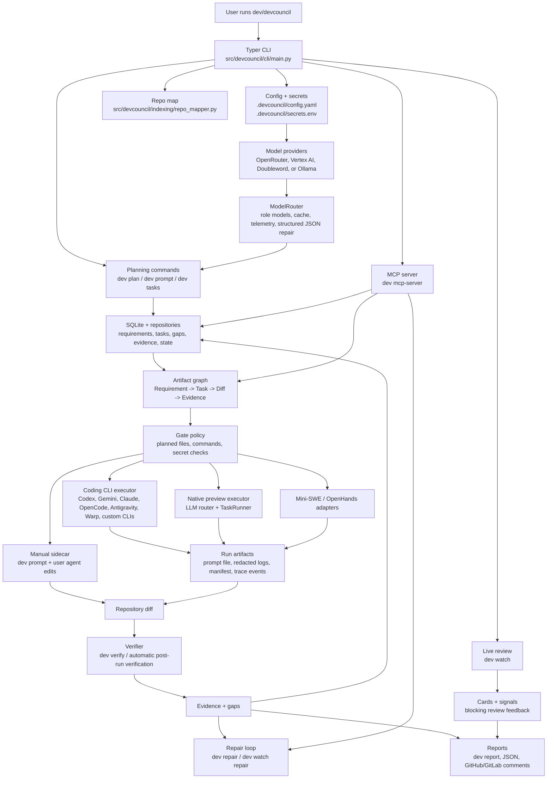

# DevCouncil: The Gated AI Orchestrator

<p align="center">
  
</p>

[](LICENSE)
[](https://www.python.org/downloads/)
[](https://github.com/astral-sh/uv)

## OpenAI Build Week 2026

Coding agents -- including Codex and other prompt-taking CLIs -- often claim success without proving that the change satisfied the original requirements. DevCouncil turns that claim into a gated engineering workflow: every change is scoped, verified, and traceable back to a requirement. Model confidence is not the final authority; evidence is.

### What judges should see

1. **Provider-free red-to-green evidence gate** -- install once, then watch a controlled sample fail verification and pass after a real fix, with no API keys.
2. **Self-contained interactive code graph** -- open the packed `demo.html` artifact and navigate filters, path highlighting, and neighborhoods (no blank canvas).
3. **Codex / MCP agent-control path** -- status, diffs, and task tools stay correct under real project-sized JSON so an agent can resume from evidence instead of chat memory.

### Judge path (intended package: `devcouncil@0.4.1`)

DevCouncil supports macOS, Linux, and Windows. Requires Node.js 18+, Python 3.12+, and Git. No model provider key is needed for the deterministic demos below.

```bash
# Prefer the Build Week release once published:
npm install -g devcouncil@0.4.1
devcouncil --help

# Core demo: red verdict -> apply fix -> green verdict (no API keys)
git clone https://github.com/bharathvbcr/DevCouncil.git
cd DevCouncil
bash scripts/build-week-demo.sh

# Interactive graph artifact (self-contained HTML)
mkdir -p /tmp/devcouncil-judge-demo
dev graph demo --project-root /tmp/devcouncil-judge-demo --json
# Open /tmp/devcouncil-judge-demo/.devcouncil/graph/demo.html
```

Until `0.4.1` is on the registry, clone this repository and run the same commands from a checkout that includes the Build Week fixes (`uv sync --group dev` if you need local `dev`).

### Eligible Build Week work

DevCouncil existed before OpenAI Build Week. This submission covers only meaningful extensions on or after **July 13, 2026**. Eligible history begins at commit `6f5bd73` (baseline before eligible work: `3cfd5d1`). Major themes:

- canonical SQLite code-intelligence index, multi-language grammars, incremental watching, graph queries/community detection, and a self-contained interactive code-graph artifact (including a ForceGraph compatibility fix for the packed demo);
- stronger deterministic verification: stop gates, claim checking, diff-to-evidence coverage, task leases, PDG/corpus checks, bounded repair, machine-readable next actions;
- deeper CLI, MCP, dashboard, coding-agent, and CI integration, plus the installable npm release path aimed at `0.4.1` for judges.

During Build Week, Codex and GPT-5.6 were used as an engineering partner to map paths, challenge claims, run install/browser checks, implement focused repairs, and verify behavior. The maintainer set requirements, scope, and acceptance evidence. The primary Codex `/feedback` session ID is on the Devpost submission. This does **not** claim that all eligible code was authored exclusively by Codex/GPT-5.6.

See [docs/build-week-demo.md](docs/build-week-demo.md) for the provider-free demo walkthrough.

## Documentation

- [Build Week demo](docs/build-week-demo.md): provider-free red-to-green judge script.
- [Quickstart](docs/quickstart.md): shortest install-to-first-task path.
- [Daily workflow](docs/workflow.md): manual sidecar loop, verification, repair, rollback, and `dev watch`.
- [Coding CLI integration](docs/coding-cli-integration.md): tiers, Claude Code, Codex, OpenCode, Antigravity, Cursor, Grok Build, Aider, MCP, hooks, stop gate / claim checks, and automated executors (Gemini deprecated).
- [CLI command reference](docs/cli-reference.md): available `dev` commands.
- [Repo map & code graph](docs/code-graph.md): `dev map` / `dev graph` -- navigation, dead code, blast radius, PDG (opt-in), HTML visualizer.
- [Corpus side index](docs/corpus.md): `dev corpus` for docs/PDFs/images and optional verify gates.
- [Hero loop](docs/hero-loop.md): certified Claude Code + MCP closed loop, leases, rigor, and `dev check --verify` on-ramp.
- [Architecture](docs/architecture.md): components, artifact graph, state machine, gating policy, and gated execution.
- [Model routing](docs/model-routing.md): provider selection, role models, OpenRouter, Vertex AI, Doubleword, and Ollama (local) setup.
- [Security model](docs/security.md): redaction, permissions, allowlists, and local state.
- [Project status](docs/project-status.md): current maturity by subsystem and near-term focus.

## Why DevCouncil Exists

Standard AI coding agents are good at producing the happy path, but they often fail in expensive ways when complexity grows:

- **Requirement omission:** agents lose track of original product or PRD constraints across chat turns.
- **Architecture drift:** agents add dependencies or change design patterns without explicit authorization.
- **Unverified success:** agents claim tests passed without proving that the new logic was exercised.
- **Hidden assumptions:** important decisions stay buried in transient chat history instead of durable project artifacts.

**DevCouncil makes evidence, not model confidence, the final authority.**

It creates a persistent **Requirement -> Task -> Diff -> Evidence** graph, blocks completion when evidence is missing, detects unauthorized changes, and produces a final report that can be reviewed like an engineering artifact.

## Quickstart

Run DevCouncil commands in a normal terminal from the root of the repository you want DevCouncil to manage. Do not run these commands inside a coding CLI chat.

Install `uv` first if it is missing:

```powershell
powershell -ExecutionPolicy ByPass -c "irm https://astral.sh/uv/install.ps1 | iex"
```

On macOS or Linux:

```bash
curl -LsSf https://astral.sh/uv/install.sh | sh
```

Install DevCouncil from npm:

```bash
npm install -g devcouncil
devcouncil --help
dev --help
```

Start the first gated workflow from your target repository:

```bash
cd path/to/your/project
dev setup
dev plan "Describe the implementation goal"
dev status                   # if AWAITING_USER_DECISIONS, run dev approve next
dev approve                  # when planning raised advisory gaps
dev tasks
dev run TASK-001 --executor manual
dev prompt TASK-001
dev verify TASK-001
```

On a fresh interactive setup, DevCouncil can configure supported coding CLI integrations immediately; pass `--skip-integrations` if you want to defer that step.

### Run locally on macOS (Apple Silicon + Ollama)

DevCouncil runs fully offline against [Ollama](https://ollama.com) — no API key, no per-token cost. It is Apple-Silicon-aware: `dev setup --provider ollama` sizes the default local model to your Mac's unified memory, and `dev doctor` reports the chip/RAM, pings the Ollama server, and flags a too-small context window.

```bash
brew install ollama && ollama serve
ollama pull qwen2.5-coder:32b     # use the size `dev doctor` recommends for your RAM
export OLLAMA_NUM_CTX=16384       # large planning prompts need a raised context window
dev setup --provider ollama      # auto-selects the model for your RAM
```

See [Model routing → macOS / Apple Silicon](docs/model-routing.md) for the RAM-to-model table.

Paste only the output from `dev prompt TASK-001` into Codex, Gemini, Claude Code, OpenCode, Antigravity, Warp, Cursor, Aider, or another coding tool. Keep `dev setup`, `dev plan`, `dev run`, and `dev verify` in the terminal at the repository root.

For an automated end-to-end run with a supported coding CLI installed:

```bash
dev e2e "Describe the implementation goal" --executor codex
dev e2e "Describe the implementation goal" --executor antigravity
dev e2e "Describe the implementation goal" --executor warp
dev go "Describe the implementation goal" --executor codex
```

`dev e2e` is the explicit one-command integration target for coding agents. It initializes local DevCouncil state if needed, plans the goal, runs each approved task through the selected executor, verifies the resulting diff, and prints the final report. If `--executor` is omitted, DevCouncil uses `execution.default_executor` from `.devcouncil/config.yaml`. `dev go` is kept as a shorter alias for the same flow.

For machine-readable agent handoff, write the final report to a stable file:

```bash
dev e2e "Describe the implementation goal" --executor codex --agent
dev e2e "Describe the implementation goal" --executor codex --json --report-file .devcouncil/reports/latest.json
```

`--agent` enables JSON output and writes `.devcouncil/reports/latest.json`. Fresh projects default to manual sidecar mode, so pass an automated executor or set `execution.default_executor` before using `dev e2e` without `--executor`.

See the full [quickstart](docs/quickstart.md) for installation variants, API-key setup, and first-run guidance.

OpenCode and Google Antigravity CLI are built-in executors and MCP integrations:

```bash
dev integrate opencode --apply
dev run TASK-001 --executor opencode
dev agents run TASK-001 --agent opencode --profile default
dev integrate antigravity --apply
dev run TASK-001 --executor antigravity
dev agents run TASK-001 --agent agy --profile default
```

Register any other local CLI that accepts prompts. `dev agents` is the first-class agent hub; `dev integrate cli-agent` remains available for older scripts:

```bash
dev agents add myagent --command myagent --arg run --input-mode prompt-file --prompt-arg=--prompt-file --supports-mcp
dev agents
dev agents doctor
dev agents run TASK-001 --agent myagent --profile default
```

GEPA prompt-profile optimization is available for the agent hub:

```bash
dev agents optimize --agent codex --profile yolo --evals .devcouncil/evals/agent-profile.jsonl --dry-run
dev agents optimize --agent codex --profile yolo --evals .devcouncil/evals/agent-profile.jsonl --apply
```

## Feature Set

DevCouncil is an application layer around coding agents. It does not just emit prompts; it owns the workflow state, validates task scope, records evidence, and produces release-style reports.

### Workflow Features

- **Repository onboarding:** `dev setup` initializes `.devcouncil/`, generates the repo map + `AGENTS.md`/`CLAUDE.md` guides, scaffolds applicable engineering skills, runs environment checks, offers integration setup, and prints the next useful commands. Use `--skip-map` / `--skip-skills` to opt out, or `--scaffold-ci` to also write a starter GitHub Actions workflow. **`dev boot "goal"`** chains setup, `dev integrate --apply`, optional CI scaffold flags, and `dev go` in one command (see [quickstart](docs/quickstart.md)).
- **Repository mapping:** `dev map` writes `.devcouncil/repo_map.json` and a symbol-level `.devcouncil/graph/code_graph.json`, identifies important files and subsystems, filters generated/temp files, and keeps managed `AGENTS.md` / `CLAUDE.md` workspace guides synchronized. Subsystems, entry points, neighbors, and important surfaces are inferred generically for **any** repository — grouped from the directory tree and ranked by an import-graph in-degree. Freshness uses git HEAD, tracked-file hash, and a content fingerprint so plain edits mark the map stale; a **missing map is stale** (fail-closed on hard rigor). Post-tool-use hooks and `dev map --watch` refresh incrementally. Unified analyze entry: `dev graph ingest`. Query with `dev graph query|trace|dead|search|cypher|html`. Liveness lists are capped at 5000 per list and 256 dependents per file (truncation metadata when hit). The map is also generated automatically on first init. (See [docs/code-graph.md](docs/code-graph.md) for details).
  
  <p align="center">
    
  </p>
- **Engineering skills:** `dev skills` lists the bundled skills and shows which apply to the repository; `dev skills scaffold` writes them into `.claude/skills/<name>/SKILL.md`. A merged always-on `core-engineering` skill (think-before-coding, simplicity, surgical changes, goal-driven execution, evidence-grounded communication) plus domain skills (Android, iOS, Windows, web, AI training) that brief the agent on current SDKs, deprecations, and tooling before coding. Applicable skills are also embedded into `dev prompt` output.
- **CI scaffolding:** `dev scaffold-ci` writes a starter `.github/workflows/devcouncil.yml` derived from the configured test/lint/typecheck commands, filtered to the detected language stack; it never overwrites existing CI unless `--force`. Run `dev scaffold-ci --evidence` to generate `.github/workflows/devcouncil-evidence.yml` which automates verifying PRs and uploading evidence JSON and HTML reports.
- **Planning council:** `dev plan` turns a goal into requirements, acceptance criteria, assumptions, critique findings, and executable tasks. When advisory gaps remain, the project stays in `AWAITING_USER_DECISIONS` until you run `dev approve` (or `dev e2e`/`dev go --force`).
- **Task graph:** `dev tasks` and `dev show TASK-001` expose requirement links, acceptance-criterion links, planned files, expected tests, allowed commands, forbidden changes, dependencies, status, and active **lease** owners. Tasks can declare `depends_on`; the plan gate rejects unknown dependencies and cycles, and `dev go`/`dev e2e` run tasks in topological order and skip a task whose prerequisites didn't complete (rather than letting it fail spuriously and burn its repair budget). `dev tasks cancel`, `dev tasks edit`, and `dev tasks reprioritize` manage the live task graph without replanning.
- **Gap and requirements surfaces:** `dev gaps` lists blocking and advisory verification gaps project-wide; `dev requirements` summarizes requirement coverage and derived status; `dev export` writes a portable JSON snapshot of requirements, tasks, and gaps.
- **Scoped task prompts:** `dev prompt TASK-001` creates a constrained implementation prompt for sidecar agents, including file scope, verification expectations, and forbidden changes. The prompt now embeds the current (secret-redacted) contents of each planned file with a top-level symbol outline, structural orientation (from the code-review graph when available, otherwise the generated `repo_map.json`), and a **dependents (blast-radius) list** — the files that import each file being changed, from the map's precomputed reverse-import index — so the agent edits in place and keeps call sites working instead of starting blind. A central prompt budget keeps the core (goal/scope/instructions) always present and fits the optional context sections in priority order (file contents > structural > dependents > skills), dropping the lowest-priority ones with an explicit marker rather than overflowing silently.
- **Execution:** `dev run TASK-001` supports manual sidecar mode, built-in coding CLI executors, external executors, and registered custom CLI agents.
- **One-command flow:** `dev e2e "goal"` and `dev go "goal"` can initialize state, plan, run approved tasks, verify the diff, and generate a report. With an automated executor the run is now a **closed loop**: a task that fails verification is re-driven through a bounded self-repair loop (a correction manifest is written and the executor re-run) until it verifies or the `execution.max_repair_attempts` budget is spent, with no-progress detection that stops early when the same blocking gaps reappear.
- **Verification:** `dev verify TASK-001` captures the diff, runs expected evidence commands, checks planned-file compliance, detects orphan changes, flags unplanned dependency edits, scans for secrets, and links evidence to acceptance criteria. An **empty diff can no longer pass** a task that declares files to create or modify (work that committed earlier is still recognized via the task checkpoint), and the result reports the rigor it ran at (`verification_mode` compiled vs coarse, `diff_empty`, `coverage_measured`/`coverage_skipped_reason`) plus a distinct `advisory_actions` list so an agent never mistakes "passed" for "proven." `dev verify` exits non-zero when a task is blocked so shell-driven agents can gate on `$?`.
- **Lite check:** `dev check --verify` runs the same deterministic evidence gate against the current working tree without planning or provider keys — useful for CI and quick audits. `dev check` without `--verify` performs an LLM audit of current changes. Run `dev check --watch` to start a fast, incremental check loop that selects and re-runs only the stack gates affected by changed files using an input-content hash cache.
- **Repair:** `dev repair` converts blocking gaps into focused follow-up work instead of leaving failures as vague test output.
- **Rollback:** `dev rollback TASK-001` uses task checkpoints to revert scoped work when a task needs to be backed out.
- **Codebase wiki:** `dev wiki update` generates and maintains an agent-facing wiki of the repository as an Open Knowledge Format bundle under `.devcouncil/knowledge/okf/wiki/` — an index, one cross-linked page per subsystem (entry points, roles, neighbors, handoff paths), a development guide, and a `log.md` change history. Pages are built deterministically from `repo_map.json` and, when a model is configured, enriched with LLM-written prose (overview, key flows, agent guidance) by the `wiki_writer` role; enrichment degrades cleanly to the skeleton. Updates are incremental (per-page fingerprints preserve prior enrichment), `dev map` refreshes stale skeletons automatically, `dev wiki status` reports freshness, and `dev wiki install-action` adds a GitHub Action that keeps the wiki current via automated PRs. Because the bundle lives under the knowledge directory, wiki pages are selected into planning/task prompts like any other OKF knowledge — tagged by subsystem so goals pull the right page.
- **Run supervision (Preview):** every automated run is a reversible object (Shepherd-style): `dev runs timeline <run-or-task>` joins the run manifest, trace events, and git checkpoints into one inspectable timeline; `dev runs diff` shows exactly what the run changed; `dev runs revert` reverses it from its checkpoints (and records the revert in the trace); and `dev runs supervise` asks a supervisor meta-agent (the `run_supervisor` role, with deterministic heuristics as fallback) for a keep/revert/repair verdict — add `--apply` on the CLI to act on a revert verdict. Over MCP, `devcouncil_run_timeline` and `devcouncil_run_supervise` expose the same inspection and verdict surfaces; MCP supervise is verdict-only (no workspace modify — use `dev runs revert` or CLI `--apply` separately).
- **Reporting:** `dev report` emits a requirements coverage table, evidence summary, blocking gaps, and live-review blockers; JSON, PR-comment, and interactive HTML report (`dev report --evidence-html PATH`) formats are available for automation.

### App Surfaces

- **CLI:** `dev` and `devcouncil` expose the same Typer command surface for local terminal workflows.
- **Multi-agent campaigns:** `dev campaign run` executes a planned task graph as a parallel, dependency-aware multi-agent campaign (Director → Coordinator → Worker pool + Reviewer QC) with automatic file-overlap serialization, cost budgeting, ntfy push notifications, and a markdown progress dashboard at `.devcouncil/campaign/dashboard.md`. Roster and mailbox commands (`dev campaign roster` / `dev campaign inbox`) expose the role hierarchy and on-disk message bus.
- **Agent hub:** `dev agents` lists built-in and custom agents, `dev agents add` registers prompt-taking CLIs, `dev agents doctor` checks wiring, `dev agents run` executes a task through a named agent/profile, and `dev agents optimize` uses GEPA to tune profile preambles from offline eval examples.
- **Integration hub:** `dev integrate all --apply` configures supported coding CLI and MCP integrations in Claude-first, Codex-second order. `dev integrate check` reports each client's **enforcement posture**: `pre-action`, `advisory+verify`, or `verify-only`, so a client API that cannot natively deny PreToolUse is never presented as blocking.
- **MCP server:** `dev mcp-server` exposes DevCouncil context and workflow tools over stdio for MCP-capable clients. Native graph tools include `devcouncil_graph_ingest`, `devcouncil_graph_cypher`, `devcouncil_pdg_query`, and `devcouncil_explain` alongside repo-map and symbol-query surfaces. `devcouncil_verify_task` now runs DevCouncil's strong compiled per-criterion checks when a provider key is configured (falling back to a clearly-labeled `coarse` mode otherwise), refuses to pass on an empty diff, and returns `verification_mode`, `diff_empty`, `coverage_measured`/`coverage_skipped_reason`, and an `advisory_actions` array alongside the blocking `next_actions`. Cheap, re-verify-free read tools — `devcouncil_get_gaps` and `devcouncil_get_next_actions` — let a reconnecting agent resume outstanding work from persisted gaps (which now carry `file`/`line`/`suggested_command`/`acceptance_criterion_id`). Task leases expire on a config-driven TTL so a crashed agent's task frees itself, with `devcouncil_renew_lease` and `devcouncil_list_leases` for long runs and fleet supervision; a partial-unique DB index enforces a single active lease per task, so concurrent checkouts can't both win the writer slot. A pure-MCP agent can now make the change itself through lease-gated write tools — `devcouncil_write_file` and `devcouncil_apply_patch` — which policy-check every target path *before* it lands (out-of-scope, protected, or escaping paths are rejected; a patch with any out-of-scope target is rejected whole, never partially applied), write atomically, and record a `FileChangeEvent` for provenance. The corpus is also browsable as MCP **resources** (`devcouncil://report`, `devcouncil://tasks`, `devcouncil://gaps`, `devcouncil://cards`, `devcouncil://task/{id}`) so a host can read project state without a tool call. `devcouncil_get_task_provenance` then exposes that audit trail — gated file changes, verification runs, diff-coverage evidence, and the latest correction manifest — so what happened on disk is inspectable. The diff↔coverage proof is now also retained across graph reloads (it was previously dropped), so reports and `dev status` reflect whether the changed lines were actually exercised.
- **Live review:** `dev watch` tracks review cards, signals, blocking feedback, and repair guidance while a session is active.
- **Trace viewer:** `dev trace tail --follow` streams local DevCouncil trace events for execution, verification, and agent handoff.
- **Cost and runs:** `dev cost show` reports estimated model-call cost from the local ledger; `dev runs list` and `dev runs show` inspect coding-agent run manifests under `.devcouncil/runs/`, and `dev runs timeline`/`diff`/`revert`/`supervise` treat each run as a reversible, supervisable trace. Over MCP, `devcouncil_wiki_page` exposes the codebase wiki; run supervision tools are documented in [coding-cli-integration.md](docs/coding-cli-integration.md#run-supervision) (`devcouncil_run_timeline`, `devcouncil_run_supervise`).
- **Live Dashboard (Stable local UI):** `dev dashboard --open` serves a local-only status dashboard (blocking-first **gaps** table, recent runs, integration diagnostics) and opens it in the default browser. Apply controls are loopback + token-guarded.
- **Agent-consumable CLI:** machine output for shell-driven agents — `dev prompt --json` (`{ok, task_id, prompt}`), `dev handoff --json` (`{ok, manifest_path, run_id, next_command}` to chain `dev run`), `dev verify` exits non-zero when blocked, and `dev status`/`dev report` accept `--fail-on-blocking` to exit non-zero on outstanding blocking gaps so a loop can gate on `$?`.
- **Config editor:** `dev config`, `dev config show`, `dev config set`, and `dev config models` inspect/update provider, model, executor, and command configuration.
- **Artifact tools:** `dev artifacts validate` checks stored graph integrity.
- **Code intelligence:** `dev lsp inspect` (with `--json` for automation) checks optional language-server readiness, and `dev ast match` searches code structurally.
- **Doctor:** `dev doctor` validates local dependencies, configures coverage floor checks (`[tool.coverage.report] fail_under`), checks mypy status, and runs environment prerequisites before a workflow fails; it includes a subsystem maturity table aligned with `docs/project-status.md`.

### Agent And Executor Support

DevCouncil works with human-in-the-loop sidecar sessions and automated prompt handoff:

- **Manual sidecar:** paste `dev prompt TASK-001` into any agent, then run `dev verify TASK-001`.
- **Built-in coding CLI adapters:** `codex`, `claude`, `opencode`, `antigravity`, `warp`, `cursor`, `grok`, `aider`, `copilot`, `goose`, `amp`, `qwen`, `crush`, and aliases such as `codex-cli`, `claude-code`, `opencode-cli`, `antigravity-cli`, `agy`, `agy-cli`, `warp-cli`, `oz`, `cursor-agent`, `cursor-cli`, `grok-build`, `grok-cli`, `gork`, `xai-grok`, `copilot-cli`, `github-copilot`, `goose-cli`, `amp-cli`, `qwen-code`, and `crush-cli`. **`gemini` / `gemini-cli` remain as deprecated compat only** — prefer Antigravity.
- **Custom CLI agents:** register any prompt-taking command with stdin, argument, or prompt-file handoff.
- **Execution profiles:** custom agents can use profiles such as `default`, `yolo`, and `prod` to adjust prompt constraints while DevCouncil still verifies the final diff.
- **External automated adapters:** `mini`, `openhands`, `native-preview`, and `native` are available when the corresponding local executor is configured. The **native executor** (`NativeAgent`) is in Preview status and supports lease-gated writes (gated by the same safety path as MCP) and a bounded self-repair closed loop.
- **Hook-aware clients:** `dev integrate hooks --apply` installs native lifecycle hooks. Claude Code can enforce the opt-in blocking write gate; Codex currently accepts advisory `systemMessage` output for PreToolUse and uses its native sandbox plus deterministic post-run verification for containment. Codex Stop/SubagentStop uses the supported `continue`/`stopReason` schema. File-write policy resolves every target and denies anything outside the project root.

### Gates And Evidence

DevCouncil blocks completion on concrete gaps rather than model confidence:

- **Plan approval gates:** requirements must have acceptance criteria, acceptance criteria need verification methods, tasks must map to known requirements and acceptance criteria, high-impact assumptions must be resolved, and high/critical critique findings must be closed.
- **Task readiness gates:** the working tree must be clean for the task, planned files must be declared, and each task needs allowed commands plus expected verification evidence.
- **Diff gates:** verification detects files changed outside the planned task scope, dependency-file edits made without authorization, deleted/added files, and untracked file diffs.
- **Architecture/subsystem boundary gates:** flags edits that cross non-neighbor subsystems without plan coverage, preventing unauthorized architecture drift. **Write policy** also soft-blocks paths outside `planned_files` unless the target shares a subsystem or a map `neighbors` area (widen via `dev scope update`).
- **Evidence gates:** passing evidence commands are linked back to acceptance criteria; missing passing evidence becomes a blocking gap.
- **Security gates:** secret scanning runs over captured diffs, and command output is redacted before it is written to logs.
- **Live-review gates:** unresolved critical review cards can block task verification and appear in reports.

### Providers, Models, And Cost Tracking

- **Providers:** OpenRouter, Vertex AI, Doubleword, and Ollama (local, no key) are supported through local configuration and secrets.
- **Role models:** planner, critic, arbiter, reviewer, and repair roles can share one model or use per-role overrides.
- **Structured repair:** model routing includes JSON repair paths for structured planning and review outputs.
- **Model defaults:** packaged YAML defaults ship with the tool so installed CLI environments do not depend on source-tree-only files.
- **Telemetry:** local trace and cost data feed `dev status`, `dev cost show`, reports, and dashboard surfaces.

### Reports And Automation Outputs

- **Markdown reports:** include verdict, coverage summary, requirement/task mapping, blocking gaps, and live-review status.
- **JSON reports:** `--json` and `--report-file` support machine-readable handoff to other automation.
- **Agent preset:** `--agent` writes `.devcouncil/reports/latest.json` for stable downstream consumption.
- **PR comments:** `dev report --github-pr-comment` and `dev report --gitlab-pr-comment` can publish verification summaries to pull/merge requests.
- **GitHub checks:** preview GitHub report/check surfaces are available for repository automation.

### Local State And Files

DevCouncil stores local workflow state in the target repository:

- `.devcouncil/config.yaml`: provider, executor, command, integration, and workflow settings.
- `.devcouncil/secrets.env`: local provider secrets such as API keys or Vertex AI project/location values. Git-ignored; copy `.devcouncil/secrets.env.example` and fill in real values. Environment variables take precedence over this file.
- `.devcouncil/repo_map.json`: generated repository map and subsystem navigation index.
- `.devcouncil/graph/code_graph.json`: symbol-level knowledge graph (imports, calls, dead-code tiers); visualize with `dev graph html`.
- `.devcouncil/state.sqlite`: SQLite state for requirements, assumptions, tasks, evidence, gaps, critique findings, and project phase history.
- `.devcouncil/checkpoints/`: task snapshots used by verification and rollback.
- `.devcouncil/logs/`: the durable run log (`devcouncil.log`, rotating, DEBUG-level) plus redacted stdout/stderr from verification commands.
- `.devcouncil/runs/<run-id>/run.log`: the full per-run log isolated to a single executor run.
- `.devcouncil/runs/<run-id>/agent-run.json`: prompt, executor, profile, exit status, and run metadata for automated agent executions.
- `.devcouncil/knowledge/okf/wiki/`: the generated codebase wiki (OKF bundle) — the one part of `.devcouncil/` meant to be committed and shared, maintained by `dev wiki update`.
- `.devcouncil/reports/latest.json`: optional machine-readable report generated by `dev e2e --agent`.
- `.devcouncil/integrations/` and `.agents/`: generated integration files such as Warp/Oz MCP JSON and Antigravity MCP config.

### Logging & diagnostics

Every command logs each stage and step. The full DEBUG trail always lands in `.devcouncil/logs/devcouncil.log` (rotating), each executor run also gets an isolated `.devcouncil/runs/<run-id>/run.log`, and uncaught crashes are captured there with a full traceback. The console stays quiet by default — raise it per command:

- `dev <command> -v` (INFO) or `-vv` (DEBUG); `-q` for errors only; `--log-level DEBUG`. The `DEVCOUNCIL_LOG_LEVEL` env var sets a default.
- `dev logs tail [-n N] [-f] [--grep TEXT]` — read/follow/filter the shared log.
- `dev logs tail --run <run-id>` — read one run's log; `dev logs runs` lists them; `dev logs path` prints the location.
- `dev doctor` reports the log location and size.

### Maturity

The stable daily workflow is planning, manual sidecar execution, verification, the deterministic repair loop in `dev go`/`dev e2e`, rollback, reporting, repo map/code graph (`dev map` / `dev graph`), and the local Live Dashboard (`dev dashboard --open`). The **certified Claude Code MCP closed loop** (checkout → write → verify → repair → release) is **Stable** (see [hero-loop.md](docs/hero-loop.md#certified-path-stable)). Coding CLI executors and hooks (including stop-gate claim checks), `dev boot` onboarding, CI scaffolding, multi-agent campaigns, watch mode, live review, PR comments, LSP/AST tools, corpus side index, opt-in PDG, and GitHub check surfaces are preview features. Optional LLM repair inference remains preview and is not required for the deterministic loop. The native autonomous executor is **Preview** (lease-gated writes + shared verify loop) and still requires DevCouncil verification before work is considered complete.

## Core Flow

DevCouncil's recommended default is **Manual Sidecar Mode**:

1. DevCouncil plans the work and creates a task graph.
2. You ask DevCouncil for one constrained task prompt.
3. You paste that prompt into your coding CLI or agent.
4. The agent edits the repository.
5. DevCouncil verifies the resulting diff against task constraints.
6. If verification fails, DevCouncil creates a focused repair loop.

The detailed task-by-task workflow lives in [docs/workflow.md](docs/workflow.md).

## How The Repo Runs



## Install From Source

For local development inside this checkout:

```bash
uv sync
uv run dev --help
```

For a global install from this repository:

```bash
uv tool install --force --reinstall --editable .
dev --help
devcouncil --help
```

`--editable` keeps `~/.local/bin/dev` pointed at this checkout so map/graph and other WIP features stay current without reinstalling after every edit. Use `uv tool install --force .` (without `--editable`) for a frozen snapshot of the tree at install time.

See [docs/code-graph.md](docs/code-graph.md) for `dev map` / `dev graph` usage (dead code, blast radius, HTML visualizer).

## Project Shape

DevCouncil implements a 7-phase software-team workflow:

1. Goal analysis and repository mapping.
2. Requirements drafting.
3. Council debate and task arbitration.
4. Gated execution with scoped files and commands.
5. Deterministic verification.
6. Repair-loop generation.
7. Evidence reporting.

Read [docs/architecture.md](docs/architecture.md) for the artifact graph, gating state machine, and component layout.

## Contributions

Project ideas and execution patterns come from the open-source ecosystem:

- [Sage](https://github.com/usetig/sage): peer-review-first model for planning and critique.
- [karpathy/llm-council](https://github.com/karpathy/llm-council): for the multi-LLM peer-review pattern.
- [GPT Pilot](https://github.com/Pythagora-io/gpt-pilot): for role-based software-team concept.
- [astral-sh/uv](https://github.com/astral-sh/uv): for reproducible Python package/runtime workflows.
- [OpenHands](https://github.com/All-Hands-AI/OpenHands): for workspace-aware agent execution patterns.
- [mini-SWE-agent](https://github.com/SWE-agent/mini-swe-agent): for lightweight execution loop inspiration.
- [SWE-agent](https://github.com/SWE-agent/SWE-agent): for full-spectrum autonomous SWE-style tasking patterns.
- [GitNexus](https://github.com/abhigyanpatwari/GitNexus): structural codebase awareness concepts (native `dev map` / `dev graph` — no runtime integration).
- [graphify](https://github.com/safishamsi/graphify): knowledge-graph / corpus coordination concepts (native `dev corpus` + optional verify gates — no runtime integration).
- [Claude-oversight](https://github.com/sabarishraja/Claude-oversight): claim-to-evidence stop-gate semantics (native stop gate + claim mapper).
- [Claude-hindsight](https://github.com/sabarishraja/Claude-hindsight): session continuity / statusline briefing patterns (native SessionStart briefing).
- [Shepherd](https://github.com/shepherd-agents/shepherd): reversible run traces and meta-agent supervision (`dev runs timeline` / `diff` / `revert` / `supervise`).

## License

Licensed under the **Apache License, Version 2.0**. See [LICENSE](LICENSE) for details.

---

**"Trust the model, but verify the graph."**
