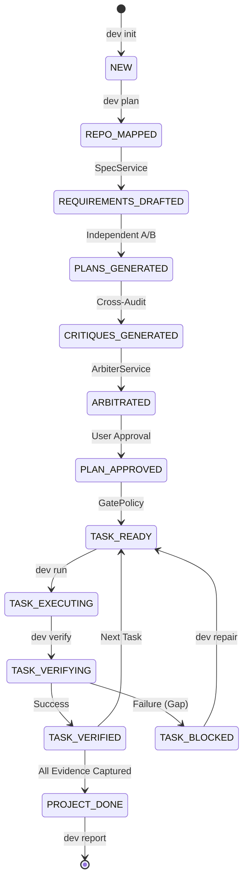

# DevCouncil: The Gated AI Orchestrator

[](LICENSE)
[](https://www.python.org/downloads/)
[](https://github.com/astral-sh/uv)

**"DevCouncil should not merely generate code. It should make AI-generated work prove that it satisfied the original intent."**

DevCouncil is a high-integrity, command-line orchestration platform for AI-assisted software development. It transforms AI implementation from a "black box" generation task into a formal, transparent engineering workflow. By enforcing strict **staff-engineer-style execution gates**, DevCouncil ensures that every line of generated code is authorized, tested, and traces back to a verified requirement.

---

## 🛑 The Problem: Why DevCouncil Exists

Standard AI coding agents often suffer from **Context Erosion** and **Verification Theater**. They are excellent at generating the "happy path" but fail in expensive ways when complexity grows:
- **Requirement Omission**: Agents frequently lose track of original PRD constraints after several chat turns.
- **Architecture Drift**: They may change fundamental design patterns or add unnecessary dependencies without explicit authorization.
- **Unverified Success**: Agents often report "All tests passed" without proving that the *new* logic was actually exercised or that edge cases were handled.
- **Hidden Assumptions**: Critical architectural decisions are often buried in transient chat history rather than being logged and verified.

**DevCouncil attacks this by making evidence—not LLM "vibes"—the final authority.**

---

## ⚖️ Competitor Comparison: The DevCouncil Differentiator

| Feature | Standard Coding Agents | DevCouncil (Gated Orchestrator) |
| :--- | :--- | :--- |
| **Primary Goal** | Generate code quickly. | Prove implementation integrity. |
| **Source of Truth** | The latest chat window. | The **Artifact Graph** (SQLite). |
| **Planning** | Single-pass generation. | Multi-agent **Council Debate** with cross-critique. |
| **Verification** | LLM says "it's done". | Deterministic gates (Orphan diffs, Secret scans, Test logs). |
| **Security** | Broad file/shell access. | Strict **Permission Model** and auto-redaction. |
| **Repair** | "Try again" loop. | Evidence-driven **Intelligent Repair** tasks. |

---

## 🔄 The Multi-Agent Implementation Lifecycle

DevCouncil implements a 7-phase "Software Team" workflow designed to stress-test plans before execution:

### 1. Repository Mapping & Deep Indexing
Performs a deterministic scan of the repo using `git` and `ripgrep`. It detects the tech stack and ranks "candidate files" based on goal keywords, providing a high-fidelity context window without token bloat.

### 2. Requirements & Assumption Tracking
A specialized **Spec Writer** extracts functional requirements and acceptance criteria. Simultaneously, an **Assumption Extractor** logs architectural assumptions (e.g., "Using existing DB schema"), ensuring these are tracked and eventually confirmed.

### 3. The Council Debate (Planner A vs. Planner B)
DevCouncil spawns a "Council" to avoid single-model bias:
- **Planner A (Pragmatic Tech Lead)**: Optimizes for simplicity and minimal dependencies.
- **Planner B (Production Architect)**: Focuses on security, edge cases, and robust failure modes.
- **Cross-Critique**: Agent A attacks Plan B, and Agent B attacks Plan A, hunting for omissions.
- **Arbitration**: An **Arbiter** (Engineering Manager) compiles a final, unified, and approved task graph.

### 4. Gated Execution
Tasks are constrained by **Allowed Files** and **Authorized Commands**. Execution occurs via specialized adapters: **Native**, **OpenHands**, **mini-SWE-agent**, or **Manual** mode.

### 5. Deterministic Verification
A 12-step audit engine checks the work:
- **Orphan Diff Detection**: Blocks the task if unauthorized files were modified.
- **Secret Scanning**: Scans for leaked API keys or tokens.
- **Command Gating**: Ensures build and test commands exit with code 0.
- **LLM Review**: A final heuristic audit of the diff against the original requirement.

### 6. The Repair Loop
If verification fails, DevCouncil generates **Intelligent Repair Tasks** based on the specific gap evidence, providing the agent with a focused path to resolution.

### 7. Evidence Reporting
Exports a comprehensive **Evidence Report (Markdown/JSON)**, mapping every Requirement to a Task, a Diff, and a verified Test Result.

---

## ✨ Technical Features

### 🧠 The Artifact Graph
The core differentiator. A persistent, directed graph in SQLite tracking:
`Requirement -> AcceptanceCriterion -> Task -> Planned File -> Changed File -> Command Result -> Test Evidence -> Gap`.

### 🛡️ Security & Guardrails
- **Permission Manager**: Blocks access to `.git`, `.env`, and sensitive directories.
- **Secret Redaction**: Sanitizes repo data before LLM transmission.
- **Command Allowlist**: Restricts agents to a safe subset of shell operations.

### 📡 MCP Server Integration
Exposes the DevCouncil state machine to **Model Context Protocol** compatible tools (Claude Code, Cursor). External agents can now "check-in" to see which tasks are ready and what constraints apply.

---

## 📐 Visual Architecture

### The Implementation Pipeline


---

## 🛠 Installation & Setup

### Prerequisites
- Python 3.12+
- `git` and `ripgrep` (`rg`)
- [uv](https://github.com/astral-sh/uv) (strongly recommended)

### Quick Start
```bash
# Install globally
uv tool install --force .

# Initialize a project
dev init

# Set your API Key (OpenRouter default)
# export OPENROUTER_API_KEY="sk-..."

# Run a planning council (Dry run available)
dev plan "Implement password reset" --dry-run
```

---

## 🙏 Acknowledgements & Inspirations

DevCouncil is built on the shoulders of giants in the open-source agentic community:

- **[GPT Pilot](https://github.com/Pythagora-io/gpt-pilot)**: For the "Software Team" multi-role workflow concept.
- **[MetaGPT](https://github.com/geekan/MetaGPT)**: For the SOP-driven multi-agent system inspiration.
- **[OpenHands](https://github.com/All-Hands-AI/OpenHands)**: For the robust executor substrate and agent workspace management.
- **[mini-SWE-agent](https://github.com/mshumer/mini-swe-agent)**: For the lightweight, hackable execution loop.
- **[llm-council](https://github.com/Doriandark/llm-council)**: For the independent peer-review and rebuttal patterns.
- **[GitNexus](https://github.com/gitnexus/gitnexus)**: For structural codebase awareness and knowledge graph concepts.
- **[Graphify](https://github.com/graphify/graphify)**: For always-on graph context and multi-agent integration.

---

## 📜 License
Licensed under the **Apache License, Version 2.0**. See [LICENSE](LICENSE) for the full text.

---
**"Trust the model, but verify the graph."**
