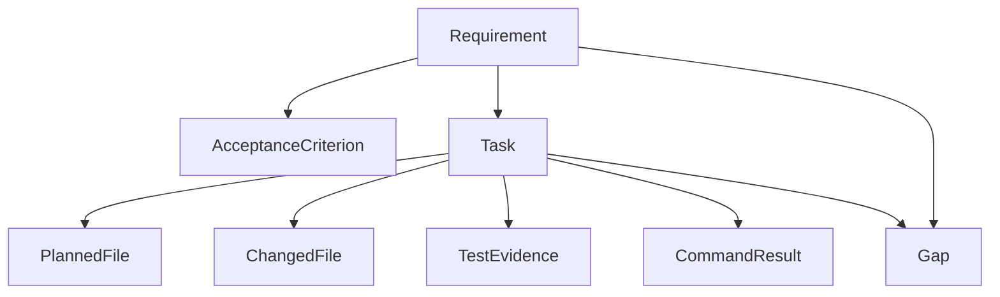
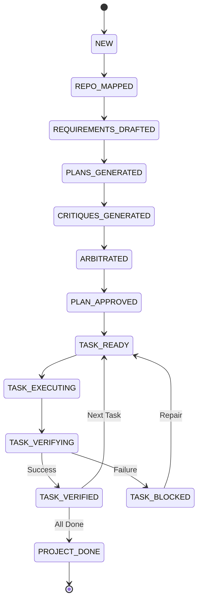

# DevCouncil: The Gated AI Orchestrator

[](LICENSE)
[](https://www.python.org/downloads/)
[](https://github.com/astral-sh/uv)

**"DevCouncil should not merely generate code. It should make AI-generated work prove that it satisfied the original intent."**

DevCouncil is a high-integrity, command-line orchestration platform for AI-assisted software development. It transforms AI implementation from a "black box" generation task into a formal, transparent engineering workflow. By enforcing strict **staff-engineer-style execution gates**, DevCouncil ensures that every line of generated code is authorized, tested, and traces back to a verified requirement.

---

## 🧐 What DevCouncil Is

DevCouncil is a gated orchestrator for AI-assisted software development. It is not trying to replace every coding agent; it is trying to make AI-generated code auditable and reliable.

It operates in three primary modes:

1.  **Manual Sidecar Mode** (Available)
    DevCouncil creates constrained task prompts. You paste them into **Claude Code**, **Cursor**, **Aider**, or **Codex**. DevCouncil then verifies the resulting diff and logs.
2.  **Executor Adapter Mode** (Experimental)
    DevCouncil invokes external executors such as **OpenHands** or **mini-SWE-agent**, manages their workspace, and validates their output against project gates.
3.  **Native Agent Mode** (Experimental)
    DevCouncil runs its own internal tool-loop with strict file-system and command permissions to implement tasks directly.

---

## 🛑 The Problem: Why DevCouncil Exists

Standard AI coding agents often suffer from **Context Erosion** and **Verification Theater**. They are excellent at generating the "happy path" but fail in expensive ways when complexity grows:
- **Requirement Omission**: Agents frequently lose track of original PRD constraints after several chat turns.
- **Architecture Drift**: They may change fundamental design patterns or add dependencies without explicit authorization.
- **Unverified Success**: Agents often report "All tests passed" without proving that the *new* logic was actually exercised.
- **Hidden Assumptions**: Critical architectural decisions are often buried in transient chat history rather than being logged.

**DevCouncil makes evidence—not LLM "vibes"—the final authority.**

---

## 🤖 Using DevCouncil with Claude Code

DevCouncil is designed to run as a high-integrity "wrapper" around your active Claude Code session.

```bash
# 1. Plan the implementation
dev plan "Add password reset with expiring single-use tokens"

# 2. Get the specific instructions for the first task
dev prompt TASK-001
```

**Paste the generated TASK-001 prompt into Claude Code.**

After Claude Code modifies the repository:

```bash
# 3. Verify the changes against the task constraints
dev verify TASK-001

# 4. If verification finds gaps, generate repair instructions
dev repair
```

In this mode, Claude Code performs the implementation while DevCouncil owns the **Task Graph**, **Constraints**, **Gap Detection**, and **Evidence Reporting**.

---

## ⚖️ How DevCouncil Differs from Sage

**Sage** reviews an active coding-agent session and provides critique cards to help the developer course-correct.

**DevCouncil** focuses on **gated execution**:
- It creates a persistent **Requirement → Task → Diff → Evidence** graph.
- It **blocks** task completion when required evidence is missing.
- It detects **Orphan Diffs** and unauthorized architectural changes.
- It produces a formal, deterministic **Evidence Report** for the final implementation.

*Sage asks: "Is this agent response good?" — DevCouncil asks: "Can this task prove it satisfied the requirement?"*

---

## 🔄 The Gated Orchestration Flow

DevCouncil implements a 7-phase "Software Team" workflow:

1.  **Goal Analysis**: Deep indexing and deterministic repository mapping.
2.  **Requirements Drafting**: Extracting explicit functional requirements and acceptance criteria.
3.  **The Council Debate**:
    - **Planner A (Pragmatic Tech Lead)**: Optimizes for simplicity and minimal dependencies.
    - **Planner B (Production Architect)**: Focuses on security, performance, and failure modes.
    - **Cross-Critique**: Agents audit each other's plans to find omissions or risks.
    - **Arbitration**: An **Arbiter** compiles a final, unified task graph in SQLite.
4.  **Gated Execution**: Tasks are scoped with allowed files and authorized commands.
5.  **Deterministic Verification**: A 12-step audit engine checks for side effects and secret leaks.
6.  **Repair Loop**: Blocking gaps are automatically converted into focused repair tasks.
7.  **Evidence Reporting**: A final release-ready matrix proving requirement coverage.

---

## 📐 Visual Architecture

### Artifact Graph (Data Lineage)


### Gating State Machine (Workflow Lifecycle)


---

## 📊 Project Status

DevCouncil is early-stage and under active development.

| Area | Status |
| :--- | :--- |
| **CLI & Storage** | ✅ Working (SQLite + SQLModel) |
| **Artifact Graph** | ✅ Working (Coverage Engine) |
| **Council Debate** | ✅ Working (Multi-Agent Planning) |
| **Manual Executor** | ✅ Working (Sidecar Mode) |
| **Security Scanning** | ✅ Working (Secret Redaction & Detection) |
| **Repair Loop** | ✅ Working (LLM-Driven Inference) |
| **Native Executor** | ⚠️ Experimental |
| **MCP Server** | ⚠️ Experimental / Starter |
| **Claude Code Hooks** | 📅 Planned |
| **GitHub PR Checks** | 📅 Planned |

---

## 🛠 Installation

### From Source
```bash
git clone https://github.com/bharathvbcr/DevCouncil.git
cd DevCouncil
uv tool install --force .
```

### For Development
```bash
uv sync
uv run dev status
```

**Command Aliases:**
DevCouncil installs two aliases: `dev` and `devcouncil`. Use `devcouncil` if `dev` conflicts with another tool on your system.

---

## 📖 CLI Command Reference

```bash
dev init                    # Initialize DevCouncil in a repo
dev doctor                  # Check dependencies and environment
dev map "goal"              # Map repo context for a goal
dev plan "goal"             # Run the full planning council debate
dev status                  # Show current project state and cost
dev tasks                   # List planned tasks and statuses
dev show TASK-001           # Show task details and constraints
dev prompt TASK-001         # Generate prompt for an external agent
dev run TASK-001            # Execute task via selected executor
dev verify TASK-001         # Verify diff, commands, and evidence
dev repair                  # Generate repair tasks from gaps
dev report                  # Generate final evidence report
dev rollback TASK-001       # Revert changes using task checkpoint
dev artifacts validate      # Validate stored artifact integrity
dev config                  # Inspect or update configuration
```

---

## 🛡️ Security Model

DevCouncil is designed to minimize unsafe agent behavior:
- **Redaction**: Automatically strips secrets and API keys before sending context to LLMs.
- **Permission Guard**: Prevents agents from accessing `.git`, `.env`, or sensitive credentials.
- **Allowlist Enforcement**: Restricts writes to task-approved files and commands to a safe subset.
- **Local Sovereignty**: All project state, logs, and artifacts are stored locally in `.devcouncil/`.

*Note: DevCouncil provides gates and evidence to make risky changes easier to detect; it does not replace human security review.*

---

## 🙏 Acknowledgements & Inspirations

DevCouncil is built on the collective wisdom of the open-source agentic community:
- **[karpathy/llm-council](https://github.com/karpathy/llm-council)**: For the multi-LLM peer-review pattern.
- **[GPT Pilot](https://github.com/Pythagora-io/gpt-pilot)**: For the "Software Team" role-based concept.
- **[OpenHands](https://github.com/All-Hands-AI/OpenHands)**: For robust agent workspace and tool-loop management.
- **[mini-SWE-agent](https://github.com/SWE-agent/mini-swe-agent)**: For lightweight execution loop inspiration.
- **[abhigyanpatwari/GitNexus](https://github.com/abhigyanpatwari/GitNexus)**: For structural codebase awareness.
- **[safishamsi/graphify](https://github.com/safishamsi/graphify)**: For knowledge graph and multi-agent coordination.

---

## 📜 License
Licensed under the **Apache License, Version 2.0**. See [LICENSE](LICENSE) for details.

---
**"Trust the model, but verify the graph."**
