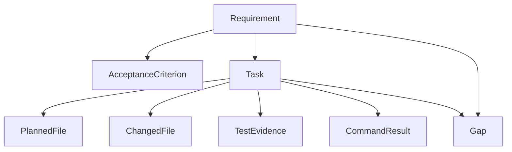
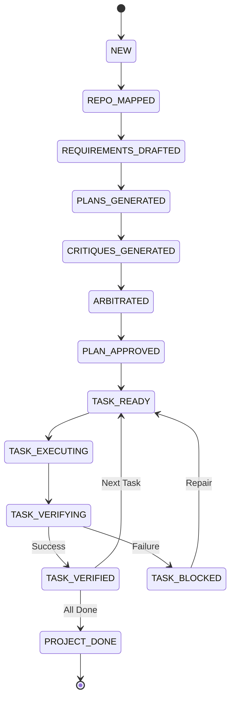

# DevCouncil

Gated orchestrator for AI-assisted software development.

DevCouncil ensures that AI-generated work proves it satisfied the original intent by enforcing strict staff-engineer-style execution gates. It maps requirements to deterministic tasks, patches, and evidence via a persistent Artifact Graph.

## Features

- **Planning Council**: Multi-agent LLM debate for planning and critique.
- **Execution Adapters**: Native, OpenHands, mini-SWE-agent, and manual task execution.
- **Verifier**: Deterministic gates detecting orphan diffs, missing test evidence, and architecture drift.
- **Security Scanning**: Automated secret redaction and detection.
- **MCP Server**: Expose DevCouncil status and tasks to MCP-compatible LLM tools like Claude Code and Cursor.

## Visual Architecture

### Artifact Graph
The core data structure that ensures every line of code traces back to a requirement.



### Gating State Machine
The deterministic workflow that manages the implementation lifecycle.



## Documentation

- [Architecture & Orchestration](docs/architecture.md)
- [Artifact Graph](docs/artifact-graph.md)
- [Gating Policy](docs/gating-policy.md)

## Installation

Recommended global CLI install:

```bash
uv tool install --force .
devcouncil --help
```

From a local checkout on Windows:

```powershell
.\scripts\install.ps1
devcouncil --help
```

From a local checkout on macOS/Linux:

```bash
./scripts/install.sh
devcouncil --help
```

If you prefer npm-style project commands, the repo also exposes wrappers that delegate to `uv`:

```bash
npm run install:dev
npm run test
npm run lint
```

For editable development installs:

```bash
uv pip install -e .
# or
npm run install:editable
uv run devcouncil --help
```

## Usage

Initialize a project:
```bash
devcouncil init
```

Generate an execution plan for a goal:
```bash
devcouncil plan "Add password reset with single-use expiring tokens"
```

Check the status and artifact graph:
```bash
devcouncil status
devcouncil tasks
devcouncil report
```

Execute and verify a task:
```bash
devcouncil run TASK-001 --executor native
devcouncil verify TASK-001
devcouncil repair
```

## MCP Server
Run the DevCouncil MCP Server via stdio to expose tasks and status to other AI tools:
```bash
uv run python -m devcouncil.integrations.mcp.server
```
