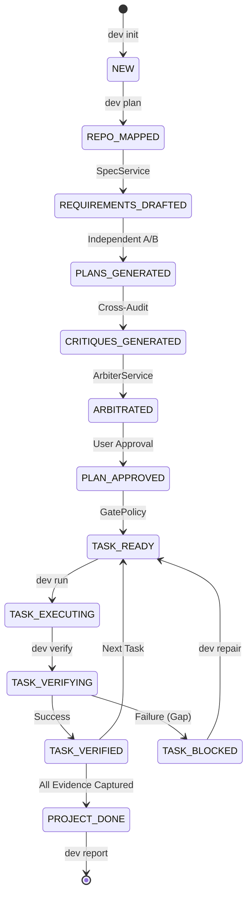

# DevCouncil: The Gated AI Orchestrator

[](LICENSE)
[](https://www.python.org/downloads/)
[](https://github.com/astral-sh/uv)

**"DevCouncil should not merely generate code. It should make AI-generated work prove that it satisfied the original intent."**

DevCouncil is a high-integrity, command-line orchestration platform for AI-assisted software development. Unlike traditional "chat-and-code" agents that prioritize generation speed over correctness, DevCouncil treats AI implementation as a formal engineering process. It enforces a rigorous team-based workflow—complete with spec writers, architects, hostile critics, and deterministic verification gates—to ensure that every line of generated code is authorized, tested, and traceable.

---

## 🛑 The Problem: The "Happy Path" Trap
Current AI coding agents are incredibly powerful but often fail in subtle, expensive ways:
*   **Context Erosion**: They lose the original PRD requirements after several turns of chat.
*   **Unauthorized Side Effects**: They modify unrelated files or introduce "architecture drift" without justification.
*   **Verification Theater**: They report "tests passed" without proving that the specific new requirement was actually exercised.
*   **Implicit Assumptions**: Critical architectural decisions are hidden in chat history rather than documented.

**DevCouncil solves this by enforcing staff-engineer-style execution gates.** It refuses to call a task "done" until the implementation evidence (diffs, command logs, and test results) deterministically satisfies the requirement's acceptance criteria.

---

## 🔄 The Multi-Agent Orchestration Flow

DevCouncil implements a sophisticated 7-phase implementation lifecycle designed to stress-test plans before a single line of code is written.

### 1. Repository Mapping & Deep Indexing
The orchestrator performs a deterministic scan of your repository using `git` and `ripgrep`. It detects languages, frameworks, package managers, and ranks "candidate files" based on your goal to provide the models with a high-fidelity context window without token bloat.

### 2. Requirements & Assumption Drafting
A specialized **Spec Writer** agent extracts explicit functional requirements and acceptance criteria. Simultaneously, an **Assumption Extractor** logs architectural assumptions (e.g., "Using existing DB schema"), ensuring these decisions are tracked as first-class citizens.

### 3. The Council Debate (Planner A vs. Planner B)
To avoid single-model bias, DevCouncil spawns a "Council":
*   **Planner A (Pragmatic Tech Lead)**: Optimizes for the simplest, most maintainable implementation with minimal dependencies.
*   **Planner B (Production Architect)**: Focuses on security, performance, edge cases, and robust failure modes.
*   **Cross-Critique**: Agent A attacks Plan B, and Agent B attacks Plan A, hunting for omissions or risks.
*   **Rebuttal & Arbitration**: The planners defend their decisions, and an **Arbiter** (Engineering Manager) compiles a final, unified task graph.

### 4. Gated Execution
Tasks are dispatched to execution adapters. Every task is constrained by:
*   **Allowed Files**: Only specific paths authorized during planning can be modified.
*   **Authorized Commands**: Only approved test/build commands can be executed.
*   **Safety Checkpoints**: Automated Git snapshots are taken before and after every execution for instant rollback.

### 5. Deterministic Verification
The **Verifier** engine runs a 12-step audit of the implementation:
*   **Orphan Diff Detection**: Blocks the task if any unauthorized files were touched.
*   **Secret Scanning**: Scans for API keys and tokens using the `SecretScanner`.
*   **Command Gating**: Ensures all unit and integration tests pass with zero exit codes.
*   **LLM Implementation Review**: A final audit where an LLM reviews the actual diff against the original requirement.

### 6. The Repair Loop
If verification fails, DevCouncil doesn't just error out. It generates **Intelligent Repair Tasks**. These tasks provide the agent with the exact verification failure evidence, allowing it to close the "gap" in a focused sub-sprint.

### 7. Evidence Reporting
Final implementation is exported as a comprehensive **Evidence Report (Markdown/JSON)**, mapping every Requirement to a Task, a Diff, and a passing Test Result.

---

## ✨ Key Features & Components

### 🧠 The Artifact Graph
The core engine of DevCouncil. It is a persistent, directed graph stored in SQLite that tracks the lineage of your project:
`Requirement -> Acceptance Criterion -> Task -> Planned File -> Changed File -> Command Result -> Test Evidence -> Gap`.

### 🛡️ Security Guardrails
*   **Permission Manager**: A strict allowlist system that prevents AI agents from accessing `.git`, `.env`, or sensitive directories.
*   **Secret Redaction**: Pre-processes all repo data to strip sensitive patterns before sending them to LLM providers.
*   **Command Allowlist**: Restricts agents to a safe subset of shell commands (e.g., `pytest`, `npm test`).

### 🔌 Multi-Model Routing
Built-in support for **OpenRouter**, allowing you to assign different models to different roles based on their strengths (e.g., Claude 3.5 Sonnet for planning, GPT-4o for critique).

### 🤖 Executor Adapters
*   **Native**: A built-in "thought-action-observation" loop with `apply_patch` and `read_file` capabilities.
*   **OpenHands & mini-SWE-agent**: Full integration with leading autonomous agent frameworks.
*   **Manual**: Generates high-context Markdown prompts for use in Cursor, Aider, or VS Code.

### 📡 MCP Server
DevCouncil acts as a **Model Context Protocol** server. You can connect it to Claude Desktop or Cursor to let your external agent "check-in" with the DevCouncil state machine and verify its work against the artifact graph.

---

## 📐 Visual Architecture

### The State Machine Lifecycle
DevCouncil manages the project through a series of deterministic state transitions.



---

## 🛠 Installation

### Prerequisites
*   Python 3.12 or higher.
*   [uv](https://github.com/astral-sh/uv) (recommended for dependency management).
*   `git` and `ripgrep` installed on your system.

### Global Installation
```bash
uv tool install --force .
devcouncil --help
```

### Local Development Setup
```bash
git clone https://github.com/bharathvbcr/DevCouncil.git
cd DevCouncil
uv venv
uv pip install -e .
```

---

## 📖 Deep-Dive Usage Guide

### 1. Initialize Your Workspace
```bash
devcouncil init --name "MySecureProject"
```
This creates `.devcouncil/` containing `config.yaml` and the `state.sqlite` database.

### 2. Run a Planning Council
```bash
devcouncil plan "Add a robust password reset flow with hashed tokens"
```
*Tip: Use `--dry-run` to see the flow without making actual LLM calls.*

### 3. Track Implementation Health
```bash
devcouncil status  # High-level overview of gaps and costs
devcouncil tasks   # List the implementation graph
devcouncil show TASK-001  # Detailed requirements for a task
```

### 4. Safe Execution & Verification
```bash
# Execute using the internal native agent
devcouncil run TASK-001 --executor native

# Verify the work against the gates
devcouncil verify TASK-001

# If blocked, generate repair tasks
devcouncil repair
```

### 5. Generate Proof of Work
```bash
devcouncil report --json > coverage-report.json
```

---

## 📚 Technical Documentation
*   [Detailed Architecture & Orchestration](docs/architecture.md)
*   [Understanding the Artifact Graph](docs/artifact-graph.md)
*   [Gating Policies & Verification Logic](docs/gating-policy.md)
*   [Developing New Executor Adapters](docs/executor-adapters.md)
*   [Model Routing & Role Configuration](docs/model-routing.md)

---

## 📜 License
Licensed under the **Apache License, Version 2.0**. See the [LICENSE](LICENSE) file for details.

---

**Built for developers who demand evidence-based AI implementation.**
"Trust the AI, but verify the graph."
