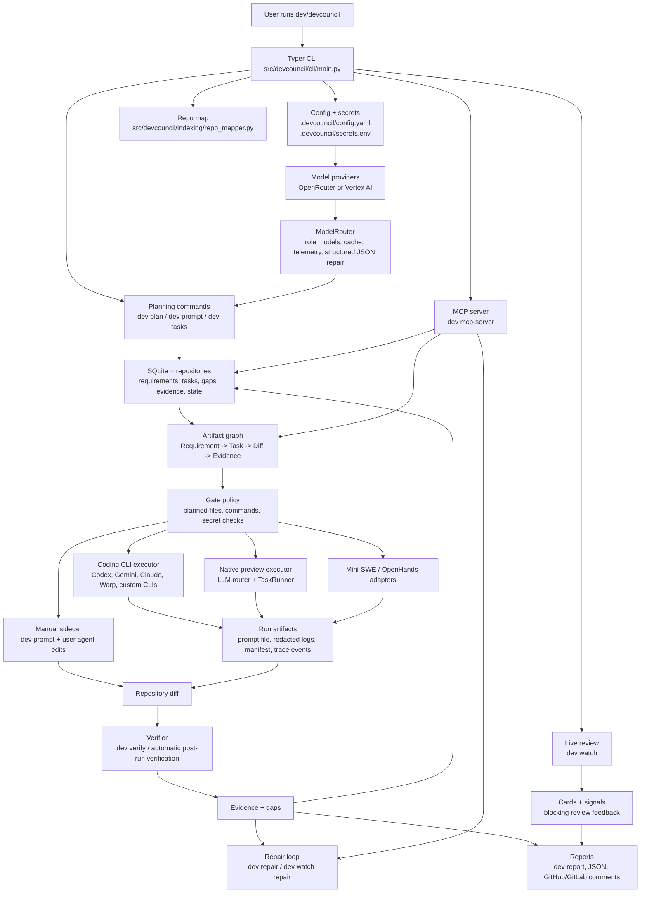

# DevCouncil: The Gated AI Orchestrator

[](LICENSE)
[](https://www.python.org/downloads/)
[](https://github.com/astral-sh/uv)

**"DevCouncil should not merely generate code. It should make AI-generated work prove that it satisfied the original intent."**

DevCouncil is a high-integrity command-line orchestration platform for AI-assisted software development. It turns AI implementation from a black-box generation task into a gated engineering workflow where every change is authorized, verified, and traceable back to a requirement.

DevCouncil does not replace coding agents. It sits beside tools like Codex CLI, Gemini CLI, Claude Code, Warp/Oz, Cursor, Aider, and bring-your-own prompt-taking CLIs, then owns the plan, task scope, verification loop, repair prompts, and evidence trail.

## Documentation

- [Quickstart](docs/quickstart.md): shortest install-to-first-task path.
- [Daily workflow](docs/workflow.md): manual sidecar loop, verification, repair, and rollback.
- [Coding CLI integration](docs/coding-cli-integration.md): Codex, Gemini, Claude Code, Cursor, Aider, MCP, hooks, and automated executors.
- [CLI command reference](docs/cli-reference.md): available `dev` commands.
- [Architecture](docs/architecture.md): components, artifact graph, state machine, and gated execution.
- [Executor adapters](docs/executor-adapters.md): manual, coding CLI, native-preview, Mini-SWE, and OpenHands execution paths.
- [Live review](docs/live-review.md): `dev watch` session review, cards, signals, and blocking behavior.
- [Model routing](docs/model-routing.md): provider selection, role models, OpenRouter, and Vertex AI setup.
- [Security model](docs/security.md): redaction, permissions, allowlists, and local state.
- [Project status](docs/project-status.md): current maturity by subsystem.
- [Roadmap](docs/roadmap.md): planned work.

## Why DevCouncil Exists

Standard AI coding agents are good at producing the happy path, but they often fail in expensive ways when complexity grows:

- **Requirement omission:** agents lose track of original product or PRD constraints across chat turns.
- **Architecture drift:** agents add dependencies or change design patterns without explicit authorization.
- **Unverified success:** agents claim tests passed without proving that the new logic was exercised.
- **Hidden assumptions:** important decisions stay buried in transient chat history instead of durable project artifacts.

**DevCouncil makes evidence, not model confidence, the final authority.**

It creates a persistent **Requirement -> Task -> Diff -> Evidence** graph, blocks completion when evidence is missing, detects unauthorized changes, and produces a final report that can be reviewed like an engineering artifact.

## Quickstart

Run DevCouncil commands in a normal terminal from the root of the repository you want DevCouncil to manage. Do not run these commands inside a coding CLI chat.

Install `uv` first if it is missing:

```powershell
powershell -ExecutionPolicy ByPass -c "irm https://astral.sh/uv/install.ps1 | iex"
```

On macOS or Linux:

```bash
curl -LsSf https://astral.sh/uv/install.sh | sh
```

Install DevCouncil from npm:

```bash
npm install -g devcouncil
devcouncil --help
dev --help
```

Start the first gated workflow from your target repository:

```bash
cd path/to/your/project
dev setup
dev plan "Describe the implementation goal"
dev tasks
dev run TASK-001 --executor manual
dev prompt TASK-001
dev verify TASK-001
```

On a fresh interactive setup, DevCouncil can configure supported coding CLI integrations immediately; pass `--skip-integrations` if you want to defer that step.

Paste only the output from `dev prompt TASK-001` into Codex, Gemini, Claude Code, Warp, Cursor, Aider, or another coding tool. Keep `dev setup`, `dev plan`, `dev run`, and `dev verify` in the terminal at the repository root.

For an automated end-to-end run with a supported coding CLI installed:

```bash
dev e2e "Describe the implementation goal" --executor codex
dev e2e "Describe the implementation goal" --executor warp
dev go "Describe the implementation goal" --executor codex
```

`dev e2e` is the explicit one-command integration target for coding agents. It initializes local DevCouncil state if needed, plans the goal, runs each approved task through the selected executor, verifies the resulting diff, and prints the final report. If `--executor` is omitted, DevCouncil uses `execution.default_executor` from `.devcouncil/config.yaml`. `dev go` is kept as a shorter alias for the same flow.

For machine-readable agent handoff, write the final report to a stable file:

```bash
dev e2e "Describe the implementation goal" --executor codex --agent
dev e2e "Describe the implementation goal" --executor codex --json --report-file .devcouncil/reports/latest.json
```

`--agent` enables JSON output and writes `.devcouncil/reports/latest.json`. Fresh projects default to manual sidecar mode, so pass an automated executor or set `execution.default_executor` before using `dev e2e` without `--executor`.

See the full [quickstart](docs/quickstart.md) for installation variants, API-key setup, and first-run guidance.

Register any local CLI that accepts prompts. `dev agents` is the first-class agent hub; `dev integrate cli-agent` remains available for older scripts:

```bash
dev agents add opencode --command opencode --arg run --input-mode prompt-file --prompt-arg=--prompt-file --supports-mcp
dev agents
dev agents doctor
dev agents run TASK-001 --agent opencode --profile default
```

## Current Code Surface

The current implementation includes these repository changes:

- **CLI composition:** `dev`/`devcouncil` now exposes stable daily commands plus preview integration surfaces including `dev agents`, `dev integrate warp`, `dev integrate cli-agent`, `dev config models`, `dev artifacts validate`, `dev watch`, `dev trace`, `dev mcp-server`, `dev lsp`, `dev ast`, and `dev dashboard`.
- **Agent execution:** built-in coding CLI adapters cover Codex, Gemini, Claude Code, and Warp/Oz. Custom prompt-taking CLIs can be registered with stdin, argument, or prompt-file handoff, execution profiles, environment overrides, help checks, MCP capability flags, and diff-review metadata.
- **Executor verification:** coding CLI runs write task prompts, redacted logs, run manifests in `.devcouncil/runs/<run-id>/agent-run.json`, trace start/finish/failure events, capture post-run diffs, and automatically run DevCouncil verification.
- **Model routing:** model defaults moved into packaged YAML resources, `dev init`, `dev setup`, and `dev config models` can set shared or per-role models, and providers now include OpenRouter plus Vertex AI through Google Cloud access tokens.
- **Configuration and setup:** fresh projects default to manual sidecar execution, setup can preview or apply coding CLI integrations, Vertex AI project/location can be stored in local secrets, and provider switches preserve custom role model overrides.
- **Repo mapping:** `dev map` writes `.devcouncil/repo_map.json`, filters generated/temp files, emits subsystem navigation metadata, and keeps managed `AGENTS.md` / `CLAUDE.md` workspace guides synchronized.
- **MCP and live review:** MCP handlers validate required arguments more defensively, live review cards/signals use stable schemas and SHA-256 IDs, and status/report output includes live-review blockers.
- **Telemetry and packaging:** model pricing moved into a packaged YAML resource shared by telemetry and cost estimation; npm and wheel smoke checks now verify packaged assets and installed CLI startup.
- **Type and test hardening:** mypy is part of local and release checks, SQLModel repository deletes use typed column expressions, stored domain objects are rebuilt through Pydantic validation, and unit coverage was expanded around CLI commands, executors, model routing, MCP, repo mapping, and pricing.

## Core Flow

DevCouncil's recommended default is **Manual Sidecar Mode**:

1. DevCouncil plans the work and creates a task graph.
2. You ask DevCouncil for one constrained task prompt.
3. You paste that prompt into your coding CLI or agent.
4. The agent edits the repository.
5. DevCouncil verifies the resulting diff against task constraints.
6. If verification fails, DevCouncil creates a focused repair loop.

The detailed task-by-task workflow lives in [docs/workflow.md](docs/workflow.md).

## How The Repo Runs



## Install From Source

For local development inside this checkout:

```bash
uv sync
uv run dev --help
```

For a global install from this repository:

```bash
uv tool install --force .
dev --help
devcouncil --help
```

## Project Shape

DevCouncil implements a 7-phase software-team workflow:

1. Goal analysis and repository mapping.
2. Requirements drafting.
3. Council debate and task arbitration.
4. Gated execution with scoped files and commands.
5. Deterministic verification.
6. Repair-loop generation.
7. Evidence reporting.

Read [docs/architecture.md](docs/architecture.md) for the artifact graph, gating state machine, and component layout.

## Contributions

Project ideas and execution patterns come from the open-source ecosystem:

- [Sage](https://github.com/usetig/sage): peer-review-first model for planning and critique.
- [karpathy/llm-council](https://github.com/karpathy/llm-council): for the multi-LLM peer-review pattern.
- [GPT Pilot](https://github.com/Pythagora-io/gpt-pilot): for role-based software-team concept.
- [astral-sh/uv](https://github.com/astral-sh/uv): for reproducible Python package/runtime workflows.
- [OpenHands](https://github.com/All-Hands-AI/OpenHands): for workspace-aware agent execution patterns.
- [mini-SWE-agent](https://github.com/SWE-agent/mini-swe-agent): for lightweight execution loop inspiration.
- [SWE-agent](https://github.com/SWE-agent/SWE-agent): for full-spectrum autonomous SWE-style tasking patterns.
- [GitNexus](https://github.com/abhigyanpatwari/GitNexus): for structural codebase awareness.
- [graphify](https://github.com/safishamsi/graphify): for knowledge-graph-based coordination concepts.

## License

Licensed under the **Apache License, Version 2.0**. See [LICENSE](LICENSE) for details.

---

**"Trust the model, but verify the graph."**
