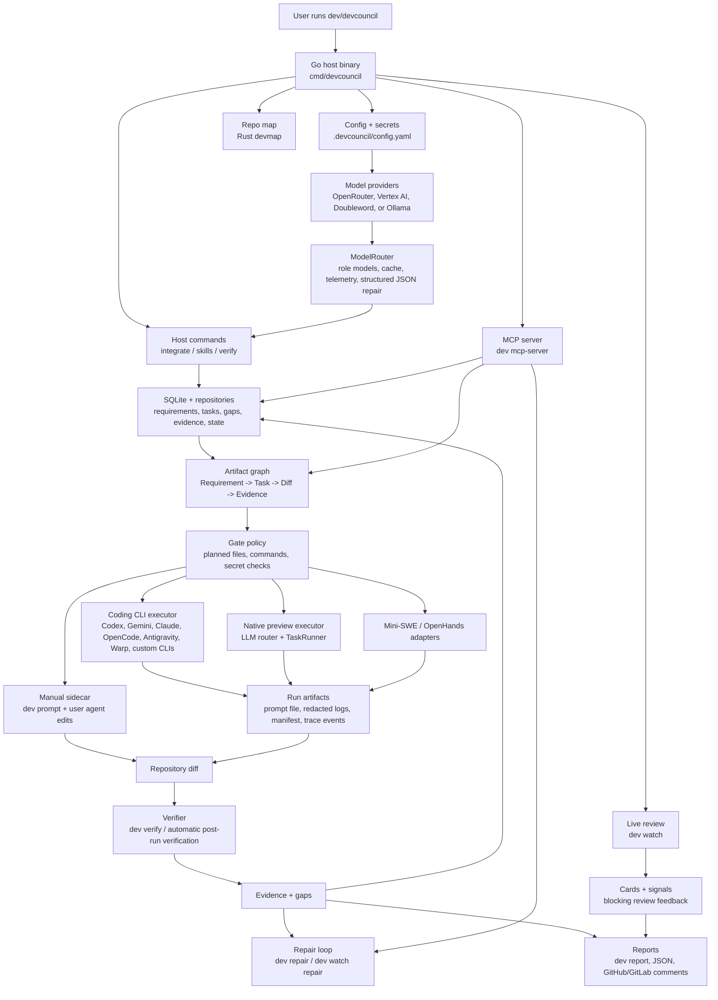

# DevCouncil: components for gated AI development

**Plugin contract (Phase 7):** standalone binaries on PATH —

| Binary | Language | Owns |
|--------|----------|------|
| `devmap` | Rust | Code graph, guides, DevMap skills/mdc, DevMap MCP |
| `devcouncil` | Go | Host MCP (lease/verify/diff), `integrate`, domain `skills`, `verify` |
| `dcstore` | Rust | Tasks, leases, evidence, gaps, verification runs |

Wrappers: **Manvi** (agent harness / LLM / TUI) imports the Go module and spawns
binaries; **GitPulse** vendors DevMap crates for IDE mediation.

Python is **not** the live map engine. Tests, benchmarks, and language fixtures
may still be Python; the product CLI is Go (`dev` / `devcouncil`) and Rust
(`devmap`). Decisions: [docs/PHASE7_LONG_TAIL.md](docs/PHASE7_LONG_TAIL.md).

```bash
# Install / build binaries (examples)
cargo install --path rust-port/crates/devmap-cli   # → devmap
cargo install --path rust-port/crates/dc-store     # → dcstore (see crate README)
go -C backend/go_orchestrator build -o ~/.local/bin/devcouncil ./cmd/devcouncil
ln -sf devcouncil ~/.local/bin/dev   # same Go binary as `dev`

devmap build --manifest
devcouncil integrate cursor --apply
devcouncil skills scaffold --skill core-engineering
devcouncil mcp   # stdio MCP
```

---

# Legacy README (pre–Phase 7 narrative)

> Social preview asset was removed with the Python `assets/` package. Prefer the
> binary table above.

[](https://devcouncil.vbcr.dev/)
[](https://github.com/bharathvbcr/DevCouncil/actions/workflows/ci.yml)
[](https://www.npmjs.com/package/devcouncil)
[](LICENSE)

<p align="center">
  <a href="https://devcouncil.vbcr.dev/"><strong>Explore the Interactive Architecture &amp; Code Graph Showcase (devcouncil.vbcr.dev) &rarr;</strong></a>
</p>

**"DevCouncil should not merely generate code. It should make AI-generated work prove that it satisfied the original intent."**

DevCouncil is a high-integrity command-line orchestration platform for AI-assisted software development. It turns AI implementation from a black-box generation task into a gated engineering workflow where every change is authorized, verified, and traceable back to a requirement.

DevCouncil does not replace coding agents. Its primary native path is Claude Code, followed by Codex CLI; it also works beside OpenCode, Google Antigravity CLI, Warp/Oz, Cursor, Aider, and bring-your-own prompt-taking CLIs. It owns the plan, task scope, verification loop, repair prompts, and evidence trail.

### Quick Demo

DevCouncil supports macOS, Linux, and Windows. Requires a Go toolchain (for `dev` / `devcouncil`), Rust/`cargo` (for `devmap` and the other analysis binaries), and Git. Node.js 18+ is only needed for the optional npm shim. No model provider key is needed for the commands below:

```bash
# Install the Go host binary and analysis components from a checkout:
bash scripts/install.sh
devcouncil --help
dev --help

# npm is a Node shim only — it does not install the binaries:
npm install -g devcouncil
# then still install Go/Rust binaries as above

# Map / graph (Rust `devmap` via the shim or `devcouncil map`)
dev map
```

Checkout fallback: clone the repo and run `bash scripts/install.sh`. There is no Python/`uv` launcher. The old `devcouncil-build-week-demo` / `dev check --verify` path was retired with the Python package.

See [docs/build-week-demo.md](docs/build-week-demo.md) for the provider-free demo walkthrough.

## Documentation

- [Provider-free demo](docs/build-week-demo.md): red-to-green evidence gate walkthrough.
- [Quickstart](docs/quickstart.md): shortest install-to-first-task path.
- [Daily workflow](docs/workflow.md): manual sidecar loop, verification, repair, rollback, and `dev watch`.
- [Coding CLI integration](docs/coding-cli-integration.md): tiers, Claude Code, Codex, OpenCode, Antigravity, Cursor, Grok Build, Aider, MCP, hooks, stop gate / claim checks, and automated executors (Gemini deprecated).
- [CLI command reference](docs/cli-reference.md): available `dev` commands.
- [Repo map & code graph](docs/code-graph.md): `dev map` (alias `dev graph`) -- navigation, dead code, blast radius, PDG (opt-in), HTML visualizer, and the in-progress Rust `devmap` engine.
- [Rust map engine](rust-port/README.md): clean-room `devmap` rewrite of `dev map` -- crate layout, build, and the [status ledger](rust-port/STATUS.md).
- [Corpus side index](docs/corpus.md): `dev corpus` for docs/PDFs/images and optional verify gates.
- [Hero loop](docs/hero-loop.md): certified Claude Code + MCP closed loop, leases, rigor, and `dev check --verify` on-ramp.
- [Architecture](docs/architecture.md): components, artifact graph, state machine, gating policy, and gated execution.
- [Model routing](docs/model-routing.md): provider selection, role models, OpenRouter, Vertex AI, Doubleword, and Ollama (local) setup.
- [Security model](docs/security.md): redaction, permissions, allowlists, and local state.
- [Project status](docs/project-status.md): current maturity by subsystem and near-term focus.

## Why DevCouncil Exists

Standard AI coding agents are good at producing the happy path, but they often fail in expensive ways when complexity grows:

- **Requirement omission:** agents lose track of original product or PRD constraints across chat turns.
- **Architecture drift:** agents add dependencies or change design patterns without explicit authorization.
- **Unverified success:** agents claim tests passed without proving that the new logic was exercised.
- **Hidden assumptions:** important decisions stay buried in transient chat history instead of durable project artifacts.

**DevCouncil makes evidence, not model confidence, the final authority.**

It creates a persistent **Requirement -> Task -> Diff -> Evidence** graph, blocks completion when evidence is missing, detects unauthorized changes, and produces a final report that can be reviewed like an engineering artifact.

## Quickstart

Run DevCouncil commands in a normal terminal from the root of the repository you want DevCouncil to manage. Do not run these commands inside a coding CLI chat.

Install the native binaries (Go `devcouncil` / `dev`, Rust `devmap`):

```powershell
# Windows
.\scripts\install.ps1
```

On macOS or Linux:

```bash
bash scripts/install.sh
```

The npm package is a Node shim that execs those binaries; it does not install Python:

```bash
npm install -g devcouncil
devcouncil --help
dev --help
```

Start the first gated workflow from your target repository:

```bash
cd path/to/your/project
dev setup
dev plan "Describe the implementation goal"
dev status                   # if AWAITING_USER_DECISIONS, run dev approve next
dev approve                  # when planning raised advisory gaps
dev tasks
dev run TASK-001 --executor manual
dev prompt TASK-001
dev verify TASK-001
```

On a fresh interactive setup, DevCouncil can configure supported coding CLI integrations immediately; pass `--skip-integrations` if you want to defer that step.

### Run locally on macOS (Apple Silicon + Ollama)

DevCouncil runs fully offline against [Ollama](https://ollama.com) — no API key, no per-token cost. It is Apple-Silicon-aware: `dev setup --provider ollama` sizes the default local model to your Mac's unified memory, and `dev doctor` reports the chip/RAM, pings the Ollama server, and flags a too-small context window.

```bash
brew install ollama && ollama serve
ollama pull qwen2.5-coder:32b     # use the size `dev doctor` recommends for your RAM
export OLLAMA_NUM_CTX=16384       # large planning prompts need a raised context window
dev setup --provider ollama      # auto-selects the model for your RAM
```

See [Model routing → macOS / Apple Silicon](docs/model-routing.md) for the RAM-to-model table.

Paste only the output from `dev prompt TASK-001` into Codex, Gemini, Claude Code, OpenCode, Antigravity, Warp, Cursor, Aider, or another coding tool. Keep `dev setup`, `dev plan`, `dev run`, and `dev verify` in the terminal at the repository root.

For an automated end-to-end run with a supported coding CLI installed:

```bash
dev e2e "Describe the implementation goal" --executor codex
dev e2e "Describe the implementation goal" --executor antigravity
dev e2e "Describe the implementation goal" --executor warp
dev go "Describe the implementation goal" --executor codex
```

`dev e2e` is the explicit one-command integration target for coding agents. It initializes local DevCouncil state if needed, plans the goal, runs each approved task through the selected executor, verifies the resulting diff, and prints the final report. If `--executor` is omitted, DevCouncil uses `execution.default_executor` from `.devcouncil/config.yaml`. `dev go` is kept as a shorter alias for the same flow.

For machine-readable agent handoff, write the final report to a stable file:

```bash
dev e2e "Describe the implementation goal" --executor codex --agent
dev e2e "Describe the implementation goal" --executor codex --json --report-file .devcouncil/reports/latest.json
```

`--agent` enables JSON output and writes `.devcouncil/reports/latest.json`. Fresh projects default to manual sidecar mode, so pass an automated executor or set `execution.default_executor` before using `dev e2e` without `--executor`.

See the full [quickstart](docs/quickstart.md) for installation variants, API-key setup, and first-run guidance.

OpenCode and Google Antigravity CLI are built-in executors and MCP integrations:

```bash
dev integrate opencode --apply
dev run TASK-001 --executor opencode
dev agents run TASK-001 --agent opencode --profile default
dev integrate antigravity --apply
dev run TASK-001 --executor antigravity
dev agents run TASK-001 --agent agy --profile default
```

Register any other local CLI that accepts prompts. `dev agents` is the first-class agent hub; `dev integrate cli-agent` remains available for older scripts:

```bash
dev agents add myagent --command myagent --arg run --input-mode prompt-file --prompt-arg=--prompt-file --supports-mcp
dev agents
dev agents doctor
dev agents run TASK-001 --agent myagent --profile default
```

GEPA prompt-profile optimization is available for the agent hub:

```bash
dev agents optimize --agent codex --profile yolo --evals .devcouncil/evals/agent-profile.jsonl --dry-run
dev agents optimize --agent codex --profile yolo --evals .devcouncil/evals/agent-profile.jsonl --apply
```

## Feature Set

DevCouncil is an application layer around coding agents. It does not just emit prompts; it owns the workflow state, validates task scope, records evidence, and produces release-style reports.

### Workflow Features

All task, lease, scope, and quality-verification enforcement below is controlled
by `gates.mode`: `enforce` is the strict certified workflow, `advisory` records
quality findings without blocking, and `off` permits ordinary taskless work and
skips quality verification. Secret scanning, repository-root boundaries, and
dangerous-Git protections remain active in every mode.

- **Repository onboarding:** `dev setup` initializes `.devcouncil/`, generates the repo map + `AGENTS.md`/`CLAUDE.md` guides, scaffolds applicable engineering skills, runs environment checks, offers integration setup, and prints the next useful commands. Use `--skip-map` / `--skip-skills` to opt out, or `--scaffold-ci` to also write a starter GitHub Actions workflow. **`dev boot "goal"`** chains setup, `dev integrate --apply`, optional CI scaffold flags, and `dev go` in one command (see [quickstart](docs/quickstart.md)).
- **Repository mapping:** `dev map` writes `.devcouncil/repo_map.json` and a symbol-level `.devcouncil/graph/code_graph.json`, identifies important files and subsystems, filters generated/temp files, and keeps managed `AGENTS.md` / `CLAUDE.md` workspace guides synchronized. Subsystems, entry points, neighbors, and important surfaces are inferred generically for **any** repository — grouped from the directory tree and ranked by an import-graph in-degree. Freshness uses git HEAD, tracked-file hash, and a content fingerprint so plain edits mark the map stale; a **missing map is stale** (fail-closed on hard rigor). Post-tool-use hooks and `dev map --watch` refresh incrementally. Unified analyze entry: `dev map ingest`. Query with `dev map query|trace|dead|search|cypher|graph-html`. Liveness lists are capped at 5000 per list and 256 dependents per file (truncation metadata when hit). The map is also generated automatically on first init. (See [docs/code-graph.md](docs/code-graph.md) for details).
- **Rust map engine (`devmap`):** the live map is the seven-crate workspace under [`rust-port/`](rust-port/) (extract → resolve → analyze → store → query → serve → CLI). `dev map` / `dev graph` / `dev ast` exec `devmap`. Python remains a language DevMap indexes (fixtures + tree-sitter-python), not a product runtime.
  
  <p align="center">
    
  </p>
- **Engineering skills:** `dev skills` lists the bundled skills and shows which apply to the repository; `dev skills scaffold` installs them into `.claude/skills`, `.cursor/skills`, and `.agents/skills` for Claude Code, Cursor, and Codex. Repeat `--skill <name>` to select packaged skills explicitly, use `--destination .agents/skills` to select one host, and add `--check` for read-only verification. Installations preserve local edits and record content hashes for subsequent upgrades. The library includes general engineering, domain, and all five DevMap navigation/debugging skills. Applicable skills are also embedded into `dev prompt` output. See [skill delivery and verification](docs/DEVMAP_SKILL_DELIVERY.md).
- **CI scaffolding:** `dev scaffold-ci` writes a starter `.github/workflows/devcouncil.yml` derived from the configured test/lint/typecheck commands, filtered to the detected language stack; it never overwrites existing CI unless `--force`. Run `dev scaffold-ci --evidence` to generate `.github/workflows/devcouncil-evidence.yml` which automates verifying PRs and uploading evidence JSON and HTML reports.
- **Planning council:** `dev plan` turns a goal into requirements, acceptance criteria, assumptions, critique findings, and executable tasks. When advisory gaps remain, the project stays in `AWAITING_USER_DECISIONS` until you run `dev approve` (or `dev e2e`/`dev go --force`).
- **Task graph:** `dev tasks` and `dev show TASK-001` expose requirement links, acceptance-criterion links, planned files, expected tests, allowed commands, forbidden changes, dependencies, status, and active **lease** owners. Tasks can declare `depends_on`; the plan gate rejects unknown dependencies and cycles, and `dev go`/`dev e2e` run tasks in topological order and skip a task whose prerequisites didn't complete (rather than letting it fail spuriously and burn its repair budget). `dev tasks cancel`, `dev tasks edit`, and `dev tasks reprioritize` manage the live task graph without replanning.
- **Gap and requirements surfaces:** `dev gaps` lists blocking and advisory verification gaps project-wide; `dev requirements` summarizes requirement coverage and derived status; `dev export` writes a portable JSON snapshot of requirements, tasks, and gaps.
- **Scoped task prompts:** `dev prompt TASK-001` creates a constrained implementation prompt for sidecar agents, including file scope, verification expectations, and forbidden changes. The prompt now embeds the current (secret-redacted) contents of each planned file with a top-level symbol outline, structural orientation (from the code-review graph when available, otherwise the generated `repo_map.json`), and a **dependents (blast-radius) list** — the files that import each file being changed, from the map's precomputed reverse-import index — so the agent edits in place and keeps call sites working instead of starting blind. A central prompt budget keeps the core (goal/scope/instructions) always present and fits the optional context sections in priority order (file contents > structural > dependents > skills), dropping the lowest-priority ones with an explicit marker rather than overflowing silently.
- **Execution:** `dev run TASK-001` supports manual sidecar mode, built-in coding CLI executors, external executors, and registered custom CLI agents.
- **One-command flow:** `dev e2e "goal"` and `dev go "goal"` can initialize state, plan, run approved tasks, verify the diff, and generate a report. With an automated executor the run is now a **closed loop**: a task that fails verification is re-driven through a bounded self-repair loop (a correction manifest is written and the executor re-run) until it verifies or the `execution.max_repair_attempts` budget is spent, with no-progress detection that stops early when the same blocking gaps reappear.
- **Verification:** under `gates.mode=enforce`, `dev verify TASK-001` captures the diff, runs expected evidence commands, checks planned-file compliance, detects orphan changes, flags unplanned dependency edits, scans for secrets, and links evidence to acceptance criteria. An **empty diff cannot pass** an enforced task that declares files to create or modify. `advisory` runs the same quality checks without quality blockers; `off` skips them and reports completion as unverified while retaining hard-safety scanning.
- **Lite check:** `dev check --verify` runs the same deterministic evidence gate against the current working tree without planning or provider keys — useful for CI and quick audits. `dev check` without `--verify` performs an LLM audit of current changes. Run `dev check --watch` to start a fast, incremental check loop that selects and re-runs only the stack gates affected by changed files using an input-content hash cache.
- **Repair:** `dev repair` converts blocking gaps into focused follow-up work instead of leaving failures as vague test output.
- **Rollback:** `dev rollback TASK-001` uses task checkpoints to revert scoped work when a task needs to be backed out.
- **Codebase wiki:** `dev wiki update` generates and maintains an agent-facing wiki of the repository as an Open Knowledge Format bundle under `.devcouncil/knowledge/okf/wiki/` — an index, one cross-linked page per subsystem (entry points, roles, neighbors, handoff paths), a development guide, and a `log.md` change history. Pages are built deterministically from `repo_map.json` and, when a model is configured, enriched with LLM-written prose (overview, key flows, agent guidance) by the `wiki_writer` role; enrichment degrades cleanly to the skeleton. Updates are incremental (per-page fingerprints preserve prior enrichment), `dev map` refreshes stale skeletons automatically, `dev wiki status` reports freshness, and `dev wiki install-action` adds a GitHub Action that keeps the wiki current via automated PRs. Because the bundle lives under the knowledge directory, wiki pages are selected into planning/task prompts like any other OKF knowledge — tagged by subsystem so goals pull the right page.
- **Run supervision (Preview):** every automated run is a reversible object (Shepherd-style): `dev runs timeline <run-or-task>` joins the run manifest, trace events, and git checkpoints into one inspectable timeline; `dev runs diff` shows exactly what the run changed; `dev runs revert` reverses it from its checkpoints (and records the revert in the trace); and `dev runs supervise` asks a supervisor meta-agent (the `run_supervisor` role, with deterministic heuristics as fallback) for a keep/revert/repair verdict — add `--apply` on the CLI to act on a revert verdict. Over MCP, `devcouncil_run_timeline` and `devcouncil_run_supervise` expose the same inspection and verdict surfaces; MCP supervise is verdict-only (no workspace modify — use `dev runs revert` or CLI `--apply` separately).
- **Reporting:** `dev report` emits a requirements coverage table, evidence summary, blocking gaps, and live-review blockers; JSON, PR-comment, and interactive HTML report (`dev report --evidence-html PATH`) formats are available for automation.

### App Surfaces

- **CLI:** `dev` and `devcouncil` are the same Go host binary. The npm package is a Node shim that execs it (`map` / `graph` / `ast` exec Rust `devmap`). The Python/Typer launcher is gone.
- **Multi-agent campaigns:** `dev campaign run` executes a planned task graph as a parallel, dependency-aware multi-agent campaign (Director → Coordinator → Worker pool + Reviewer QC) with automatic file-overlap serialization, cost budgeting, ntfy push notifications, and a markdown progress dashboard at `.devcouncil/campaign/dashboard.md`. Roster and mailbox commands (`dev campaign roster` / `dev campaign inbox`) expose the role hierarchy and on-disk message bus.
- **Agent hub:** `dev agents` lists built-in and custom agents, `dev agents add` registers prompt-taking CLIs, `dev agents doctor` checks wiring, `dev agents run` executes a task through a named agent/profile, and `dev agents optimize` uses GEPA to tune profile preambles from offline eval examples.
- **Integration hub:** `dev integrate all --apply` configures supported coding CLI and MCP integrations in Claude-first, Codex-second order. `dev integrate matrix` reports each client's **capability posture**: `pre-action`, `advisory+verify`, or `verify-only`. `dev integrate check` verifies installed MCP/hook files (including Cursor/Grok assist vs `--write-gate`) rather than re-deriving the matrix.
- **MCP server:** `dev mcp-server` exposes DevCouncil context and workflow tools over stdio for MCP-capable clients. In `enforce`, write/patch/run tools require a task and valid lease and verification applies the full evidence contract. In `advisory`/`off`, `task_id` and leases are optional for ordinary write/patch/run calls; `off` skips quality verification. Hard-safety checks still run. Read-only resources and provenance remain available in every mode.
- **Live review:** `dev watch` tracks review cards, signals, blocking feedback, and repair guidance while a session is active.
- **Trace viewer:** `dev trace tail --follow` streams local DevCouncil trace events for execution, verification, and agent handoff.
- **Cost and runs:** `dev cost show` reports estimated model-call cost from the local ledger; `dev runs list` and `dev runs show` inspect coding-agent run manifests under `.devcouncil/runs/`, and `dev runs timeline`/`diff`/`revert`/`supervise` treat each run as a reversible, supervisable trace. Over MCP, `devcouncil_wiki_page` exposes the codebase wiki; run supervision tools are documented in [coding-cli-integration.md](docs/coding-cli-integration.md#run-supervision) (`devcouncil_run_timeline`, `devcouncil_run_supervise`).
- **Live Dashboard (Stable local UI):** `dev dashboard --open` serves a local-only status dashboard (blocking-first **gaps** table, recent runs, integration diagnostics) and opens it in the default browser. Apply controls are loopback + token-guarded.
- **Agent-consumable CLI:** machine output for shell-driven agents — `dev prompt --json` (`{ok, task_id, prompt}`), `dev handoff --json` (`{ok, manifest_path, run_id, next_command}` to chain `dev run`), `dev verify` exits non-zero when blocked, and `dev status`/`dev report` accept `--fail-on-blocking` to exit non-zero on outstanding blocking gaps so a loop can gate on `$?`.
- **Config editor:** `dev config`, `dev config show`, `dev config set`, and `dev config models` inspect/update provider, model, executor, and command configuration.
- **Artifact tools:** `dev artifacts validate` checks stored graph integrity.
- **Code intelligence:** `dev lsp inspect` (with `--json` for automation) checks optional language-server readiness, and `dev ast match` searches code structurally.
- **Doctor:** `dev doctor` was a Python CLI surface and is retired. Use `devmap` status/doctor for the map engine and `devcouncil --help` for the host binary. Maturity labels live in `docs/project-status.md`.

### Agent And Executor Support

DevCouncil works with human-in-the-loop sidecar sessions and automated prompt handoff:

- **Manual sidecar:** paste `dev prompt TASK-001` into any agent, then run `dev verify TASK-001`.
- **Built-in coding CLI adapters:** `codex`, `claude`, `opencode`, `antigravity`, `warp`, `cursor`, `grok`, `aider`, `copilot`, `goose`, `amp`, `qwen`, `crush`, and aliases such as `codex-cli`, `claude-code`, `opencode-cli`, `antigravity-cli`, `agy`, `agy-cli`, `warp-cli`, `oz`, `cursor-agent`, `cursor-cli`, `grok-build`, `grok-cli`, `gork`, `xai-grok`, `copilot-cli`, `github-copilot`, `goose-cli`, `amp-cli`, `qwen-code`, and `crush-cli`. **`gemini` / `gemini-cli` remain as deprecated compat only** — prefer Antigravity.
- **Custom CLI agents:** register any prompt-taking command with stdin, argument, or prompt-file handoff.
- **Execution profiles:** custom agents can use profiles such as `default`, `yolo`, and `prod` to adjust prompt constraints while DevCouncil still verifies the final diff.
- **External automated adapters:** `mini`, `openhands`, `native-preview`, and `native` are available when the corresponding local executor is configured. The **native executor** (`NativeAgent`) is in Preview status and supports strict lease/scope writes plus a bounded self-repair loop in `enforce`; advisory/off relax or skip those quality gates.
- **Hook-aware clients:** `dev integrate hooks --apply` installs native lifecycle hooks. Claude Code can enforce the opt-in blocking write gate; Codex currently accepts advisory `systemMessage` output for PreToolUse and uses its native sandbox plus deterministic post-run verification for containment. Codex Stop/SubagentStop uses the supported `continue`/`stopReason` schema. File-write policy resolves every target and denies anything outside the project root.

### Gates And Evidence

DevCouncil can enforce, observe, or skip quality gates via `gates.mode`:

- **`enforce` (default):** run quality verification and block on concrete gaps.
- **`advisory`:** run the same checks and preserve findings, but only hard-safety
  findings block.
- **`off`:** skip quality checks, test commands, model review, coverage, and sandbox
  execution. Completed tasks are recorded as `done`, not `verified`.

Set the posture with `dev config set gates.mode off|advisory|enforce`. Secret
scanning, out-of-root write denial, and dangerous Git protections remain active
in every mode.

- **Plan approval gates (`enforce`):** requirements must have acceptance criteria, acceptance criteria need verification methods, tasks must map to known requirements and acceptance criteria, high-impact assumptions must be resolved, and high/critical critique findings must be closed.
- **Task readiness gates (`enforce`):** the working tree must be clean for the task and planned files must be declared. These checks are advisory or skipped in the other modes.
- **Diff gates:** verification detects files changed outside the planned task scope, dependency-file edits made without authorization, deleted/added files, and untracked file diffs.
- **Architecture/subsystem boundary gates:** flags edits that cross non-neighbor subsystems without plan coverage, preventing unauthorized architecture drift. **Write policy** also soft-blocks paths outside `planned_files` unless the target shares a subsystem or a map `neighbors` area (widen via `dev scope update`).
- **Evidence gates:** passing evidence commands are linked back to acceptance criteria; missing passing evidence becomes a blocking gap.
- **Security gates:** secret scanning runs over captured diffs, and command output is redacted before it is written to logs.
- **Live-review gates:** unresolved critical review cards can block task verification and appear in reports.

### Providers, Models, And Cost Tracking

- **Providers:** OpenRouter, Vertex AI, Doubleword, and Ollama (local, no key) are supported through local configuration and secrets.
- **Role models:** planner, critic, arbiter, reviewer, and repair roles can share one model or use per-role overrides.
- **Structured repair:** model routing includes JSON repair paths for structured planning and review outputs.
- **Model defaults:** packaged YAML defaults ship with the tool so installed CLI environments do not depend on source-tree-only files.
- **Telemetry:** local trace and cost data feed `dev status`, `dev cost show`, reports, and dashboard surfaces.

### Reports And Automation Outputs

- **Markdown reports:** include verdict, coverage summary, requirement/task mapping, blocking gaps, and live-review status.
- **JSON reports:** `--json` and `--report-file` support machine-readable handoff to other automation.
- **Agent preset:** `--agent` writes `.devcouncil/reports/latest.json` for stable downstream consumption.
- **PR comments:** `dev report --github-pr-comment` and `dev report --gitlab-pr-comment` can publish verification summaries to pull/merge requests.
- **GitHub checks:** preview GitHub report/check surfaces are available for repository automation.

### Local State And Files

DevCouncil stores local workflow state in the target repository:

- `.devcouncil/config.yaml`: provider, executor, command, integration, and workflow settings.
- `.devcouncil/secrets.env`: local provider secrets such as API keys or Vertex AI project/location values. Git-ignored; copy `.devcouncil/secrets.env.example` and fill in real values. Environment variables take precedence over this file.
- `.devcouncil/repo_map.json`: generated repository map and subsystem navigation index.
- `.devcouncil/graph/code_graph.json`: symbol-level knowledge graph (imports, calls, dead-code tiers); visualize with `dev map graph-html` (or `dev map html --symbols`).
- `.devcouncil/state.sqlite`: SQLite state for requirements, assumptions, tasks, evidence, gaps, critique findings, and project phase history.
- `.devcouncil/checkpoints/`: task snapshots used by verification and rollback.
- `.devcouncil/logs/`: the durable run log (`devcouncil.log`, rotating, DEBUG-level) plus redacted stdout/stderr from verification commands.
- `.devcouncil/runs/<run-id>/run.log`: the full per-run log isolated to a single executor run.
- `.devcouncil/runs/<run-id>/agent-run.json`: prompt, executor, profile, exit status, and run metadata for automated agent executions.
- `.devcouncil/knowledge/okf/wiki/`: the generated codebase wiki (OKF bundle) — the one part of `.devcouncil/` meant to be committed and shared, maintained by `dev wiki update`.
- `.devcouncil/reports/latest.json`: optional machine-readable report generated by `dev e2e --agent`.
- `.devcouncil/integrations/` and `.agents/`: generated integration files such as Warp/Oz MCP JSON and Antigravity MCP config.

### Logging & diagnostics

Every command logs each stage and step. The full DEBUG trail always lands in `.devcouncil/logs/devcouncil.log` (rotating), each executor run also gets an isolated `.devcouncil/runs/<run-id>/run.log`, and uncaught crashes are captured there with a full traceback. The console stays quiet by default — raise it per command:

- `dev <command> -v` (INFO) or `-vv` (DEBUG); `-q` for errors only; `--log-level DEBUG`. The `DEVCOUNCIL_LOG_LEVEL` env var sets a default.
- `dev logs tail [-n N] [-f] [--grep TEXT]` — read/follow/filter the shared log.
- `dev logs tail --run <run-id>` — read one run's log; `dev logs runs` lists them; `dev logs path` prints the location.
- `dev doctor` reports the log location and size.

### Maturity

The strict daily workflow is planning, manual sidecar execution, verification, the deterministic repair loop in `dev go`/`dev e2e`, rollback, reporting, repo map/code graph (`dev map`; `dev graph` alias), and the local Live Dashboard (`dev dashboard --open`). The **certified Claude Code MCP closed loop** (checkout → write → verify → repair → release) is **Stable** when `gates.mode=enforce` (see [hero-loop.md](docs/hero-loop.md#certified-path-stable)). The native autonomous executor is **Preview**; its lease/scope/verification requirements apply in enforce mode and are relaxed or skipped by advisory/off.

## Core Flow

DevCouncil's recommended default is **Manual Sidecar Mode**:

1. DevCouncil plans the work and creates a task graph.
2. You ask DevCouncil for one constrained task prompt.
3. You paste that prompt into your coding CLI or agent.
4. The agent edits the repository.
5. DevCouncil verifies the resulting diff against task constraints.
6. If verification fails, DevCouncil creates a focused repair loop.

The detailed task-by-task workflow lives in [docs/workflow.md](docs/workflow.md).

## How The Repo Runs


```mermaid
flowchart TD
    user["User runs dev/devcouncil"] --> cli["Go host binary\ncmd/devcouncil"]
    cli --> config["Config + secrets\n.devcouncil/config.yaml"]
    cli --> map["Repo map\nRust devmap"]
    cli --> planning["Host commands\nintegrate / skills / verify"]

    config --> providers["Model providers\nOpenRouter, Vertex AI, Doubleword, or Ollama"]
    providers --> router["ModelRouter\nrole models, cache, telemetry, structured JSON repair"]
    router --> planning

    planning --> storage["SQLite + repositories\nrequirements, tasks, gaps, evidence, state"]
    storage --> artifactGraph["Artifact graph\nRequirement -> Task -> Diff -> Evidence"]
    artifactGraph --> gates["Gate policy\nplanned files, commands, secret checks"]

    gates --> manual["Manual sidecar\ndev prompt + user agent edits"]
    gates --> coding["Coding CLI executor\nCodex, Gemini, Claude, OpenCode, Antigravity, Warp, custom CLIs"]
    gates --> native["Native preview executor\nLLM router + TaskRunner"]
    gates --> external["Mini-SWE / OpenHands adapters"]

    coding --> runlog["Run artifacts\nprompt file, redacted logs, manifest, trace events"]
    native --> runlog
    external --> runlog
    manual --> diff["Repository diff"]
    runlog --> diff

    diff --> verify["Verifier\ndev verify / automatic post-run verification"]
    verify --> evidence["Evidence + gaps"]
    evidence --> storage
    evidence --> repair["Repair loop\ndev repair / dev watch repair"]
    evidence --> report["Reports\ndev report, JSON, GitHub/GitLab comments"]

    cli --> mcp["MCP server\ndev mcp-server"]
    mcp --> storage
    mcp --> artifactGraph
    mcp --> repair

    cli --> live["Live review\ndev watch"]
    live --> cards["Cards + signals\nblocking review feedback"]
    cards --> report
```

## Install From Source

For local development inside this checkout:

```bash
bash scripts/install.sh
dev --help
devmap --version
```

See [docs/code-graph.md](docs/code-graph.md) for `dev map` usage (`dev graph` alias) (dead code, blast radius, HTML visualizer).

## Project Shape

DevCouncil implements a 7-phase software-team workflow:

1. Goal analysis and repository mapping.
2. Requirements drafting.
3. Council debate and task arbitration.
4. Gated execution with scoped files and commands.
5. Deterministic verification.
6. Repair-loop generation.
7. Evidence reporting.

Read [docs/architecture.md](docs/architecture.md) for the artifact graph, gating state machine, and component layout.

## Contributions

Project ideas and execution patterns come from the open-source ecosystem:

- [Sage](https://github.com/usetig/sage): peer-review-first model for planning and critique.
- [karpathy/llm-council](https://github.com/karpathy/llm-council): for the multi-LLM peer-review pattern.
- [GPT Pilot](https://github.com/Pythagora-io/gpt-pilot): for role-based software-team concept.
- [astral-sh/uv](https://github.com/astral-sh/uv): historically used for the retired Python package; remaining `benchmarks/` scripts can still be run with a local Python interpreter.
- [OpenHands](https://github.com/All-Hands-AI/OpenHands): for workspace-aware agent execution patterns.
- [mini-SWE-agent](https://github.com/SWE-agent/mini-swe-agent): for lightweight execution loop inspiration.
- [SWE-agent](https://github.com/SWE-agent/SWE-agent): for full-spectrum autonomous SWE-style tasking patterns.
- [GitNexus](https://github.com/abhigyanpatwari/GitNexus): structural codebase awareness concepts (native `dev map` — no runtime integration).
- [graphify](https://github.com/safishamsi/graphify): knowledge-graph / corpus coordination concepts (native `dev corpus` + optional verify gates — no runtime integration).
- [Claude-oversight](https://github.com/sabarishraja/Claude-oversight): claim-to-evidence stop-gate semantics (native stop gate + claim mapper).
- [Claude-hindsight](https://github.com/sabarishraja/Claude-hindsight): session continuity / statusline briefing patterns (native SessionStart briefing).
- [Shepherd](https://github.com/shepherd-agents/shepherd): reversible run traces and meta-agent supervision (`dev runs timeline` / `diff` / `revert` / `supervise`).

## License

Licensed under the **Apache License, Version 2.0**. See [LICENSE](LICENSE) for details.

---

**"Trust the model, but verify the graph."**
