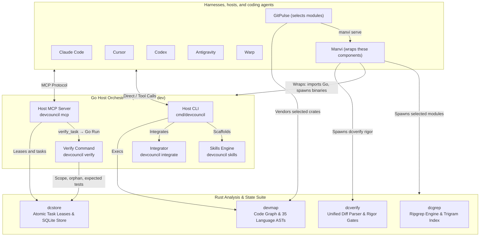

# DevCouncil: Components and Modules for AI Development

[](https://devcouncil.vbcr.dev/)
[](https://github.com/bharathvbcr/DevCouncil/actions/workflows/ci.yml)
[](https://www.npmjs.com/package/devcouncil)
[](LICENSE)

<p align="center">
  <a href="https://devcouncil.vbcr.dev/"><strong>Explore the Interactive Architecture &amp; Code Graph Showcase (devcouncil.vbcr.dev) &rarr;</strong></a>
</p>

> **"DevCouncil should not merely generate code. It should make AI-generated work prove that it satisfied the original intent."**  
> *Evidence, not model confidence, is the final authority.*

DevCouncil is **components and modules** for AI-assisted software development. It ships independently installable binaries and libraries — code intelligence (`devmap`), task and lease state (`dcstore`), deterministic verification (`dcverify`), ignore-aware search (`dcgrep`), and a Go host (`devcouncil` / `dev`) — so a harness or an app can take only the pieces it needs and update them one at a time.

See [repository input and verification boundaries](docs/SECURITY_BOUNDARIES.md)
for executable selection, filesystem protections, resource limits, and the
difference between unavailable evidence and a passing check.

**Manvi wraps these components** into a coding-agent harness (turn loop, providers, policy, TUI, `manvi serve`). **GitPulse** uses Manvi for policy, workbench, and agent hosting, and DevCouncil components for code intelligence and related analysis. DevCouncil does not replace coding agents; it sits beside Claude Code, Codex, Cursor, and others as selectable modules.

---

## Architecture & Components

DevCouncil's core runtime is a set of standalone, compiled native modules. Each binary is useful on its own, sits on `PATH`, and can be spawned or linked by a host that wants that one job:

| Binary | Language | Role & Ownership |
|--------|----------|------------------|
| `devcouncil` / `dev` | **Go** | Host orchestrator: Stdio MCP server (`mcp`), multi-host agent integration (`integrate`), engineering skills distribution (`skills`), task verification (`verify`), and devmap forwarding (`map`, `graph`, `ast`). |
| `devmap` | **Rust** | Code intelligence engine: 35 named tree-sitter language extractors plus a generic tree-sitter fallback, symbol resolution, blast-radius calculation, dead-code analysis, workspace guides (`AGENTS.md`), and DevMap MCP server (`devmap mcp`). |
| `dcstore` | **Rust** | State & lease store: SQLite-backed task repository, mutual-exclusion leases for concurrent agent building, evidence records, and gap tracking. |
| `dcverify` | **Rust** | Deterministic verification: Unified-diff parsing, planned file scope classification, anti-laziness/stub gates, test coverage evaluation, and typed `next_actions` repair signals. |
| `dcgrep` | **Rust** | Code search: Ripgrep-powered ignore-aware search engine with optional trigram indexing (`tgrep-core`). |

### How hosts consume the modules

- **Manvi** wraps the components: it drives the agent loop, provider routing, policy ladder, and TUI, and reaches each binary over JSON on stdio. A host that wants a harness embeds Manvi rather than reimplementing it.
- **GitPulse** uses both for their respective jobs: Manvi (`manvi serve`) for policy, workbench, and agent hosting; selected DevCouncil crates and the `devmap` CLI for in-process code intelligence. It does not have to take every module.
- **Other apps** pick the same way — `devmap` alone, `dcverify` alone, the Go host MCP, or the full set. Updating one module does not require shipping the rest.

> [!NOTE]
> DevCouncil is built entirely as native compiled Go and Rust binaries; legacy Python orchestration has been retired (see [docs/PHASE7_LONG_TAIL.md](docs/PHASE7_LONG_TAIL.md)).

---

## Benchmarks: DevMap vs Graphify, Gortex, GitNexus, CodeGraph, and codebase-memory-mcp

Every number below is a measured median from a reproducible run with the raw
evidence committed beside it — not a marketing estimate. Six code-graph tools
plus a ripgrep text baseline indexed the **same frozen 1,186-file / 46.9 MB
repository** on one Apple M5 Pro, with 261 timed samples and per-tool
correctness checks. Head-to-head breakdown:
**[DevMap vs GitNexus, CodeGraph, Graphify, Gortex, and codebase-memory-mcp](docs/devmap/comparison.md)**.
Full method, caveats, and raw output:
**[benchmark report](benchmarks/results/competition/20260913-48cd3c7/REPORT.md)**.

| Tool | Cold index | Unchanged refresh | Single-file edit | Peak RSS | Caller pairs found |
|---|---:|---:|---:|---:|---:|
| **DevMap 0.2.1** | **2.031 s** | **107.1 ms** | 957.8 ms | **610 MiB** | **5/5** |
| CodeGraph 1.6.0 | 2.912 s | 241.9 ms | **417.2 ms** | 2438 MiB | 3/5 |
| codebase-memory-mcp 0.10.8 | 8.019 s | 6.160 s | 9.347 s | 1208 MiB | **5/5** |
| Graphify 0.9.59 | 16.456 s | 4.327 s | 3.945 s | 3293 MiB | 3/5 |
| GitNexus 1.6.9 | 34.102 s | 567.5 ms | 33.417 s | 3095 MiB | 3/5 |
| Gortex 0.64.3 | 38.835 s | 967.5 ms | 5.754 s | 2206 MiB | 4/5 |

**Where DevMap won.** Lowest cold-index median (**1.4× faster than CodeGraph**,
**16.8× faster than GitNexus**), lowest unchanged-refresh median, the lowest
median in **all six symbol-query cells** — definition lookups ran 30–33 ms,
**4.8–5.2× faster than CodeGraph** and **31–33× faster than GitNexus** — the
lowest sampled peak memory of any graph tool, and all five source-inspected
caller pairs.

**Where DevMap lost.** CodeGraph re-indexed a single edited file in 417 ms
against DevMap's 958 ms — **2.3× faster**, the one stage where a competitor is
consistently ahead. DevMap's 139 MiB store is also larger than Graphify's
42 MiB, CodeGraph's 63 MiB, and codebase-memory-mcp's 67 MiB.

**What these numbers are not.** One corpus, one machine, three-to-five
repetitions, three symbols, and five inspected caller pairs. They do not
establish general graph accuracy, persistent-MCP latency, or coding-agent task
success. Tool output scopes differ, so equal latency is not equal analysis.
The report states every limit explicitly and keeps the failures in — including
GitNexus retaining a deleted symbol through ordinary refreshes until a forced
rebuild.

---

## Installation

DevCouncil supports macOS, Linux, and Windows. Requires a Go toolchain (`>=1.22`), Rust/`cargo`, and Git.

### 1. Build and Install Native Binaries

From a clone of this repository:

```bash
# macOS & Linux: builds Go host and all Rust analysis binaries into ~/.local/bin
bash scripts/install.sh

# Standalone DevMap (no Go host)
bash scripts/install.sh --only=devmap

# Analysis suite only (devmap dcstore dcverify dcgrep)
bash scripts/install.sh analysis

# Windows (PowerShell):
.\scripts\install.ps1
.\scripts\install.ps1 -Components devmap
```

To build and install the analysis components (`devmap`, `dcstore`, `dcverify`, `dcgrep`):

```bash
# Build & install all analysis components to ~/.local/bin
bash scripts/install-components.sh

# Or install specific components
bash scripts/install-components.sh devmap
bash scripts/install-components.sh dcstore dcverify dcgrep

# Build the Go host binary
go -C backend/go_orchestrator build -o ~/.local/bin/devcouncil ./cmd/devcouncil
ln -sf devcouncil ~/.local/bin/dev
```

Ensure `~/.local/bin` is in your `PATH`:

```bash
export PATH="$HOME/.local/bin:$PATH"
```

### 2. Optional Global npm Shim

If you prefer to dispatch through npm, install the lightweight Node.js wrapper (Node 18+). The npm package ships a shim that resolves and executes the native binaries:

```bash
npm install -g devcouncil
```

### 3. Verify Environment

```bash
devcouncil --help
dev --help
devmap --version
dcverify health
dcstore --db .devcouncil/state.sqlite health
dcgrep health
```

---

## Core Capabilities & Workflows

### 1. Coding Agent Integration (`devcouncil integrate`)

Connect DevCouncil's MCP server to Cursor or Claude Code. `--write-gate` has been removed: it named a pre-tool-use gate that only the retired lifecycle hooks installed, and nothing enforced it. Use `dev hook status` to inspect old registrations and `dev hook disable --dry-run` to preview cleanup.

```bash
devcouncil integrate cursor --apply
devcouncil integrate claude --apply

# Stub receipt only — not a working installer:
# devcouncil integrate antigravity --apply

# Verify existing integration configuration
devcouncil integrate cursor --check
```

### 2. Engineering Skills Delivery (`devcouncil skills`)

Deliver verified engineering practices and code-intelligence skills directly into agent skill folders (`.agents/skills`, `.claude/skills`, `.cursor/skills`):

```bash
# List available skills embedded in the binary
devcouncil skills list

# Scaffold all applicable skills into the repository
devcouncil skills scaffold

# Scaffold a specific skill (e.g. core-engineering or devmap)
devcouncil skills scaffold --skill core-engineering
devcouncil skills scaffold --skill devmap
```

### 3. Repository Mapping & Code Intelligence (`devmap` / `dev map`)

Build and query deep semantic relationships across your codebase without an LLM:

```bash
# Build the repository map (.devcouncil/repo_map.json) and code graph
devmap build --manifest

# Shorthand via the Go host:
dev map

# Query symbol blast radius & reverse dependents before editing
devmap impact path/to/file.go

# Trace dependency paths between two symbols
devmap trace SymbolA SymbolB

# Find dead code with confidence tiers (extracted | inferred | ambiguous)
devmap dead

# Launch the interactive HTML visualizer
devmap view
```

### 4. Task Leases & Gated Verification (`devcouncil verify`)

Prevent multi-agent file trampling and verify diff correctness against deterministic criteria:

```bash
# Run deterministic verification against a task's diff
devcouncil verify TASK-001

# Machine-readable output for agent loops
devcouncil verify TASK-001 --json

# Sandbox flag is recorded only; docker/nix do not isolate (TASK-P7-2)
devcouncil verify TASK-001 --sandbox local
```

Verification today (Go `verify.Run()`) enforces:
- **Planned file scope:** Rejects unauthorized edits outside declared task boundaries.
- **Orphan diffs / dependency-risk:** Flags files changed that were not planned.
- **Expected tests / allowed commands:** Runs the task's command list via `/bin/sh -c` in the project root.
- **Typed `next_actions`:** Structured repair instructions when those gates fail.

Stub detection, secret scanning, and coverage intersection live in the **`dcverify`** binary. `devcouncil verify`, MCP `devcouncil_verify_task`, and **Manvi** `runRigor` all spawn it. When `dcverify` is not installed the report carries an empty `rigor_applied` **and** a `rigor_skipped_reason` naming what to install — never a silent clean pass. Diff↔coverage runs only when a profile is supplied (`devcouncil verify --coverage PATH`); otherwise `coverage_skipped_reason` says so.

### 5. MCP Servers for AI Agents

DevCouncil provides two complementary Model Context Protocol (MCP) servers:

- **Host MCP Server (`devcouncil mcp`)**: Eight tools — checkout / renew / release / next_task / get_diff / verify_task / get_gaps / policy_check_write. `verify_task` runs Go `verify.Run()`, which spawns `dcverify` for the stub and secret gates; diff↔coverage needs a profile this tool has no field for, so use `devcouncil verify --coverage PATH`.
- **DevMap MCP Server (`devmap mcp`)**: Eleven query tools (status, search, dependencies, impact, trace, neighbors, dead_symbols, clones, preview, explore, affected_tests). Always pass `repo_path`.

---

## Architecture Flow


```mermaid
flowchart TD
    subgraph Agents["Harnesses, hosts, and coding agents"]
        Claude["Claude Code"]
        Cursor["Cursor"]
        Codex["Codex"]
        AGY["Antigravity"]
        Warp["Warp"]
        Manvi["Manvi (wraps these components)"]
        GitPulse["GitPulse (selects modules)"]
    end

    subgraph Host["Go Host Orchestrator (devcouncil / dev)"]
        CLI["Host CLI\ncmd/devcouncil"]
        MCP["Host MCP Server\ndevcouncil mcp"]
        Integ["Integrator\ndevcouncil integrate"]
        Skills["Skills Engine\ndevcouncil skills"]
        VerifyCmd["Verify Command\ndevcouncil verify"]
    end

    subgraph RustAnalysis["Rust Analysis & State Suite"]
        DevMap["devmap\nCode Graph & 35 Language ASTs"]
        DCStore["dcstore\nAtomic Task Leases & SQLite Store"]
        DCVerify["dcverify\nUnified Diff Parser & Rigor Gates"]
        DCGrep["dcgrep\nRipgrep Engine & Trigram Index"]
    end

    Agents <-->|MCP Protocol| MCP
    Agents <-->|Direct / Tool Calls| CLI
    Manvi -->|Wraps: imports Go, spawns binaries| Host
    Manvi -->|Spawns selected modules| RustAnalysis
    GitPulse -->|Vendors selected crates| DevMap
    GitPulse -->|manvi serve| Manvi

    CLI -->|Execs| DevMap
    CLI -->|Integrates| Integ
    CLI -->|Scaffolds| Skills
    VerifyCmd -->|Scope, orphan, expected tests| DCStore
    Manvi -->|Spawns dcverify rigor| DCVerify

    MCP -->|Leases and tasks| DCStore
    MCP -->|verify_task → Go Run| VerifyCmd
```

---

## Repository Layout

```
DevCouncil/
├── backend/go_orchestrator/     # Go host orchestrator binary and packages
│   ├── cmd/devcouncil/          # Main entrypoint for devcouncil and dev
│   ├── devcouncil/              # MCP server, integrate, skills, verify implementations
│   ├── dc/store/                # Interop client for dcstore binary
│   └── policy/                  # File-write containment & security policies
├── rust/                        # Analysis and verification engine crates (dcstore, dcverify, dcgrep, devmap)
├── bin/                         # Node.js npm shim (bin/devcouncil.js)
├── scripts/                     # Platform installers (install.sh, install-components.sh)
└── docs/                        # Architecture, releases, and integration guides
```

---

## Documentation

- [Release Notes (v0.2.0)](docs/releases/v0.2.0.md): Native orchestration and analysis migration.
- [Native cutover follow-ups](docs/TODO.md): Open wiring and honesty work after Phase 7.
- [Architecture Decisions & Python Retirement](docs/PHASE7_LONG_TAIL.md): Background on the transition to native Go and Rust binaries.
- [Archived ledgers](docs/archive/README.md): Pre-cutover DevMap plans, audits, and qualification dumps.
- [Code Graph & DevMap Guide](docs/code-graph.md): Symbol resolution, dead code, and blast radius.
- [DevMap vs other code-graph tools](docs/devmap/comparison.md): Head-to-head comparison written for the "which code intelligence tool should my agent use" question, with per-tool sections and the limits stated.
- [DevMap competitor benchmark report](benchmarks/results/competition/20260913-48cd3c7/REPORT.md): Full measured comparison against Graphify, Gortex, GitNexus, CodeGraph, codebase-memory-mcp, and ripgrep — indexing and query latency, memory, storage, caller accuracy, stale-index recovery, scope limits, and committed raw evidence. The [DevMap guide](docs/devmap/README.md#benchmark-comparison) carries the shorter summary and the [competition index](benchmarks/results/competition/README.md) links every prior run.
- [Hero Loop (MCP Closed Loop)](docs/hero-loop.md): Autonomous task loop with deterministic gates.
- [Coding CLI Integration](docs/coding-cli-integration.md): Configuring Claude, Codex, Cursor, Warp, and Antigravity.
- [Security Model](docs/security.md): Redaction, write isolation, and containment rules.
- [Project Status](docs/project-status.md): Subsystem maturity ledger.

---

## License

Licensed under the **Apache License, Version 2.0**. See [LICENSE](LICENSE) for details.
