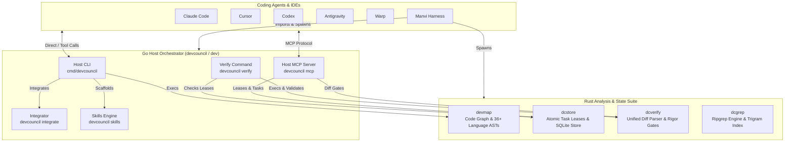

# DevCouncil: Gated AI Development & Code Intelligence

[](https://devcouncil.vbcr.dev/)
[](https://github.com/bharathvbcr/DevCouncil/actions/workflows/ci.yml)
[](https://www.npmjs.com/package/devcouncil)
[](LICENSE)

<p align="center">
  <a href="https://devcouncil.vbcr.dev/"><strong>Explore the Interactive Architecture &amp; Code Graph Showcase (devcouncil.vbcr.dev) &rarr;</strong></a>
</p>

> **"DevCouncil should not merely generate code. It should make AI-generated work prove that it satisfied the original intent."**  
> *Evidence, not model confidence, is the final authority.*

DevCouncil is a high-integrity orchestration platform and native analysis engine for AI-assisted software development. It transforms AI code generation from an unverified black-box loop into a gated, deterministic engineering workflow where changes are scoped, checked against mutual-exclusion leases, verified with rigor gates, and backed by a deep code intelligence graph.

DevCouncil does not replace coding agents. It works natively beside Claude Code, Codex, Cursor, Google Antigravity, OpenCode, Warp, and Aider, owning the task scope, write policy, verification loop, and evidence trail.

---

## Architecture & Components

DevCouncil's core runtime consists of standalone, compiled native binaries designed to sit on `PATH` or be spawned by agent harnesses:

| Binary | Language | Role & Ownership |
|--------|----------|------------------|
| `devcouncil` / `dev` | **Go** | Host orchestrator: Stdio MCP server (`mcp`), multi-host agent integration (`integrate`), engineering skills distribution (`skills`), task verification (`verify`), and devmap forwarding (`map`, `graph`, `ast`). |
| `devmap` | **Rust** | Code intelligence engine: 36+ tree-sitter language extractors, symbol resolution, blast-radius calculation, dead-code analysis, workspace guides (`AGENTS.md`), and DevMap MCP server (`serve --mcp`). |
| `dcstore` | **Rust** | State & lease store: SQLite-backed task repository, mutual-exclusion leases for concurrent agent building, evidence records, and gap tracking. |
| `dcverify` | **Rust** | Deterministic verification: Unified-diff parsing, planned file scope classification, anti-laziness/stub gates, test coverage evaluation, and typed `next_actions` repair signals. |
| `dcgrep` | **Rust** | Code search: Ripgrep-powered ignore-aware search engine with optional trigram indexing (`tgrep-core`). |

### Upstream Wrappers & Ecosystem

- **Manvi**: Agent harness, LLM provider routing, and TUI. Manvi imports the Go orchestrator module and spawns the native analysis binaries.
- **GitPulse**: IDE mediation vendoring DevMap crates.

> [!NOTE]
> DevCouncil is built entirely as native compiled Go and Rust binaries; legacy Python orchestration has been retired (see [docs/PHASE7_LONG_TAIL.md](docs/PHASE7_LONG_TAIL.md)).

---

## Installation

DevCouncil supports macOS, Linux, and Windows. Requires a Go toolchain (`>=1.22`), Rust/`cargo`, and Git.

### 1. Build and Install Native Binaries

From a clone of this repository:

```bash
# macOS & Linux: builds Go host and all Rust analysis binaries into ~/.local/bin
bash scripts/install.sh

# Windows (PowerShell):
.\scripts\install.ps1
```

To build and install the analysis components (`devmap`, `dcstore`, `dcverify`, `dcgrep`):

```bash
# Build & install all analysis components to ~/.local/bin
bash scripts/install-components.sh

# Or install specific components
bash scripts/install-components.sh devmap
bash scripts/install-components.sh dcstore dcverify dcgrep

# Build the Go host binary
go -C backend/go_orchestrator build -o ~/.local/bin/devcouncil ./cmd/devcouncil
ln -sf devcouncil ~/.local/bin/dev
```

Ensure `~/.local/bin` is in your `PATH`:

```bash
export PATH="$HOME/.local/bin:$PATH"
```

### 2. Optional Global npm Shim

If you prefer to dispatch through npm, install the lightweight Node.js wrapper (Node 18+). The npm package ships a shim that resolves and executes the native binaries:

```bash
npm install -g devcouncil
```

### 3. Verify Environment

```bash
devcouncil --help
dev --help
devmap --version
dcverify health
dcstore --db .devcouncil/state.sqlite health
dcgrep health
```

---

## Core Capabilities & Workflows

### 1. Coding Agent Integration (`devcouncil integrate`)

Connect DevCouncil's MCP servers, policy gates, and skills to your coding environment:

```bash
# Supported hosts: cursor, claude, codex, gemini, opencode, warp, aider, antigravity

# Apply configuration for a specific host
devcouncil integrate cursor --apply
devcouncil integrate claude --apply
devcouncil integrate antigravity --apply

# Enforce the blocking write gate (Claude Code)
devcouncil integrate claude --apply --write-gate

# Verify existing integration configuration
devcouncil integrate cursor --check
```

### 2. Engineering Skills Delivery (`devcouncil skills`)

Deliver verified engineering practices and code-intelligence skills directly into agent skill folders (`.agents/skills`, `.claude/skills`, `.cursor/skills`):

```bash
# List available skills embedded in the binary
devcouncil skills list

# Scaffold all applicable skills into the repository
devcouncil skills scaffold

# Scaffold a specific skill (e.g. core-engineering or devmap)
devcouncil skills scaffold --skill core-engineering
devcouncil skills scaffold --skill devmap
```

### 3. Repository Mapping & Code Intelligence (`devmap` / `dev map`)

Build and query deep semantic relationships across your codebase without an LLM:

```bash
# Build the repository map (.devcouncil/repo_map.json) and code graph
devmap build --manifest

# Shorthand via the Go host:
dev map

# Query symbol blast radius & reverse dependents before editing
devmap impact path/to/file.go

# Trace dependency paths between two symbols
devmap trace SymbolA SymbolB

# Find dead code with confidence tiers (extracted | inferred | ambiguous)
devmap dead

# Launch the interactive HTML visualizer
devmap view
```

### 4. Task Leases & Gated Verification (`devcouncil verify`)

Prevent multi-agent file trampling and verify diff correctness against deterministic criteria:

```bash
# Run deterministic verification against a task's diff
devcouncil verify TASK-001

# Machine-readable output for agent loops
devcouncil verify TASK-001 --json

# Run verification in a containerized sandbox
devcouncil verify TASK-001 --sandbox docker
```

Verification enforces:
- **Planned File Scope:** Rejects unauthorized edits outside declared task boundaries.
- **Anti-Laziness & Stubs:** Detects empty implementations, placeholders, and unfulfilled promises.
- **Test Coverage:** Intersects test execution with modified code paths.
- **Secret Scanning:** Blocks accidental leaks of API tokens or credentials.
- **Typed `next_actions`:** Generates structured repair instructions when verification fails.

### 5. MCP Servers for AI Agents

DevCouncil provides two complementary Model Context Protocol (MCP) servers:

- **Host MCP Server (`devcouncil mcp`)**: Exposes task management, mutual-exclusion leases, diff inspection, policy-checked writes, and verification gates.
- **DevMap MCP Server (`devmap serve --mcp`)**: Exposes symbol exploration, call graphs, impact analysis, and workspace navigation over stdio or HTTP.

---

## Architecture Flow


```mermaid
flowchart TD
    subgraph Agents["Coding Agents & IDEs"]
        Claude["Claude Code"]
        Cursor["Cursor"]
        Codex["Codex"]
        AGY["Antigravity"]
        Warp["Warp"]
        Manvi["Manvi Harness"]
    end

    subgraph Host["Go Host Orchestrator (devcouncil / dev)"]
        CLI["Host CLI\ncmd/devcouncil"]
        MCP["Host MCP Server\ndevcouncil mcp"]
        Integ["Integrator\ndevcouncil integrate"]
        Skills["Skills Engine\ndevcouncil skills"]
        VerifyCmd["Verify Command\ndevcouncil verify"]
    end

    subgraph RustAnalysis["Rust Analysis & State Suite"]
        DevMap["devmap\nCode Graph & 36+ Language ASTs"]
        DCStore["dcstore\nAtomic Task Leases & SQLite Store"]
        DCVerify["dcverify\nUnified Diff Parser & Rigor Gates"]
        DCGrep["dcgrep\nRipgrep Engine & Trigram Index"]
    end

    Agents <-->|MCP Protocol| MCP
    Agents <-->|Direct / Tool Calls| CLI
    Manvi -->|Imports & Spawns| Host
    Manvi -->|Spawns| RustAnalysis

    CLI -->|Execs| DevMap
    CLI -->|Integrates| Integ
    CLI -->|Scaffolds| Skills
    VerifyCmd -->|Execs & Validates| DCVerify
    VerifyCmd -->|Checks Leases| DCStore

    MCP -->|Leases & Tasks| DCStore
    MCP -->|Diff Gates| DCVerify
```

---

## Repository Layout

```
DevCouncil/
├── backend/go_orchestrator/     # Go host orchestrator binary and packages
│   ├── cmd/devcouncil/          # Main entrypoint for devcouncil and dev
│   ├── devcouncil/              # MCP server, integrate, skills, verify implementations
│   ├── dc/store/                # Interop client for dcstore binary
│   └── policy/                  # File-write containment & security policies
├── rust/                        # Analysis and verification engine crates (dcstore, dcverify, dcgrep, devmap)
├── bin/                         # Node.js npm shim (bin/devcouncil.js)
├── scripts/                     # Platform installers (install.sh, install-components.sh)
└── docs/                        # Architecture, releases, and integration guides
```

---

## Documentation

- [Release Notes (v0.2.0)](docs/releases/v0.2.0.md): Native orchestration and analysis migration.
- [Architecture Decisions & Python Retirement](docs/PHASE7_LONG_TAIL.md): Background on the transition to native Go and Rust binaries.
- [Code Graph & DevMap Guide](docs/code-graph.md): Symbol resolution, dead code, and blast radius.
- [Hero Loop (MCP Closed Loop)](docs/hero-loop.md): Autonomous task loop with deterministic gates.
- [Coding CLI Integration](docs/coding-cli-integration.md): Configuring Claude, Codex, Cursor, Warp, and Antigravity.
- [Security Model](docs/security.md): Redaction, write isolation, and containment rules.
- [Project Status](docs/project-status.md): Subsystem maturity ledger.

---

## License

Licensed under the **Apache License, Version 2.0**. See [LICENSE](LICENSE) for details.
