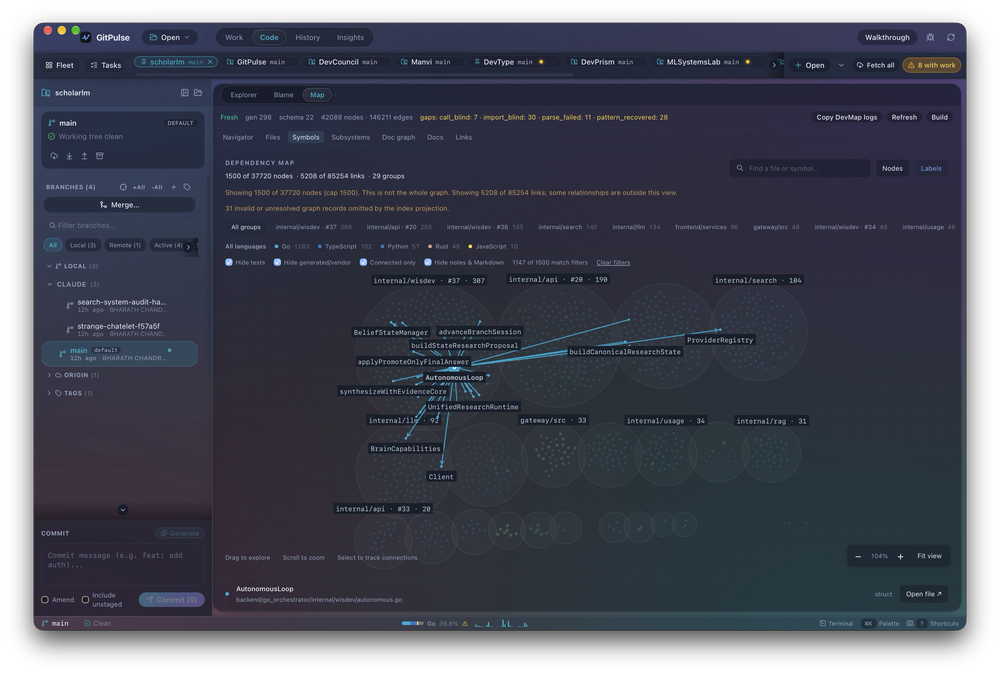
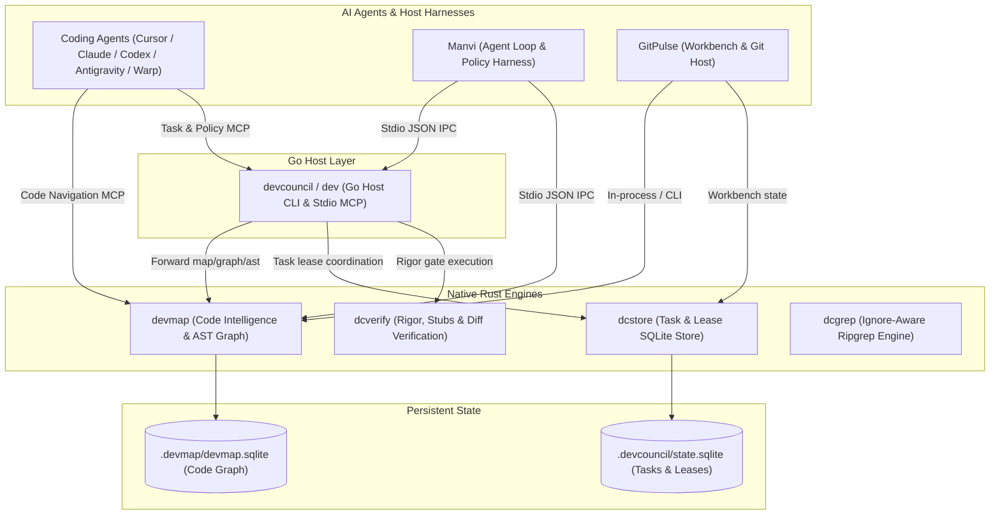
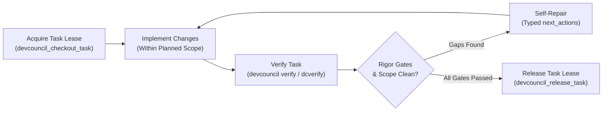

# DevCouncil

Code intelligence and verification components for AI development.

[](https://devcouncil.vbcr.dev/)
[](https://github.com/bharathvbcr/DevCouncil/actions/workflows/ci.yml)
[](https://www.npmjs.com/package/devcouncil)
[](LICENSE)

<p align="center">
  <a href="https://devcouncil.vbcr.dev/"><strong>Explore the Interactive Architecture &amp; Code Graph Showcase (devcouncil.vbcr.dev) &rarr;</strong></a>
</p>

> **"DevCouncil should not merely generate code. It should make AI-generated work prove that it satisfied the original intent."**  
> *Evidence, not model confidence, is the final authority.*

DevCouncil is **components and modules** for AI-assisted software development. It ships independently installable binaries and libraries — code intelligence (`devmap`), task and lease state (`dcstore`), deterministic verification (`dcverify`), ignore-aware search (`dcgrep`), and a Go host (`devcouncil` / `dev`) — so a harness or an app can take only the pieces it needs and update them one at a time.

See [repository input and verification boundaries](docs/SECURITY_BOUNDARIES.md)
for executable selection, filesystem protections, resource limits, and the
difference between unavailable evidence and a passing check.

**Manvi wraps these components** into a coding-agent harness (turn loop, providers, policy, TUI, `manvi serve`). **GitPulse** uses Manvi for policy, workbench, and agent hosting, and DevCouncil components for code intelligence and related analysis. DevCouncil does not replace coding agents; it sits beside Claude Code, Codex, Cursor, and others as selectable modules.



---

## Architecture & Components

DevCouncil's core runtime is a set of standalone, compiled native modules. Each binary is useful on its own, sits on `PATH`, and can be spawned or linked by a host that wants that one job:

| Binary | Language | Role & Ownership |
|--------|----------|------------------|
| `devcouncil` / `dev` | **Go** | Host orchestrator: Stdio MCP server (`mcp`), multi-host agent integration (`integrate`), engineering skills distribution (`skills`), task verification (`verify`), and devmap forwarding (`map`, `graph`, `ast`). |
| `devmap` | **Rust** | Code intelligence engine: Language-aware tree-sitter extraction and explicit fallback/coverage reporting, symbol resolution, blast-radius calculation, dead-code analysis, workspace guides (`AGENTS.md`), and DevMap MCP server (`devmap mcp`). |
| `dcstore` | **Rust** | State & lease store: SQLite-backed task repository, mutual-exclusion leases for concurrent agent building, evidence records, and gap tracking. |
| `dcverify` | **Rust** | Deterministic verification: Unified-diff parsing, planned file scope classification, anti-laziness/stub gates, test coverage evaluation, and typed `next_actions` repair signals. |
| `dcgrep` | **Rust** | Code search: Ripgrep-powered ignore-aware search engine with optional trigram indexing (`tgrep-core`). |


```mermaid
flowchart TD
    subgraph Consumers["AI Agents & Host Harnesses"]
        Agent["Coding Agents (Cursor / Claude / Codex / Antigravity / Warp)"]
        Manvi["Manvi (Agent Loop & Policy Harness)"]
        GitPulse["GitPulse (Workbench & Git Host)"]
    end

    subgraph Orchestration["Go Host Layer"]
        DevCouncil["devcouncil / dev (Go Host CLI & Stdio MCP)"]
    end

    subgraph NativeModules["Native Rust Engines"]
        DevMap["devmap (Code Intelligence & AST Graph)"]
        DCStore["dcstore (Task & Lease SQLite Store)"]
        DCVerify["dcverify (Rigor, Stubs & Diff Verification)"]
        DCGrep["dcgrep (Ignore-Aware Ripgrep Engine)"]
    end

    subgraph Storage["Persistent State"]
        GraphDB[(".devmap/devmap.sqlite (Code Graph)")]
        TaskDB[(".devcouncil/state.sqlite (Tasks & Leases)")]
    end

    Agent -->|"Code Navigation MCP"| DevMap
    Agent -->|"Task & Policy MCP"| DevCouncil
    Manvi -->|"Stdio JSON IPC"| DevCouncil
    Manvi -->|"Stdio JSON IPC"| DevMap
    GitPulse -->|"In-process / CLI"| DevMap
    GitPulse -->|"Workbench state"| DCStore

    DevCouncil -->|"Forward map/graph/ast"| DevMap
    DevCouncil -->|"Task lease coordination"| DCStore
    DevCouncil -->|"Rigor gate execution"| DCVerify

    DevMap --> GraphDB
    DCStore --> TaskDB
```

### How hosts consume the modules

- **Manvi** wraps the components: it drives the agent loop, provider routing, policy ladder, and TUI, and reaches each binary over JSON on stdio. A host that wants a harness embeds Manvi rather than reimplementing it.
- **GitPulse** uses both for their respective jobs: Manvi (`manvi serve`) for policy, workbench, and agent hosting; selected DevCouncil crates and the `devmap` CLI for in-process code intelligence. It does not have to take every module.
- **Other apps** pick the same way — `devmap` alone, `dcverify` alone, the Go host MCP, or the full set. Updating one module does not require shipping the rest.

> [!NOTE]
> DevCouncil is built entirely as native compiled Go and Rust binaries; legacy Python orchestration has been retired (see [docs/PHASE7_LONG_TAIL.md](docs/PHASE7_LONG_TAIL.md)).

---

## Benchmarks: DevMap vs Graphify, Gortex, GitNexus, CodeGraph, and codebase-memory-mcp

Six code-graph tools plus a ripgrep text baseline, measured on **four
repositories** (595 to 4,335 files, mixing Rust, Go, TypeScript, Python and
Swift) on one Apple M5 Pro. Every timing is a minimum or median from a
reproducible run with the raw evidence committed beside it — not a marketing
estimate. Head-to-head breakdown:
**[DevMap vs GitNexus, CodeGraph, Graphify, Gortex, and codebase-memory-mcp](docs/devmap/comparison.md)**.
Full method, caveats, and raw output:
**[benchmark report](benchmarks/results/competition/20260914-v0.2.2/REPORT.md)**.

**DevMap 0.2.2 was fastest on most of what was measured:** cold indexing and
unchanged refresh on **all four repositories**, the lowest median in **all six
symbol-query cells**, and **5/5** source-inspected caller pairs — matched only
by codebase-memory-mcp.

Detailed table on the 1,098-file DevCouncil corpus, where the correctness and
query campaign also ran:

| Tool | Cold index | Unchanged refresh | Single-file edit | Definition lookup | Peak RSS | Caller pairs found |
|---|---:|---:|---:|---:|---:|---:|
| **DevMap 0.2.2** | **2.012 s** | **0.089 s** | 0.816 s | **9.7 ms** | **678 MiB** | **5/5** |
| CodeGraph 1.6.0 | 3.294 s | 0.235 s | **0.512 s** | 101–106 ms | 2430 MiB | 3/5 |
| codebase-memory-mcp 0.10.8 | 9.357 s | 5.726 s | 8.894 s | ~3.94 s | — | **5/5** |
| Graphify 0.9.59 | 14.989 s | 5.080 s | 4.883 s | 557–572 ms | 3417 MiB | 3/5 |
| GitNexus 1.6.9 | 33.689 s | 0.699 s | 31.841 s | 792–808 ms | 3355 MiB | 3/5 |
| Gortex 0.64.3 | 16.5 s to query-ready | — | — | 92–104 ms | — | 4/5 |

**Where DevMap won.** Fastest cold index on all four corpora (**1.6–21×** the
competitors' time) and fastest unchanged refresh on all four (**2.2–107×**).
Lowest median in all six query cells — definition lookups at 9.7 ms, **~10×
faster than CodeGraph** and **~82× faster than GitNexus**. Lowest sampled peak
memory on three of four corpora. All five source-inspected caller pairs, and a
clean result on both index-staleness probes.

**Where DevMap lost.** CodeGraph re-indexes a single edited file faster **on
every corpus** — DevMap takes 1.08× its time on the smallest and **3.61×** on
GitPulse. That is the one stage where a competitor is consistently ahead.
DevMap's store is 1.6–2.0× CodeGraph's and 2.8–4.7× Graphify's, and Graphify
used **less memory than DevMap on the largest repository** (1,458 MB vs
1,725 MB). Against v0.2.1, unchanged refresh regressed ~12% on the smallest
corpus.

**What these numbers are not.** Four repositories, one machine, three-to-five
repetitions, three symbols, and five inspected caller pairs. They do not
establish general graph accuracy, persistent-MCP latency, or coding-agent task
success. Tool output scopes differ, so equal latency is not equal analysis.
DevMap itself reports 106,217 unexplained call-attribution sites on this corpus.
The report states every limit explicitly and keeps the failures in — including
GitNexus serving a deleted symbol through two ordinary refreshes until a forced
rebuild.

---

## Get started

Build just DevMap from source, then map a project:

```bash
git clone https://github.com/bharathvbcr/DevCouncil.git
cd DevCouncil
bash scripts/install.sh --only=devmap
export PATH="$HOME/.local/bin:$PATH"

cd /path/to/your/project
devmap build --manifest --guides
devmap paths --json
devmap status --json
devmap explore MyFunction --json
```

Git and Rust/Cargo are required. To include the Go host and full analysis suite,
run `bash scripts/install.sh`; the host needs the toolchain declared in
[`go.mod`](backend/go_orchestrator/go.mod), currently Go 1.26.6. On Windows use
`.\scripts\install.ps1 -Components devmap`, or omit `-Components` for the suite.
The npm package is a lightweight launcher for native binaries, not a bundled
runtime. [Complete installation guide](docs/quickstart.md).

Use the paths returned by `devmap paths`: new repositories default to `.devmap`,
existing `.devcouncil` layouts remain supported, and explicit configuration can
override either. `--guides` requests managed workspace guides separately from
the map export. Check freshness, coverage gaps and result truncation before
using graph answers as evidence. If first-time guide creation leaves status
stale, run `devmap build --manifest` once more to index the new guides.

## Connect an agent

```bash
devmap integrate cursor --dry-run
devmap integrate cursor
devmap integrate cursor --check
```

Substitute `claude`, `codex`, `antigravity`, `opencode` or `warp` for `cursor`.
Integration can update user-level MCP settings as well as project assets.
Inspect the receipt and complete host reload/trust steps. For task tooling,
add the Go-host integration described in
[coding CLI integration](docs/coding-cli-integration.md).

## Verification is opt-in

For an existing task in an initialized `.devcouncil/state.sqlite`:

```bash
devcouncil verify TASK-001 --mode enforce --json
```


```mermaid
flowchart LR
    A["Acquire Task Lease<br/>(devcouncil_checkout_task)"] --> B["Implement Changes<br/>(Within Planned Scope)"]
    B --> C["Verify Task<br/>(devcouncil verify / dcverify)"]
    C --> D{"Rigor Gates<br/>& Scope Clean?"}
    D -->|"Gaps Found"| E["Self-Repair<br/>(Typed next_actions)"]
    E --> B
    D -->|"All Gates Passed"| F["Release Task Lease<br/>(devcouncil_release_task)"]
```

Read gate mode, skipped reasons and coverage metadata. The Go host invokes
`dcverify` for rigor checks; changed-line coverage requires a profile supplied
through `--coverage PATH`. The default gate mode is `off`. Task leases and MCP
policy results coordinate participating clients; retired lifecycle hooks do
not intercept arbitrary shell commands or editor writes. The sandbox selector
does not implement Docker/Nix isolation. See the
[task loop contract](docs/hero-loop.md).

## Documentation

Start at the **[documentation index](docs/README.md)**.

| Topic | Guide |
|---|---|
| Installation and first query | [Quickstart](docs/quickstart.md) |
| Components and state ownership | [Architecture](docs/architecture.md) |
| Symbols, impact and evidence limits | [Code graph](docs/code-graph.md) |
| Editor setup and hooks | [Integration](docs/coding-cli-integration.md) |
| Commands and flags | [CLI reference](docs/cli-reference.md) |
| Task workflow | [Workflow](docs/workflow.md) and [MCP loop](docs/hero-loop.md) |
| Implementation and migration limits | [Project status](docs/project-status.md) |
| Native development | [Rust workspace](rust/README.md) |

[Apache 2.0](LICENSE). The Python CLI, its release lineage and its historical
workflow certifications are retired; current native source and installed
binary identities must be checked separately.
