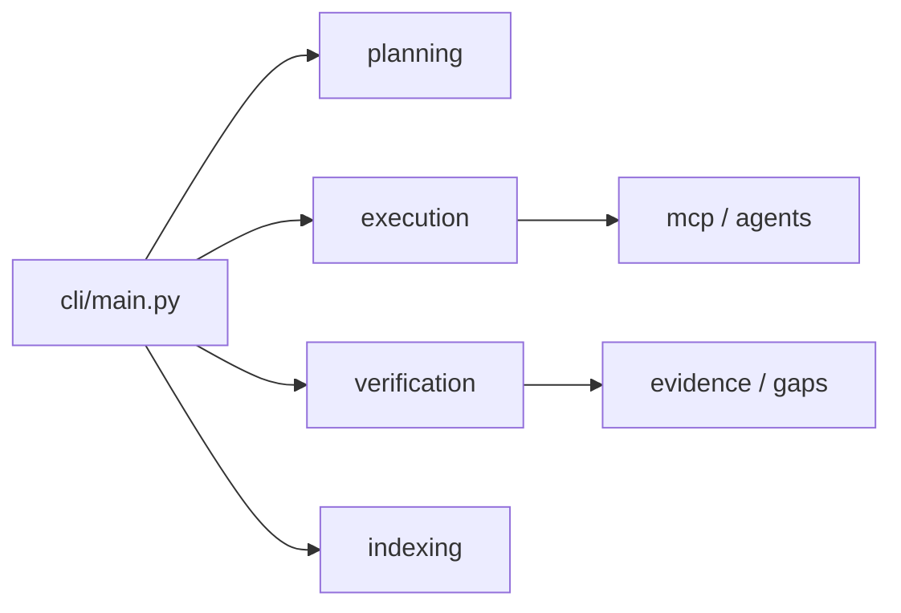
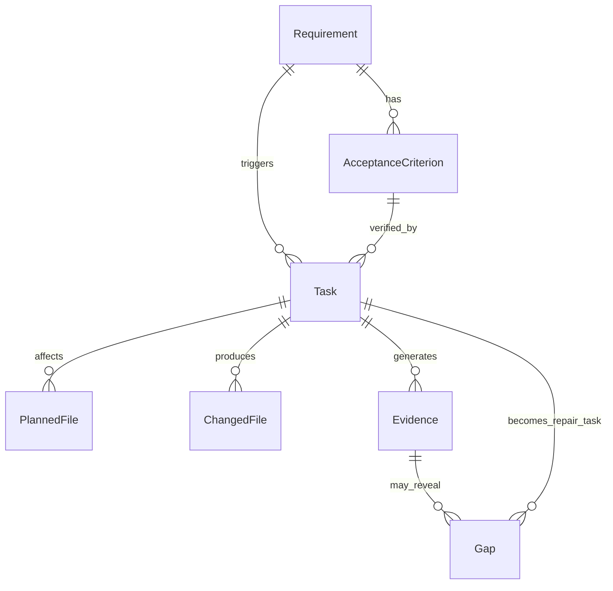
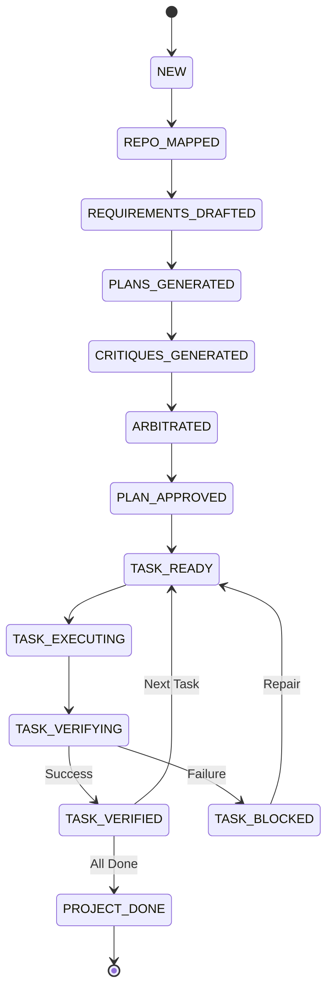

# DevCouncil Architecture

DevCouncil is a gated orchestrator for AI-assisted software development. It ensures that AI-generated work proves it satisfies the original intent.

## Core Components

- **CLI**: Typer-based `dev` / `devcouncil` command surface for local terminal workflows.
- **Orchestrator & State Machine**: Manages transitions between planning, execution, and verification phases (see [Gating state machine](#gating-state-machine) below).
- **Artifact Graph**: Directed graph linking requirements, tasks, files, evidence, and gaps (see [Artifact graph](#artifact-graph) below).
- **Planning Council**: Multi-agent LLM debate for planning and critique.
- **Executors**: Adapters to run tasks via manual sidecar, mini-SWE-agent, OpenHands, native-preview, coding CLI execution, and registered bring-your-own CLI agents. See [coding-cli-integration.md](coding-cli-integration.md) for tiers and adapters.
- **Verifier & Gating**: Git cleanliness, authorized file modifications, test evidence, diff↔coverage, and secret scanning. Map/graph checks also surface unwired files, stale maps (missing map is stale — fail-closed on hard rigor), wiring gaps, dead-symbol candidates, and corpus/doc-ref gates when enabled. Stop-gate claim checks map completion text to independent command/filesystem probes (see [Claim verification](#claim-verification-preview)). Write policy soft-blocks paths outside planned files unless same subsystem or map `neighbors`.
- **Repository map & code graph** (Stable): `dev map` writes `.devcouncil/repo_map.json` (subsystems, entry roots, liveness lists capped at 5000/256) and a symbol-level `.devcouncil/graph/code_graph.json`. Unified ingest: `dev graph ingest`. Query with `dev graph query|trace|dead|check|process|impact|search|cypher|html|view|demo`. Opt-in PDG/taint remains Preview: `dev map --pdg`, `dev graph pdg-query` / `explain`. Sample UI: `dev graph demo` or `dev map && dev graph view`. See [code-graph.md](code-graph.md).
- **Corpus side index**: Advisory doc/PDF/image graph via `dev corpus build`/`query`/`status`, with optional rigor gates. See [corpus.md](corpus.md).
- **Knowledge formats**: Open Knowledge Format (OKF) export/ingest/validate/html and `design.md` design-system lint/export/check, injected into planning and coding prompts. Bidirectional OKF ↔ skills bridge via `dev okf export --skills` / `dev okf ingest`. Commands: `dev okf *`, `dev design *`.
- **Engineering skills**: Bundled domain skills scaffolded into `.claude/skills/` and embedded in `dev prompt` output.

### Code graph visualizer

Sample UI with no repository map: `dev graph demo`. Full guide: [code-graph.md](code-graph.md).

## Related docs

| Topic | Document |
| :--- | :--- |
| Hero loop (Claude Code + MCP) | [hero-loop.md](hero-loop.md) |
| Coding CLI tiers, hooks, stop gate | [coding-cli-integration.md](coding-cli-integration.md) |
| Repo map & code graph | [code-graph.md](code-graph.md) |
| Corpus side index | [corpus.md](corpus.md) |
| Daily sidecar workflow | [workflow.md](workflow.md) |
| Subsystem maturity | [project-status.md](project-status.md) |

## Artifact graph

The durable source of truth for every run. Every modified line should trace back to a requirement and acceptance criterion.

| Node | Role |
| :--- | :--- |
| **Requirement** | Discrete functionality or constraint from the goal |
| **Acceptance Criterion** | Falsifiable condition for requirement satisfaction |
| **Task** | Executor unit of work linked to requirements |
| **Planned / Changed File** | Expected vs actual file modifications |
| **Evidence** | Deterministic proof (tests, logs, reviews) |
| **Gap** | Verification discrepancy (may become a repair task) |

Persisted in SQLite (`.devcouncil/state.sqlite`) for queries, resumption, and evidence reports. Validate with `dev artifacts validate`.

## Gating state machine

Transitions are gated: a task cannot move from `TASK_EXECUTING` to `TASK_VERIFIED` without `TASK_VERIFYING`.

| Phase | Meaning |
| :--- | :--- |
| `NEW` → `REPO_MAPPED` → `REQUIREMENTS_DRAFTED` | Goal + map + requirements |
| `PLANS_GENERATED` → `CRITIQUES_GENERATED` → `ARBITRATED` → `PLAN_APPROVED` | Council debate and approval |
| `TASK_READY` → `TASK_EXECUTING` → `TASK_VERIFYING` | Scoped execution |
| `TASK_VERIFIED` / `TASK_BLOCKED` | Pass or gap report (repair returns to ready) |
| `PROJECT_DONE` | All requirements satisfied |

### Gating policy (summary)

Every stage blocks unless verifiable progress has been made:

1. **PLAN_APPROVED**: Every requirement has acceptance criteria and maps to at least one task; high-impact assumptions confirmed.
2. **TASK_READY**: Clean git working tree; task specifies planned files and commands.
3. **TASK_VERIFIED**: Changed files within allowed set, no orphan diffs, commands pass, implementation review passes. Optional rigor gates (stubs, effort, map/corpus stale, dead symbols) apply per `verification.rigor` and task difficulty — see [hero-loop.md](hero-loop.md#anti-laziness-rigor) and [corpus.md](corpus.md).

## Orchestration principles

1. **Requirement-first** — no code until requirements and acceptance criteria exist in the artifact graph.
2. **Independent planning** — competing plans, cross-critique, then arbitration.
3. **Deterministic gating** — phase transitions follow the state machine above.
4. **Evidence persistence** — diffs, tests, and logs link back to requirements.

Typical CLI path: `dev plan` → `dev run` → `dev verify` (or `dev e2e` / `dev go` for the closed loop).

## Module map

| Package | Responsibility |
| :--- | :--- |
| `app` | Lifecycle, state machine, event bus |
| `cli` | Command surface |
| `council` | Multi-agent planning debate |
| `domain` | Requirements, tasks, evidence schemas |
| `execution` | Leases, stop gate, execution environments |
| `executors` | Manual, mini-SWE, OpenHands, native-preview, coding CLIs |
| `gating` | Phase/task policy checks |
| `indexing` | Repo map, code graph, optional PDG, corpus |
| `integrations` | Hooks, MCP, integrate/check |
| `llm` | Provider router |
| `planning` | Goal → task DAG |
| `repo` | Filesystem and Git |
| `storage` | Artifact graph persistence |
| `verification` | Evidence, gaps, rigor, claim checks |

## Executors

Headless coding CLI adapters (all post-run verified by DevCouncil):

`codex`, `claude`, `opencode`, `antigravity`, `warp`, `cursor`, `aider`, `copilot`, `goose`, `amp`, `qwen`, `crush`, plus configured custom CLI agent names and their aliases. **`gemini` is deprecated** (compat only; prefer `antigravity`).

Other execution paths:

- `manual` — sidecar prompts pasted into any coding tool
- `mini` — mini-SWE-agent
- `openhands` — OpenHands task API
- `native-preview` / `native` — built-in preview loop (Preview maturity; verification remains the completion gate)

Coding CLI adapters write the task prompt to `.devcouncil/{TASK}-{client}-task.md` when needed, then launch the CLI in the repository root with `DEVCOUNCIL_PROJECT_ROOT` set. Tier definitions and hook parity: [coding-cli-integration.md](coding-cli-integration.md).

## Lite verification

`dev check --verify` runs the deterministic evidence gate against the current working tree without planning or provider keys. It shares the verifier, diff↔coverage gate, and typed next-actions contract used by `dev verify` and MCP `verify_task`. See [hero-loop.md](hero-loop.md).

## Claim verification (Preview)

On Claude/Codex Stop hooks, DevCouncil can map the agent's completion text into structured assertions (`tests_pass`, `build_succeeds`, `lint_clean`, file create/update, command success, or weak `generic_done`) and re-check them with configured project commands under a time budget. Combined with optional active-task verify, this is the unified **stop gate** (`execution.stop_gate`: `off` | `assist` | `block`). Implementation lives in `verification/claims/` and `execution/stop_gate.py`. Details and config: [coding-cli-integration.md](coding-cli-integration.md#stop-gate-assist-vs-block-executionstop_gate).

## Cost and run telemetry

Model-call cost is recorded locally in `.devcouncil/model_calls.jsonl` and surfaced through `dev cost show`, `dev status`, reports, and the dashboard. Coding-agent runs write manifests under `.devcouncil/runs/<run-id>/` inspectable via `dev runs list` and `dev runs show`.
