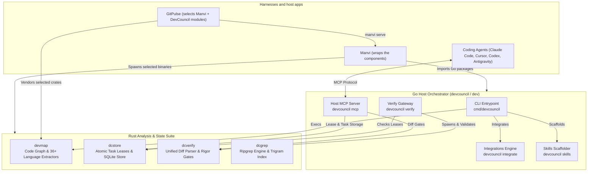
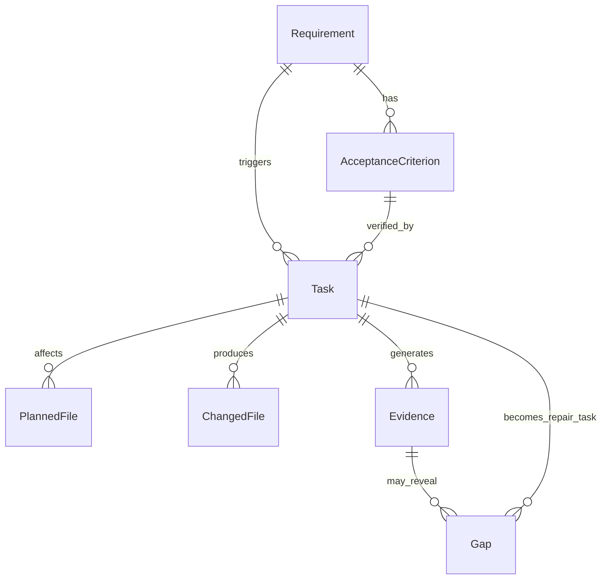

# DevCouncil Architecture

DevCouncil is **components and modules** for AI-assisted software development. It provides the deterministic substrate — code intelligence, leases, verification, search — that makes AI-generated work verifiable, scoped, and traceable back to requirements. Manvi wraps those modules into a harness; host apps such as GitPulse take Manvi and selected DevCouncil components for their respective jobs.

---

## 1. System Architecture

DevCouncil is built as independently installable native modules. Rather than linking large runtimes together via complex FFI or Python bindings, components communicate across process and protocol boundaries, and a host may also link a selected crate when that is the right seam:

```mermaid
flowchart TD
    subgraph Upstream["Harnesses and host apps"]
        Manvi["Manvi (wraps the components)"]
        GitPulse["GitPulse (selects Manvi + DevCouncil modules)"]
        ExternalAgents["Coding Agents (Claude Code, Cursor, Codex, Antigravity)"]
    end

    subgraph Host["Go Host Orchestrator (devcouncil / dev)"]
        HostCLI["CLI Entrypoint
cmd/devcouncil"]
        HostMCP["Host MCP Server
devcouncil mcp"]
        HostInteg["Integrations Engine
devcouncil integrate"]
        HostSkills["Skills Scaffolder
devcouncil skills"]
        HostVerify["Verify Gateway
devcouncil verify"]
    end

    subgraph Analysis["Rust Analysis & State Suite"]
        DevMap["devmap
Code Graph & 36+ Language Extractors"]
        DCStore["dcstore
Atomic Task Leases & SQLite Store"]
        DCVerify["dcverify
Unified Diff Parser & Rigor Gates"]
        DCGrep["dcgrep
Ripgrep Engine & Trigram Index"]
    end

    ExternalAgents <-->|MCP Protocol| HostMCP
    Manvi -->|Imports Go packages| Host
    Manvi -->|Spawns selected binaries| Analysis
    GitPulse -->|Vendors selected crates| DevMap
    GitPulse -->|manvi serve| Manvi

    HostCLI -->|Execs| DevMap
    HostCLI -->|Integrates| HostInteg
    HostCLI -->|Scaffolds| HostSkills
    HostVerify -->|Spawns & Validates| DCVerify
    HostVerify -->|Checks Leases| DCStore

    HostMCP -->|Lease & Task Storage| DCStore
    HostMCP -->|Diff Gates| DCVerify
```

---

## 2. Core Components

### A. Go Host Orchestrator (`devcouncil` / `dev`)

Located in `backend/go_orchestrator/`. Compiled as a single static native binary.
- **Host MCP Server (`mcp`):** Provides stdio MCP tools for task checkout, leases, diff analysis, and verification gates.
- **Agent Integration (`integrate`):** Installs and verifies configuration for Cursor, Claude Code, Codex, Antigravity, OpenCode, Warp, and Aider.
- **Skills Distribution (`skills`):** Scaffolds embedded engineering and code intelligence skills into agent directories (`.agents/skills`, `.claude/skills`, `.cursor/skills`).
- **Verification Gateway (`verify`):** Invokes `dcverify` and checks leases in `dcstore`, returning human-readable or structured JSON verdicts.
- **DevMap Forwarding (`map`, `graph`, `ast`):** Dispatches directly to `devmap`.

### B. Code Intelligence Engine (`devmap`)

Multi-crate workspace providing compiler-grade code intelligence without calling an LLM.
- **Extract (`devmap-extract`):** 36+ tree-sitter grammars extracting definitions, imports, calls, exports, and language fixtures.
- **Resolve (`devmap-resolve`):** High-speed cross-file symbol resolution and import binding.
- **Analyze (`devmap-analyze`):** Blast radius, reverse dependents, circular dependency detection, and dead code classification.
- **Store (`devmap-store`):** SQLite WAL-mode canonical code graph store (`.devcouncil/codeintel/devmap.sqlite`).
- **Query & Serve (`devmap-query`, `devmap-serve`):** CLI queries (`query`, `trace`, `impact`, `dead`, `cypher`) and standalone DevMap MCP server.

### C. State & Lease Repository (`dcstore`)

Provides safe concurrent agent building through atomic SQLite leases:
- Manages tasks, requirements, leases, evidence, and verification runs.
- Mutual-exclusion task locking prevents multi-agent write collisions on shared files.
- Communicates with the Go host via JSON over stdio.

### D. Deterministic Verification Engine (`dcverify`)

Evaluates task diffs against strict engineering invariants:
- **Scope Classification:** Rejects diffs that touch files outside the task's declared `planned_files`.
- **Rigor Gates:** Anti-laziness stub detection, empty diff rejection, secret scanning.
- **Coverage Intersection:** Intersects modified line ranges with test execution coverage.
- **Typed Next Actions:** Emits machine-readable repair instructions (`next_actions`) when verification fails.

---

## 3. Separation of Concerns: DevCouncil vs. Manvi vs. GitPulse

DevCouncil is the **components and modules**. Manvi **wraps** them. GitPulse **selects** both for their respective jobs. Each module can be updated on its own, and an app is not required to take the whole suite.

- **DevCouncil owns:**
  - Standalone compiled binaries and libraries (`devcouncil`, `devmap`, `dcstore`, `dcverify`, `dcgrep`).
  - Code graph extraction, symbol resolution, and workspace navigation.
  - Task state, atomic leases, write containment policy, and deterministic verification gates.
  - MCP servers for agent tooling.
- **Manvi wraps those modules and owns:**
  - The agent turn loop, LLM provider routing, and policy ladder.
  - Prompt construction, agent personas, and debate councils.
  - Multi-agent campaign coordination, TUI, and `manvi serve` for embedding.
- **GitPulse uses:**
  - Manvi for policy, workbench, and agent hosting.
  - Selected DevCouncil components (`devmap` CLI and crates, verification reads) for code intelligence and related analysis.

---

## 4. The Artifact Graph

The durable source of truth for every task. Every modified line of code traces back to a requirement and acceptance criterion:

```mermaid
erDiagram
    Requirement ||--o{ AcceptanceCriterion : "has"
    Requirement ||--o{ Task : "triggers"
    AcceptanceCriterion ||--o{ Task : "verified_by"
    Task ||--o{ PlannedFile : "affects"
    Task ||--o{ ChangedFile : "produces"
    Task ||--o{ Evidence : "generates"
    Evidence ||--o{ Gap : "may_reveal"
    Gap }o--|| Task : "becomes_repair_task"
```

| Entity | Description |
|---|---|
| **Requirement** | Discrete functionality or constraint from project goals. |
| **Acceptance Criterion** | Falsifiable condition required to satisfy a requirement. |
| **Task** | Scoped unit of work linked to requirements, carrying declared planned files. |
| **Evidence** | Deterministic artifacts (test output, diff coverage, verification logs). |
| **Gap** | Blocking or advisory issue identified during verification. |

---

## 5. Storage Layout

State is kept locally inside the target repository:
- `.devcouncil/repo_map.json`: High-level inventory, entry points, and subsystem groupings.
- `.devcouncil/graph/code_graph.json`: Exported symbol-level knowledge graph.
- `.devcouncil/codeintel/devmap.sqlite`: Canonical SQLite store for code intelligence.
- `.devcouncil/state.sqlite`: Canonical SQLite store for tasks, leases, and verification records.
- `.devcouncil/logs/`: Redacted execution and verification logs.
