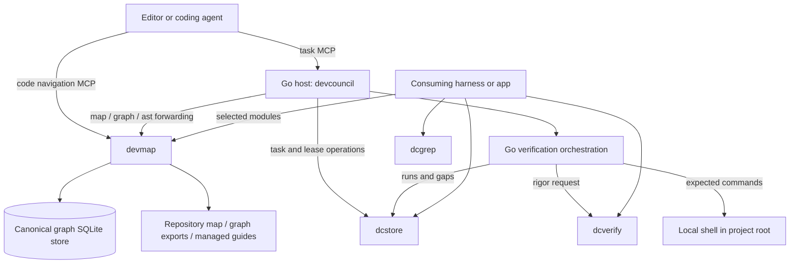

# Architecture

DevCouncil supplies native components for AI-assisted development. The Go host
connects task tooling; Rust owns code intelligence, state, search and rigor
checks. A consumer can use a single binary or selected library crates.
[Documentation index](README.md)

## Components and ownership

| Component | Source owner | Responsibility |
|---|---|---|
| `devcouncil` / `dev` | `backend/go_orchestrator/cmd/devcouncil/` | Host CLI, task MCP, integration, skills, verification orchestration and DevMap forwarding |
| `devmap` | `rust/devmap-cli/` and `rust/devmap-*` | Extraction, resolution, graph storage, analysis, queries, watching and navigation MCP |
| `dcstore` | `rust/dc-store/` | SQLite task and workbench state, leases, verification records and gaps |
| `dcverify` | `rust/dc-verify/` | Structured diff analysis, scope classification, stub/secret checks and diff–coverage intersection |
| `dcgrep` | `rust/dc-grep/` | Ignore-aware text search with optional trigram indexing |

```mermaid
flowchart TD
    Agent[Editor or coding agent] -->|code navigation MCP| Map[devmap]
    Agent -->|task MCP| Host[Go host: devcouncil]
    Host -->|map / graph / ast forwarding| Map
    Host -->|task and lease operations| State[dcstore]
    Host --> Verify[Go verification orchestration]
    Verify -->|rigor request| Rigor[dcverify]
    Verify -->|expected commands| Shell[Local shell in project root]
    Verify -->|runs and gaps| State
    Map --> Graph[(Canonical graph SQLite store)]
    Map --> Exports[Repository map / graph exports / managed guides]
    Harness[Consuming harness or app] -->|selected modules| Map
    Harness --> State
    Harness --> Rigor
    Harness --> Search[dcgrep]
```

The diagram describes implemented interfaces, not a claim that every consumer
uses every edge. Manvi owns its agent loop and provider orchestration. GitPulse
composes Manvi with selected DevCouncil components; those consumers have their
own versions and qualification requirements.

## Two MCP servers

`devmap mcp` serves code navigation. Its repository-aware envelopes let one
server serve multiple workspaces: clients send `repo_path` and verify the
returned `repository.root` before using the answer.

`devcouncil mcp` serves eight task/policy tools from
[`Registry.Specs`](../backend/go_orchestrator/devcouncil/registry.go): diff,
checkout, renew lease, release, next task, verify task, get gaps and check write
policy. It binds to the project root resolved by the Go host. It is not an
arbitrary shell/file-edit server. Ordinary editor writes are not intercepted
by the retired DevCouncil lifecycle hooks.

## Code graph pipeline

1. `devmap-extract` discovers files and extracts definitions, imports, calls and
   language-specific evidence. Parsing and discovery gaps remain visible.
2. `devmap-resolve` resolves symbols and relationships, preserving ambiguity and
   unresolved sites rather than upgrading a name match into certainty.
3. `devmap-analyze` computes graph analysis and liveness candidates.
4. `devmap-store` owns persistence; `devmap-query` reads and composes results.
5. `devmap-serve` watches and updates state; `devmap-cli` exposes CLI/MCP and
   integration surfaces.

Supported parsing is not complete semantic coverage. Read
[code graph interpretation](code-graph.md) before making completeness claims.

## Verification pipeline

The CLI and host MCP converge on
[`VerifyTask` / `Run`](../backend/go_orchestrator/devcouncil/verify/orchestrate.go).
The Go layer collects task and diff context, checks no-work/planned-file/orphan/
dependency conditions, and executes expected commands. It invokes `dcverify`
through [`runRigorGates`](../backend/go_orchestrator/devcouncil/verify/rigor.go)
for stub, secret and optional coverage checks.

Go scope findings retain their existing owner; the rigor adapter does not
report a second independent scope verdict. Result metadata names applied gates
and skipped reasons. CLI `--coverage PATH` supplies a profile; the host MCP
verify tool does not expose that field. Missing `dcverify` is reported as a
skip; a configured verifier that fails produces an unavailable-check gap.

The gate mode governs the verdict. Default `off` reports verification skipped;
`advisory` and `enforce` have different blocking policies. A success-shaped
response or process exit alone does not establish that all checks ran.
Expected commands run in a local shell. The sandbox selector does not implement
Docker or Nix isolation. See the [task loop contract](hero-loop.md).

## State and artifacts

| Artifact | Location / resolution |
|---|---|
| Code graph database | `db_path` from `devmap paths --json`; canonical query source |
| Repository map | `repo_map` from `paths`; file/subsystem navigation |
| Graph export | `code_graph` from `paths`; may be capped |
| Agent guides | Project `AGENTS.md` / `CLAUDE.md`, written when requested and managed |
| Task state | `.devcouncil/state.sqlite`, opened by the Go host |

[`devmap-extract/src/paths.rs`](../rust/devmap-extract/src/paths.rs) owns state
resolution: configured state home, then existing `.devmap/`, then existing
`.devcouncil/`, otherwise new `.devmap/`. An explicit `--db` selects a database.
Do not confuse the task store with the graph store, or copy generated state
between worktrees.

## Build and compatibility

Use [source installers](quickstart.md) and the repository toolchain manifests.
The npm package is a launcher, separately versioned from native components.
Changing one component need not require installing all others, but wire
contracts and store schemas still need compatible readers and writers.
[Project status](project-status.md) separates current interfaces, implementation
limits and historical material.
