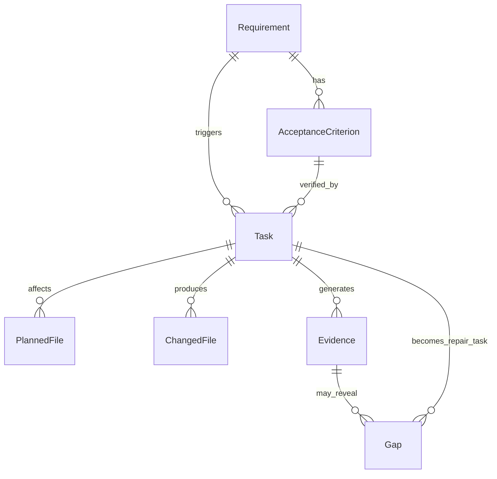

# Artifact Graph

The **Artifact Graph** is the durable source of truth for every DevCouncil run. It is a directed graph that links high-level user intent to atomic requirements, tasks, and eventually to the binary evidence of implementation.

## Data Relationships

The graph ensures that every line of code modified can be traced back to a specific requirement and its corresponding acceptance criteria.

## Node Types

| Node Type | Description |
|---|---|
| **Requirement** | A discrete piece of functionality or a constraint derived from the user's goal. |
| **Acceptance Criterion** | A falsifiable condition that must be met for a requirement to be considered satisfied. |
| **Task** | A unit of work for an executor, linked to one or more requirements. |
| **Planned File** | A file identified during the planning phase that is expected to be modified. |
| **Changed File** | A record of a file actually modified during execution (captured via Git diffs). |
| **Evidence** | Deterministic proof of work, such as test results, command logs, or code reviews. |
| **Gap** | A discrepancy discovered during verification (e.g., a requirement with no evidence). |

## Persistence

The Artifact Graph is stored in a SQLite database (`.devcouncil/state.sqlite`) during a run. This allows for:
- **Complex Queries**: e.g., "Find all requirements that don't have passing unit test evidence."
- **Resumption**: A run can be stopped and resumed at any point without losing the state of the graph.
- **Reporting**: The final evidence report is generated by traversing the graph from Requirements down to Evidence.
