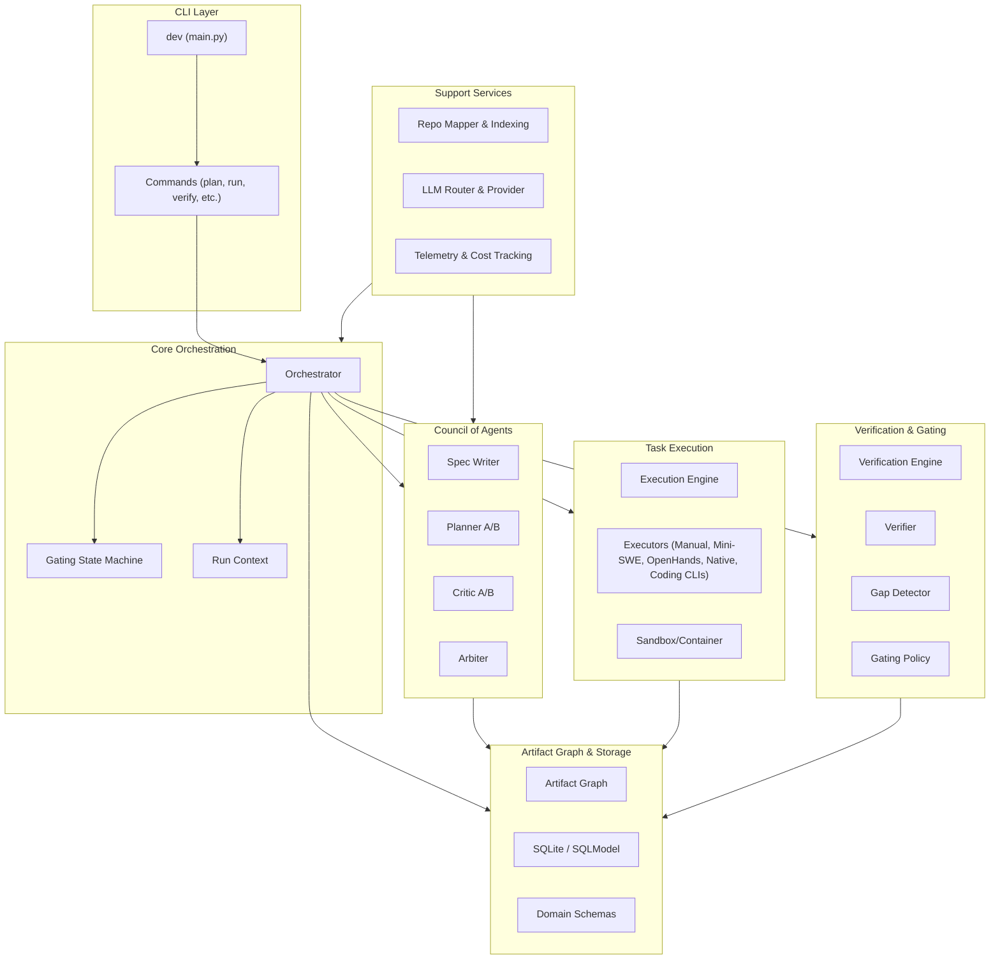

# Codebase Architecture

DevCouncil is organized into modular packages, each handling a specific domain of the AI development lifecycle. This modularity ensures that components like LLM providers or execution environments can be swapped or extended without affecting the core orchestration logic.

## High-Level Component Map

The following diagram illustrates how the various subsystems interact.

## Module Responsibilities

| Module | Responsibility |
|---|---|
| `app` | Application lifecycle, state machine management, and global event bus. |
| `cli` | Command-line interface and user interaction logic. |
| `council` | The multi-agent debate engine that handles requirement gathering and planning. |
| `domain` | Core data models and schemas (Requirements, Tasks, Evidence). |
| `execution` | Logic for running tasks and managing execution environments. |
| `executors` | Concrete adapters for execution strategies (manual, mini-SWE-agent, OpenHands, native, and coding CLIs). |
| `gating` | Policy-based check logic that decides if a task or phase can proceed. |
| `indexing` | Static analysis and repository mapping for LLM context. |
| `llm` | Abstraction layer for different LLM providers (OpenAI, Anthropic, etc.). |
| `planning` | Decomposition of high-level goals into a directed acyclic graph (DAG) of tasks. |
| `repo` | Direct interactions with the local filesystem and Git repository. |
| `storage` | Persistence layer for the Artifact Graph and run history. |
| `verification` | Evidence analysis and gap detection logic. |
