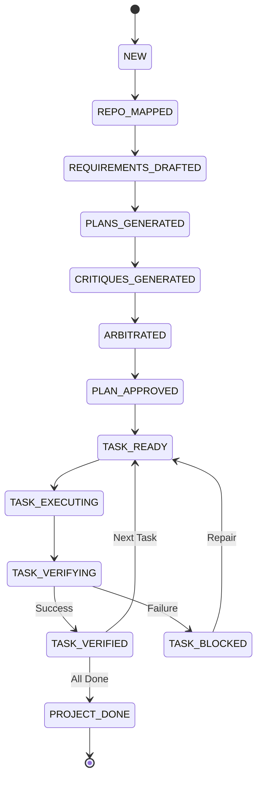

# Gating State Machine

DevCouncil uses a formal state machine to manage the project lifecycle. This ensures that the orchestrator follows a deterministic path and that "safety gates" are enforced at critical transitions.

## Phase Definitions

The following table describes each phase in the development lifecycle.

| Phase | Description | Key Artifacts Required |
|---|---|---|
| `NEW` | The run has been initialized but no processing has started. | Goal string. |
| `REPO_MAPPED` | The repository has been indexed and the context is ready for the LLM. | `repo_map.json` |
| `REQUIREMENTS_DRAFTED` | High-level requirements and acceptance criteria have been defined. | `requirements.json` |
| `PLANS_GENERATED` | Independent implementation plans have been created by different agents. | `plan_a.json`, `plan_b.json` |
| `CRITIQUES_GENERATED` | Agents have cross-critiqued each other's plans for flaws or omissions. | `critiques.json` |
| `ARBITRATED` | A final, unified plan and task graph have been synthesized. | `task_graph.json` |
| `PLAN_APPROVED` | The user (or an automated policy) has approved the plan for execution. | User approval flag. |
| `TASK_READY` | A task is ready to be picked up by an executor. | No blockers. |
| `TASK_EXECUTING` | An executor is actively applying changes to the codebase. | Execution lock. |
| `TASK_VERIFYING` | The verification engine is checking the evidence produced during execution. | Diffs, logs, test output. |
| `TASK_VERIFIED` | The task has passed all gates and is considered complete. | Passing gate results. |
| `TASK_BLOCKED` | Verification failed or a dependency issue stopped the task. | Gap report. |
| `PROJECT_DONE` | All requirements have been satisfied and verified. | Final report. |

## Transition Logic

Transitions are strictly controlled. For example, a task cannot move from `TASK_EXECUTING` to `TASK_VERIFIED` without first passing through `TASK_VERIFYING`.

## Gatekeepers

Each transition is guarded by a "Gatekeeper" service that validates the internal state. If requirements are missing, evidence is incomplete, or tests fail, the state machine will block the transition and generate a **Gap** node in the Artifact Graph.
