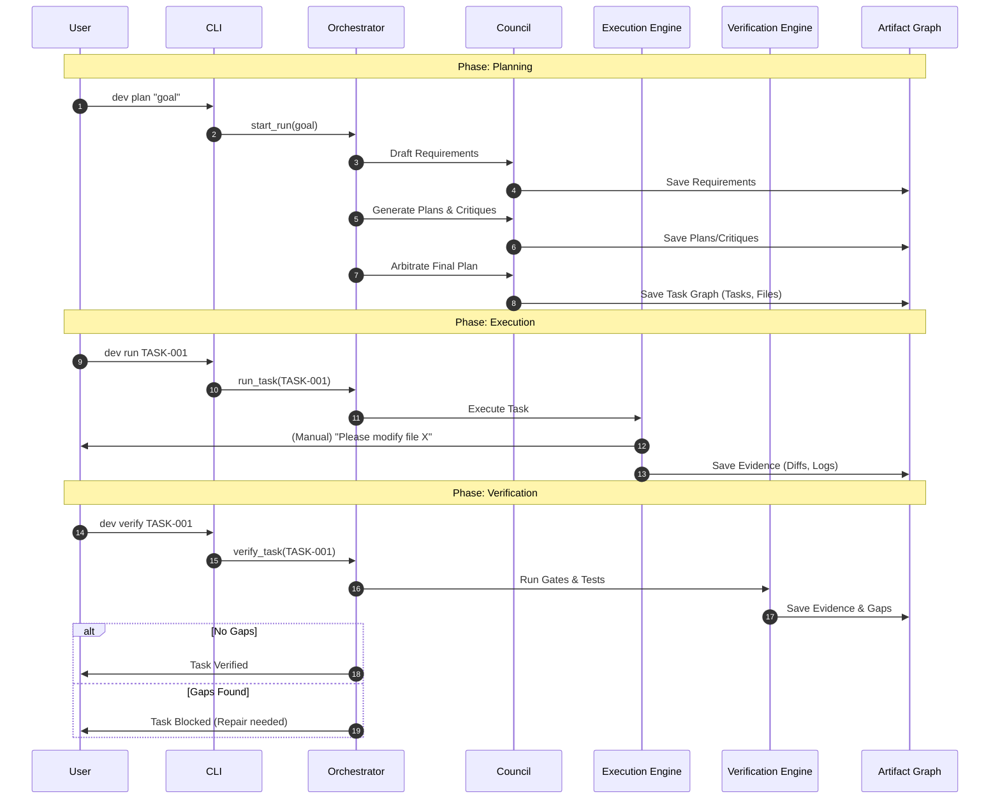

# Orchestration Flow

The orchestration flow in DevCouncil is designed to be **evidence-driven** and **gated**. It moves through distinct phases where each step must produce artifacts that satisfy specific verification criteria before the next step can begin.

## Workflow Lifecycle

The following sequence diagram shows the typical interaction between the user, the orchestrator, and the various internal engines during a development run.

## Core Principles

1.  **Requirement-First**: No code is written until requirements and acceptance criteria are explicitly defined and saved to the Artifact Graph.
2.  **Independent Planning**: The "Council" uses multiple agents to generate competing plans, which are then cross-critiqued to find edge cases and risks.
3.  **Deterministic Gating**: Transitioning from one phase to another (e.g., from Execution to Verification) is managed by a strict State Machine.
4.  **Evidence Persistence**: Every action taken by an agent or executor must produce evidence (diffs, test results, logs) that is linked back to the original requirements.
