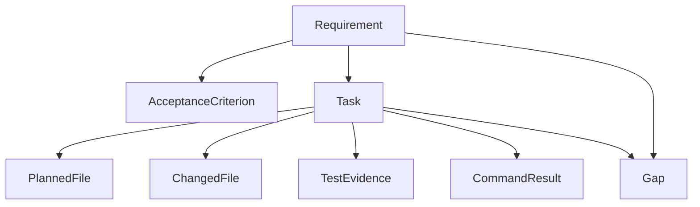

# Artifact Graph

The Artifact Graph is DevCouncil's core data structure. It connects the "why" (requirements) to the "what" (tasks) and the "proof" (evidence/gaps).

This graph enables structural querying of test coverage, unmodified files, orphan diffs, and missing evidence.
