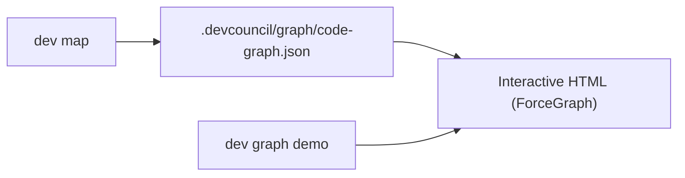

# Code graph visualizer

DevCouncil can render the repository import graph as an interactive HTML page using the
[force-graph](https://github.com/vasturiano/force-graph) viewer. The visualizer is a
self-contained static page under `.devcouncil/graph/` — no separate server is required
after the HTML is generated.

## Quick demo (no `dev map` required)

Try the UI with a synthetic graph before mapping your repository:

```bash
dev graph demo
```

This writes `.devcouncil/graph/demo.html` and opens it in your default browser. The page
uses the same ForceGraph UI as graphs built from a real map.

## Building a graph from the repository

After you map the repository, DevCouncil can write `.devcouncil/graph/code-graph.json`
from the import edges captured in `.devcouncil/repo_map.json`. Re-run `dev map` when
the codebase changes so the graph stays aligned with the current tree.



## Output location

| Artifact | Purpose |
| :--- | :--- |
| `.devcouncil/graph/code-graph.json` | Canonical graph payload (nodes + import links) |
| `.devcouncil/graph/demo.html` | Sample visualizer with synthetic data (`dev graph demo`) |

Generated graph artifacts live under `.devcouncil/` and are local to your checkout.
