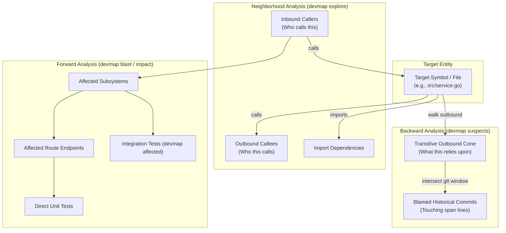
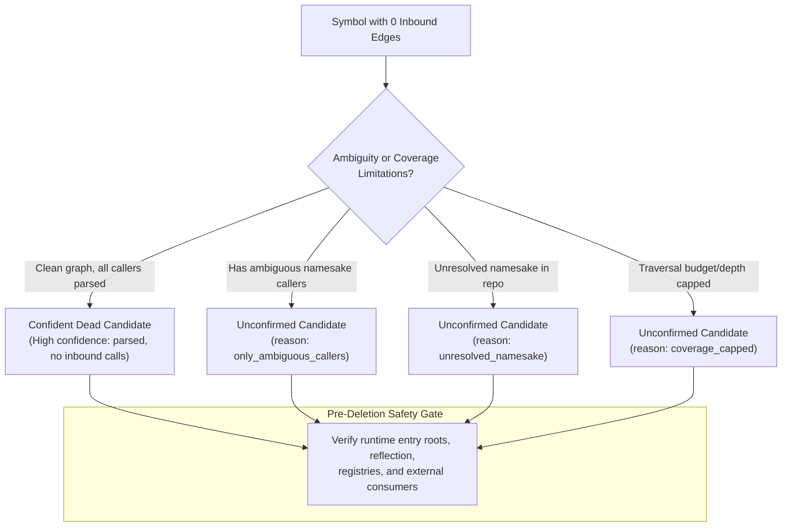

# Code graph and repository navigation

DevMap builds a local graph from source without a model call. Use it to locate
symbols, inspect relationships and narrow an investigation. Static graph
results remain evidence with limits, not runtime proof.
[Documentation index](README.md)

## Build and locate state

```bash
devmap build --manifest --guides
devmap paths --json
devmap status --json
```

`build` indexes source; `--manifest` exports map/graph artifacts; `--guides`
requests marker-managed agent guides. Without `--guides`, the manifest build
is not a guide installer. If newly created guides make the initial status
stale, run `devmap build --manifest` once more to index that inventory change.
`dev map` is Go-host forwarding to
`devmap build --manifest`.

Use `paths` rather than hard-coded state paths. New repositories use `.devmap`;
existing `.devcouncil` state remains supported, and `.devmap` wins when both
exist. Explicit configuration may override the default. The canonical SQLite
store is separate from `.devcouncil/state.sqlite`, which holds task state.
Build each worktree independently.

## Choose the question

Replace example names and paths with actual repository symbols:

| Question | Command |
|---|---|
| Find a symbol | `devmap search MyFunction --json` |
| Read its neighborhood | `devmap explore MyFunction --json` |
| Inspect change impact | `devmap impact src/service.go --json` |
| Trace a relationship | `devmap trace EntryPoint TargetFunction --json` |
| Find dead-code candidates | `devmap dead --json` |
| Find candidate tests | `devmap affected src/service.go --json` |
| Forward change impact | `devmap blast --since HEAD~1 --json` |
| Backward root-cause commits | `devmap suspects MyFunction --since v0.2.0 --json` |
| Preview unsaved edit impact | `devmap preview --file src/service.go --json` |
| Find duplicate symbol bodies | `devmap clones --json` |
| Keep the index warm | `devmap serve` |
| Inspect installed identity | `devmap --version` |


```mermaid
flowchart TD
    subgraph Target["Target Entity"]
        Symbol["Target Symbol / File<br/>(e.g., src/service.go)"]
    end

    subgraph DirectNeighbors["Neighborhood Analysis (devmap explore)"]
        InboundCallers["Inbound Callers<br/>(Who calls this)"]
        OutboundCallees["Outbound Callees<br/>(Who this calls)"]
        Imports["Import Dependencies"]
    end

    subgraph ForwardAnalysis["Forward Analysis (devmap blast / impact)"]
        Subsystems["Affected Subsystems"]
        APIRoutes["Affected Route Endpoints"]
        DirectTests["Direct Unit Tests"]
        IntegrationTests["Integration Tests (devmap affected)"]
    end

    subgraph BackwardAnalysis["Backward Analysis (devmap suspects)"]
        DependencyCone["Transitive Outbound Cone<br/>(What this relies upon)"]
        BlamedCommits["Blamed Historical Commits<br/>(Touching span lines)"]
    end

    InboundCallers -->|"calls"| Symbol
    Symbol -->|"calls"| OutboundCallees
    Symbol -->|"imports"| Imports

    InboundCallers --> Subsystems
    Subsystems --> APIRoutes
    APIRoutes --> DirectTests
    Subsystems --> IntegrationTests

    Symbol -->|"walk outbound"| DependencyCone
    DependencyCone -->|"intersect git window"| BlamedCommits
```

`devmap COMMAND --help` is the installed binary's flag authority. There is no
`devmap query` command and no `build --watch`; use `serve` for watching.
The daemon updates the same store. No Python build engine or Python fallback
is required.

## Interpret evidence before using it

- **Readiness:** `query_ready` and `reader_ready` distinguish an available store
  from one that needs repair or rebuilding.
- **Freshness:** `is_fresh`, `source_freshness`, `analyzer_freshness` and
  `rebuild_required` describe whether the index matches source and kernel.
- **Coverage:** `coverage_gaps` separates parse failures, unsupported input,
  recovered patterns, and call/import blind spots. A fresh index can have gaps.
- **Confidence:** read each row's `confidence`, reasons and resolution evidence.
  Ambiguous name matches and unresolved receivers must not be treated as exact
  call relationships.
- **Bounds:** inspect `truncated`, `total` and per-list metadata. Capped role
  buckets and graph exports are navigation samples; they are not complete
  inventories. `walk_incomplete` means unattributed calls limit the analysis.

The repository map's `files` list locates source. `subsystems`, entry points,
critical files, neighbors and handoff paths help follow ownership. Role-file
samples carry separate totals. Trust current source when a map disagrees.

## Dead code and liveness

`devmap dead --json` returns candidates with per-row confidence. No inbound
resolved evidence is a static observation. Only ambiguous callers, unresolved
namesakes or capped coverage make the conclusion weaker. Runtime entry points,
registries, generated code, reflection and external consumers need separate
inspection before deleting anything.

Map `unwired_candidates` and `dead_symbol_candidates` are useful starting
points. Do not treat `unreachable_files` as reliable when entry roots are empty
or `liveness_unreachable_unreliable` is set. Consult the accompanying exclusion
and truncation metadata rather than equating an empty sample with full coverage.
`NoNamesake` unresolved sites are explained gaps, not dead-symbol findings.

Confirm a deletion through independent source/caller evidence and relevant
runtime tests. A graph match alone does not establish safety.


```mermaid
flowchart TD
    Candidate["Symbol with 0 Inbound Edges"] --> FilterCheck{"Ambiguity or Coverage<br/>Limitations?"}

    FilterCheck -->|"Has ambiguous namesake callers"| Unconfirmed1["Unconfirmed Candidate<br/>(reason: only_ambiguous_callers)"]
    FilterCheck -->|"Unresolved namesake in repo"| Unconfirmed2["Unconfirmed Candidate<br/>(reason: unresolved_namesake)"]
    FilterCheck -->|"Traversal budget/depth capped"| Unconfirmed3["Unconfirmed Candidate<br/>(reason: coverage_capped)"]
    FilterCheck -->|"Clean graph, all callers parsed"| Confident["Confident Dead Candidate<br/>(High confidence: parsed, no inbound calls)"]

    subgraph VerificationGate["Pre-Deletion Safety Gate"]
        CheckSurfaces["Verify runtime entry roots, reflection,<br/>registries, and external consumers"]
    end

    Confident --> CheckSurfaces
    Unconfirmed1 --> CheckSurfaces
    Unconfirmed2 --> CheckSurfaces
    Unconfirmed3 --> CheckSurfaces
```

## MCP and host setup

`devmap mcp` is separate from `devcouncil mcp`: the former serves navigation,
the latter task/policy operations. Every DevMap MCP query should include the
absolute `repo_path`; verify the response's `repository.root`, especially in
multi-tab hosts sharing one MCP process. Use the live tool catalog instead of
copying an old tool count.

[Integration setup](coding-cli-integration.md) covers supported hosts, dry-run
receipts, guides, skills and navigation hooks. CLI surfaces may exceed MCP
coverage; use the installed help/catalog to check availability.

## Troubleshooting

| Symptom | Next check |
|---|---|
| Missing map or store | Run `paths`, build in this worktree, then inspect `status` |
| Wrong repository returned | Check `repo_path`, response root and pinned/global MCP registrations |
| Fresh but incomplete answer | Inspect coverage, resolution reasons, totals and truncation |
| Old behavior after installation | Compare binary identity from `paths`; reload existing host processes |
| Schema mismatch | Inspect `status` and `devmap repair --help`; coordinate compatible readers/writers before repair |
| Export too small to answer | Query the canonical store instead of assuming a capped JSON export is complete |

The [Rust workspace guide](../rust/README.md) documents the implementation;
[comparison evidence](devmap/comparison.md) describes measured workloads and
retains their failures and limits.
