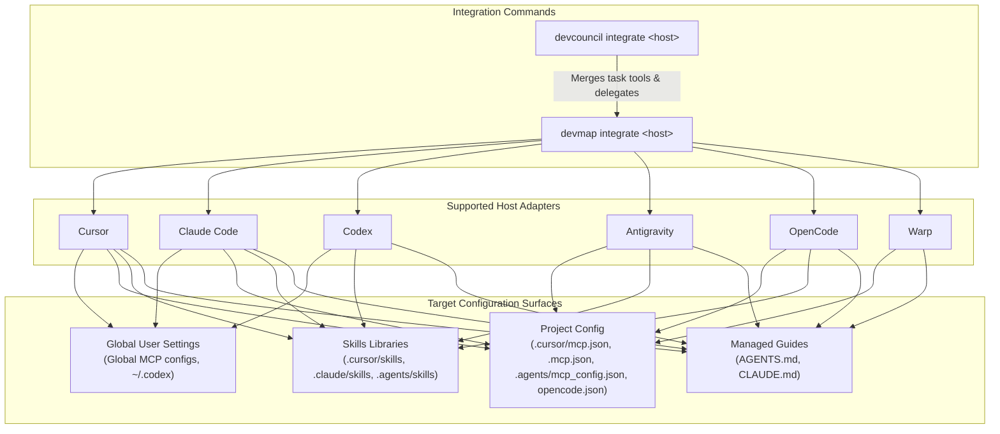

# Coding CLI integration

Choose code navigation (`devmap`) and optionally task tooling (`devcouncil`).
These are separate MCP servers. Integration writes configuration and project
assets; successful file validation does not prove that a running editor has
reloaded or trusted them. [Documentation index](README.md)

## Standalone DevMap

Both native installers accept `cursor`, `claude`, `codex`, `antigravity`,
`opencode` and `warp`. The source authority is the Rust `Host` enum and Go
`integrate.Hosts`; unknown names and the legacy `gemini` / `aider` targets are
refused by these adapters. This is the repository's adapter set, not a claim
about every host's current capabilities.

From the target repository:

```bash
devmap integrate cursor --dry-run
devmap integrate cursor
devmap integrate cursor --check
```

There is no `--apply` on `devmap integrate`: an invocation without `--dry-run`
or `--check` applies changes. Read the JSON receipt with `--json` when scripting.

| Host | DevMap configuration surfaces |
|---|---|
| Cursor | Global MCP registration, owned project entries, managed guides/rule, `.cursor/skills` and `.cursor/hooks.json` |
| Claude | Global MCP registration, owned project entries, managed guides and `.claude/skills`; separate `devmap claude plugin` generates a plugin bundle |
| Codex | User `~/.codex/config.toml` MCP registration, `.agents/skills`, project plugin/hook assets; host trust may need renewal |
| Antigravity | `.agents/mcp_config.json` and `.agents/skills` |
| OpenCode | `opencode.json`, its project skills layout and a DevMap post-tool plugin |
| Warp | `.devcouncil/integrations/warp-mcp.json`; no project skill destination is installed by this adapter |



All adapters also use the managed guide-writing path. Inspect the receipt for
exact files and changes: global settings may be touched. Existing unrelated
server entries are preserved. Do not assume a project-only dry run previews
only project-local effects.

Every DevMap MCP call should include absolute `repo_path`; verify
`repository.root` in the answer. One global registration can serve multiple
repositories. Hard-coded database paths and duplicate server registrations can
otherwise route a query to the wrong index. `devmap paths --json` reports
binary/configuration diagnostics.

## Optional Go-host task tools

Install the full native suite first, then preview/apply the Go host:

```bash
devcouncil integrate cursor --dry-run
devcouncil integrate cursor --apply
devcouncil integrate cursor --check
```

The Go adapter merges the `devcouncil` server and invokes DevMap integration
when a usable binary is found. Inspect `spawned` and `notes`; a Go receipt alone
is not proof that every DevMap asset is installed.

| Host | Go-owned configuration |
|---|---|
| Cursor | `.cursor/mcp.json` and `.cursor/rules/devcouncil.mdc` |
| Claude | `.mcp.json` with host and DevMap entries |
| Codex | A comment-only project `.codex/config.toml` adapter; this does not register the Go host's task server |
| Antigravity | `.agents/mcp_config.json` |
| OpenCode | `opencode.json` |
| Warp | `.devcouncil/integrations/warp-mcp.json` |

Codex's DevMap registration is implemented in the Rust integrator. Do not
confuse that with complete Go-host task MCP setup for Codex. Use the host's
current documented MCP setup for any additional manual registration.

The Go host serves checkout, renew/release lease, next task, diff, gaps,
verification and write-policy checks. It does not serve arbitrary file-edit
or shell tools. Tasks require initialized state and a consuming agent that
honors policy/results. See [MCP task loop](hero-loop.md).

## Hooks, skills and enforcement

DevMap navigation hooks maintain code context. DevCouncil's old lifecycle
write/stop gates are retired. Installing either server does not intercept all
ordinary editor writes, and `--write-gate` is no longer supported.

Use `devcouncil skills list` and `devcouncil skills scaffold --dry-run` to inspect
the Go host's engineering skills. Embedded instructions can retain migration
limits; they are guidance, not a permissions mechanism. DevMap integration
installs its own navigation skills through the existing managed installer.

Reload the host after updating a binary or configuration. For Codex hook
assets, the generated receipt calls out the host trust step; changing a hook
can require renewed trust. File checks and physical host execution are
separate verification steps.

## Remove retired DevCouncil hooks

```bash
dev hook status --project-root /path/to/project
dev hook disable --project-root /path/to/project --client claude --dry-run
dev hook disable --project-root /path/to/project --client claude
```

Status can be nonzero because registrations remain or inspection failed; read
its receipt to distinguish them. Cleanup preserves unrelated tools and records
recoverable backups. Old event invocations are silent no-ops, not verification.
See [CLI cleanup details](cli-reference.md#retired-hook-compatibility-and-cleanup).

Source owners:
[`rust/devmap-cli/src/integrate.rs`](../rust/devmap-cli/src/integrate.rs),
[`backend/go_orchestrator/devcouncil/integrate/integrate.go`](../backend/go_orchestrator/devcouncil/integrate/integrate.go).
