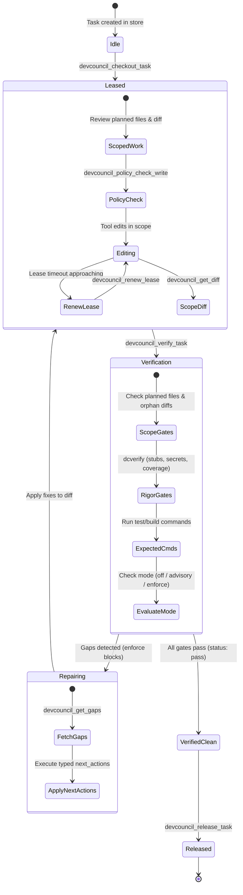

# MCP task loop and verification contract

DevCouncil supplies an opt-in task loop over the Go host’s eight MCP tools.
The agent drives checkout → implement → verify → repair → release. DevCouncil
supplies state and verification; it does not run the agent’s model loop.
[Documentation index](README.md)

## Prerequisites

- Native `devcouncil`, `dcstore` and `dcverify` binaries on the consumer’s PATH.
- A project `.devcouncil/state.sqlite` initialized by a store client or consuming
  application, with a real task, planned files and expected commands.
- Host MCP registration pointing at the intended project.
- An explicit choice of gate mode. Default `off` is not a verification pass.

Mapping a repository or installing the binaries does not create a task. The
Go host does not supply the retired `dev plan`, `dev go` or `dev e2e` commands.
See [integration setup](coding-cli-integration.md).

## Live tool surface

The authority is
[`backend/go_orchestrator/devcouncil/registry.go`](../backend/go_orchestrator/devcouncil/registry.go),
which both advertises and dispatches these names:

| Tool | Purpose |
|---|---|
| `devcouncil_get_diff` | Read repository diff, optionally scoped to a task |
| `devcouncil_checkout_task` | Acquire a task lease for a client |
| `devcouncil_renew_lease` | Renew an existing lease |
| `devcouncil_release_task` | Release the lease; not proof of successful verification |
| `devcouncil_next_task` | Select available task work |
| `devcouncil_verify_task` | Evaluate task changes and return verification metadata/gaps |
| `devcouncil_get_gaps` | Read the recorded task gaps |
| `devcouncil_policy_check_write` | Ask the host policy whether a write is permitted |

Use the tool’s advertised input schema. The host does not offer arbitrary
`read_file`, `write_file`, `run_command`, scope-update or rollback MCP tools.
Implement edits through the agent’s own tools. A policy-check result protects
only consumers that honor it; ordinary external writes are not intercepted.



## Read the result, not just the verdict

CLI and MCP share Go verification orchestration. It checks work presence,
planned files, orphan diffs, dependency changes and expected commands. The
`dcverify` adapter adds stub and secret checks and optional diff–coverage
intersection. No model key is needed for these deterministic checks; an
operator-provided test command can still access the network.

| Field | Interpretation |
|---|---|
| `gate_mode`, `status`, `verification_skipped` | Whether the verdict represents enforcement, advisory handling or skipped verification |
| `rigor_applied` | Rigor gates actually applied |
| `rigor_skipped_reason` | Why rigor did not run; missing evidence is not a clean finding |
| `coverage_measured`, `coverage_skipped_reason` | Whether changed-line coverage was evaluated |
| `next_actions`, `advisory_actions` | Concrete gaps for the agent to address or review |
| finding `strength` | How the gate knows: `proven` (from the parsed diff), `observed` (from an execution artifact), `derived` (a text pattern, which can match something else). Both findings gates report `derived` today. |
| `low_substance` gap | How much of the diff is new work rather than structure, relocation, repetition or generated output. Never blocking — a refactor measures low by construction. Absent means either substantive or too small to judge. |
| gap `occurrences`, `resurfaces` | From `devcouncil_get_gaps`. `resurfaces > 0` means this gap was reported, went away, and came back — something reported it fixed and a later run disagreed. `recurrence_available: false` means the annotation is missing from every gap, not that nothing has recurred. |
| `allowed_next_tools` | Names the host actually serves; not a grant of permission to arbitrary tools |

The MCP verify tool has no coverage-profile input. Use the CLI when that gate
is required:

```bash
# Run inside the project; TASK-001 must already exist.
devcouncil verify TASK-001 --mode enforce --json
devcouncil verify TASK-001 --mode enforce --coverage /path/to/coverage-profile --json
```

If `dcverify` is missing, the result names the skipped rigor. If a configured
verifier fails, it produces a `rigor_check_unavailable` gap. A consumer requiring
complete rigor should reject missing/skipped evidence in addition to checking
the verdict. The result describes the supplied scope and commands; it is not a
certificate of complete functional correctness.

## Modes and isolation

`off` is the default and reports skipped verification. `advisory` preserves
findings with a different blocking policy; `enforce` blocks blocking gaps.
Use `devcouncil gate status --json` to inspect project configuration and the
result’s own mode to interpret a run. Do not infer mode from an old README or
from an agent’s claimed posture.

Expected commands execute through the local shell in the project root.
`--sandbox local|docker|nix` records the selection but the gateway does not
implement Docker or Nix isolation. A task lease is also not a filesystem lock
against arbitrary editors. [Repository boundaries](SECURITY_BOUNDARIES.md)
provide the detailed implementation limits.

## Repair and completion

The agent reads gaps, modifies the implementation and reruns verification.
The consuming harness must bound attempts, time and cost; this host is not an
autonomous repair scheduler. Preserve failing tests and evidence rather than
weakening expectations to reach a green verdict. Only claim checks that ran.
Release leases when the participating workflow is finished; preserve any
remaining gaps in the handoff.

Historical Python slash commands, advisor configuration, stop gates, executor
adapters and certification tables are not the current native contract.
[Project status](project-status.md) tracks that migration boundary.
